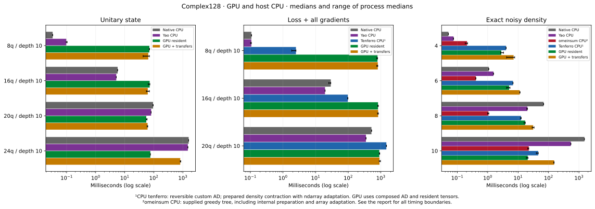
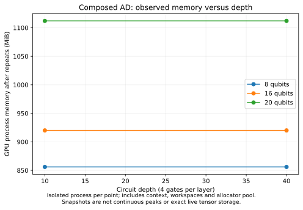

# A800 CUDA and same-host CPU comparison

Published tenferro 0.4.0 executes complex128 circuits, first-order custom-loss
gradients, and exact noisy tensor networks on the NVIDIA A800. This report
supports explicit CUDA selection; it does not justify replacing CPU defaults.

The [complete generated report](report.md) contains all timing boundaries,
run ranges, process-cold phases and memory snapshots. The study completed three
independent timing processes per runner: **168 CPU records, 66 GPU records and
42 passing Yao output comparisons**, plus **14 successful isolated GPU probes**.
Maximum absolute full-output discrepancies are `1.15e-14` for CUDA versus native
Rust and `6.66e-15` for Yao versus Rust.

## Measured results

Milliseconds, medians of three process medians; consult the full report for
dispersion and raw confidence intervals. Dashes indicate an unmeasured API
boundary, not a zero cost.

| Workload | Native CPU | Yao CPU | Tenferro CPU¹ | omeinsum CPU² | GPU resident | GPU + transfers |
| --- | ---: | ---: | ---: | ---: | ---: | ---: |
| State, 8 qubits, 10 layers | 0.033 | 0.097 | — | — | 70.525 | 64.551 |
| State, 24 qubits, 10 layers | 1585.271 | 1488.150 | — | — | 76.268 | 812.825 |
| Loss + gradients, 20 qubits, 10 layers | 515.975 | 349.750 | 1477.831 | — | 899.168 | 910.279 |
| Exact noise, 8 qubits | 68.642 | 20.176 | 12.484 | 1.057 | 17.062 | 31.214 |
| Exact noise, 10 qubits | 1513.946 | 539.873 | 45.719 | 22.390 | 20.700 | 153.157 |

¹CPU tenferro uses the reversible circuit operation for AD, and the supported
prepared contractor with ndarray adaptation for density networks. GPU AD uses
ordinary tensor composition. ²omeinsum uses the supplied greedy tree, including
its internal preparation and array adaptation. CPU tensor rows exclude tree
search and context creation. GPU rows reuse prepared structure/constants;
resident execution includes host dispatch, allocation and fresh tracked device
copies, while transfers add all input uploads and complete output downloads.
Neither GPU boundary includes context creation or preparation.

- The 24-qubit state benefits from resident GPU execution, but transfers reduce
  its advantage substantially. Small circuits are dominated by runtime/dispatch
  overhead. These measurements do not establish a universal crossover size.
- At 20 qubits, GPU AD is faster than the CPU tenferro custom-operation boundary,
  but slower than native Rust and Yao. At smaller sizes the GPU overhead is much
  larger. CPU and GPU use different AD implementations for the same outputs.
- The 10-qubit noisy GPU contraction is close to the existing omeinsum CPU
  contractor when resident; transfers make it slower. At eight qubits, omeinsum
  is substantially faster. Large gains relative to direct density evolution
  combine hardware and algorithm differences, rather than isolating a GPU gain.
- Transfer-inclusive measurements can occasionally be lower than resident
  measurements, as in the small-state row. These are separately timed regions
  on a shared host; that inversion is variability, not evidence that transfers
  have negative cost. Raw run ranges remain visible.



## Workloads and limits

All fixtures are serialized in [cases.json](cases.json). State cases use 40
gates with rotations, distant controls and ordered FSim targets. Gradient cases
repeat four gates on the final two sites of an asymmetric state; they return
the real squared-distance loss, every physical-parameter gradient and every
complex input-state gradient. They are not full-width variational ansatz tests.
Noise cases use an entangling chain with amplitude damping and depolarization
from the zero state. Full density outputs are checked, not only their traces.

Forty-layer GPU gradients are bounded diagnostics: one process-cold execution,
one warm sample and a complete transfer-inclusive correctness check at each
of 8/16/20 qubits. Their first executions take 131.53/135.39/135.18 seconds and
warm samples 15.60/15.42/7.58 seconds. These single-process values do not enter
the repeated GPU timing ratios. CPU/Yao still time all 14 cases.

The observed device memory after repeats is 856/920/1112 MiB for the gradient
sizes, unchanged between the two measured depths. These allocator-inclusive
snapshots are not continuous peaks or exact live derivative storage; flat
lines do not prove depth-independent memory. The 24-qubit state snapshot is
2136 MiB and the 10-qubit noise snapshot 984 MiB. Host peak RSS is separate and
includes the native correctness oracle. Larger sizes were not qualified here.



Trace/diagonal network gradients and the upstream whole-program eager prototype
are rejected explicitly. Forward trace/diagonal contraction works. The
[CUDA guide](../../../docs/src/cuda.md) describes operation coverage, smooth
loss construction and the composed AD storage limitation.

## Environment and reproduction

Host: Ubuntu 22.04.5, dual Xeon Platinum 8378A, approximately 1 TiB RAM, GPU 0
on a six-A800 80 GB system. Other GPUs were occupied; the host was shared.
CPU affinity and GPU clocks were not pinned. The runner used niceness 5,
one configured CPU/provider/Julia thread, Rust 1.96.0 without custom Rust flags,
Julia 1.12.7 and Yao 0.9.2 at commit
`31c7c1333b14b1e89123c511eff5742e7ac24edd`. Julia reports ILP64 OpenBLAS;
tenferro CPU uses faer. Native circuit kernels are serial.

The task-local CUDA runtime uses CUDA 12.8.90, cuBLAS 12.8.5.5, NVRTC 12.8.93,
cuTENSOR 2.6.0.4 and compatibility libraries 570.211.01 with system driver
535.230.02. [Package versions/hashes](validation/packages.json), the cuTENSOR
archive hash and [validation evidence](validation/validation.json) are retained.
The system driver and other users' environments were not changed.

Measured Rust source is `5e825920701c9a35016872298ca0a036d7b4c881`.
[Metadata](metadata.json) records all 84 source hashes, clean source trees,
hardware and runtime paths. The [source audit](validation/source-verification.json)
checked those hashes against Git objects, case identity, all expected provider
records, finite samples and successful qualification exits. Later report-only
validation and plotting changes have separate analysis hashes. Cargo and Julia
manifests are included; generated large output references are represented by
their reproducible [hashes](reference-hashes.json).

Follow the [benchmark setup instructions](../../README.md#cuda-and-same-host-cpu-comparison),
using `--qualification-timeout 600` for this study. All probes ran serially;
no additional GPU tests/builds ran during measurement. Persistent compiler and
driver disk caches were retained. Regenerate tables and standalone figures from
the repository root:

```bash
python3 benchmarks/compare.py --backend-results benchmarks/results/a800-cuda-2026-09-07
uv run --with matplotlib --with numpy python benchmarks/plot_cuda.py benchmarks/results/a800-cuda-2026-09-07
```
