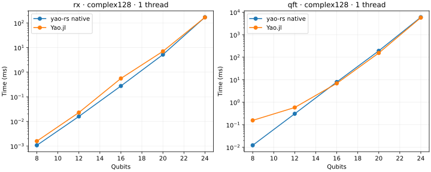
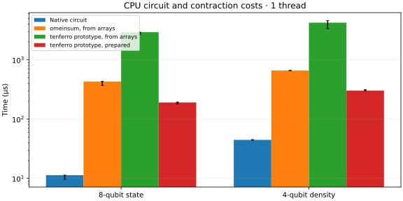
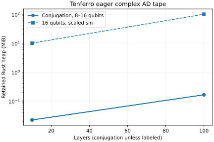

# CPU backend baseline

Generated from raw Criterion and BenchmarkTools samples in this directory.

Platform: Linux-5.15.0-190-generic-x86_64-with-glibc2.35. Precision: complex128. Independent runs: 3.

Measurement notes: Measurements were not pinned to exclusive CPU cores; inspect independent-run ranges. Shared dual-socket host with other user workloads. This is the original 48-case prototype/native baseline, not a measurement of the supported adapter.

Times below are medians of per-process medians. Rust/Julia includes state copying; tensor phases are reported separately. A Julia/Rust ratio greater than one means native Rust was faster.

| Threads | Case | Native Rust µs | Yao µs | Julia/Rust | Max output error |
| --- | --- | ---: | ---: | ---: | ---: |
| 1 | cry_low_far_12 | 7.154 | 18.197 | 2.54 | 2.89e-17 |
| 1 | cry_low_far_16 | 132.914 | 509.766 | 3.84 | 6.13e-18 |
| 1 | cry_low_far_20 | 2827.681 | 9472.047 | 3.35 | 6.23e-18 |
| 1 | cry_low_far_24 | 135889.763 | 153020.005 | 1.13 | 1.92e-17 |
| 1 | cry_low_far_8 | 0.533 | 7.109 | 13.33 | 1.39e-17 |
| 1 | fsim_adjacent_12 | 26.334 | 40.694 | 1.55 | 2.61e-17 |
| 1 | fsim_adjacent_16 | 431.512 | 718.745 | 1.67 | 5.82e-18 |
| 1 | fsim_adjacent_20 | 7747.917 | 12614.404 | 1.63 | 5.63e-18 |
| 1 | fsim_adjacent_24 | 199484.558 | 201042.120 | 1.01 | 1.71e-17 |
| 1 | fsim_adjacent_8 | 2.288 | 10.036 | 4.39 | 1.55e-17 |
| 1 | gradient100_12 | 46706.923 | 33088.787 | 0.71 | 8.88e-16 |
| 1 | gradient100_4 | 211.943 | 239.810 | 1.13 | 1.83e-15 |
| 1 | gradient100_8 | 2298.024 | 1815.651 | 0.79 | 1.03e-15 |
| 1 | gradient10_12 | 4694.990 | 3260.849 | 0.69 | 1.89e-15 |
| 1 | gradient10_4 | 21.642 | 25.201 | 1.16 | 1.67e-16 |
| 1 | gradient10_8 | 231.943 | 198.033 | 0.85 | 6.66e-16 |
| 1 | layers100_12 | 10121.969 | 4868.673 | 0.48 | 1.22e-16 |
| 1 | layers100_4 | 43.714 | 30.310 | 0.69 | 3.51e-16 |
| 1 | layers100_8 | 510.567 | 255.446 | 0.50 | 3.18e-16 |
| 1 | layers10_12 | 1013.313 | 492.503 | 0.49 | 1.25e-16 |
| 1 | layers10_4 | 4.407 | 6.880 | 1.56 | 8.33e-17 |
| 1 | layers10_8 | 51.228 | 26.434 | 0.52 | 7.85e-17 |
| 1 | noisy_10 | 1318293.941 | 585109.505 | 0.44 | 6.72e-18 |
| 1 | noisy_4 | 44.635 | 64.677 | 1.45 | 1.25e-16 |
| 1 | noisy_6 | 937.079 | 683.963 | 0.73 | 5.20e-17 |
| 1 | noisy_8 | 60024.318 | 15682.891 | 0.26 | 1.83e-17 |
| 1 | qft_12 | 306.465 | 582.048 | 1.90 | 3.51e-16 |
| 1 | qft_16 | 7887.591 | 6864.798 | 0.87 | 8.49e-16 |
| 1 | qft_20 | 192049.646 | 153943.225 | 0.80 | 5.55e-16 |
| 1 | qft_24 | 5968459.932 | 5724743.407 | 0.96 | 2.16e-14 |
| 1 | qft_8 | 12.166 | 155.823 | 12.81 | 6.87e-16 |
| 1 | rx_12 | 15.894 | 22.890 | 1.44 | 2.50e-17 |
| 1 | rx_16 | 274.216 | 555.404 | 2.03 | 5.64e-18 |
| 1 | rx_20 | 5167.243 | 7019.912 | 1.36 | 5.60e-18 |
| 1 | rx_24 | 170245.856 | 167937.155 | 0.99 | 1.70e-17 |
| 1 | rx_8 | 1.071 | 1.577 | 1.47 | 1.39e-17 |
| 1 | rz_12 | 6.913 | 14.414 | 2.08 | 2.64e-17 |
| 1 | rz_16 | 130.875 | 519.068 | 3.97 | 6.25e-18 |
| 1 | rz_20 | 2653.318 | 9852.808 | 3.71 | 5.60e-18 |
| 1 | rz_24 | 139490.510 | 158917.483 | 1.14 | 1.68e-17 |
| 1 | rz_8 | 0.488 | 2.682 | 5.50 | 1.43e-17 |
| 1 | swap_far_12 | 6.175 | 9.637 | 1.56 | 2.36e-17 |
| 1 | swap_far_16 | 118.958 | 474.283 | 3.99 | 4.94e-18 |
| 1 | swap_far_20 | 2557.297 | 9535.574 | 3.73 | 5.39e-18 |
| 1 | swap_far_24 | 141575.242 | 153765.797 | 1.09 | 1.68e-17 |
| 1 | swap_far_8 | 0.392 | 1.288 | 3.28 | 6.94e-18 |
| 1 | tensor_state_4 | 1.298 | 1.690 | 1.30 | 0.00e+00 |
| 1 | tensor_state_8 | 11.328 | 8.056 | 0.71 | 0.00e+00 |
| 4 | cry_low_far_12 | 7.153 | 28.590 | 4.00 | 2.89e-17 |
| 4 | cry_low_far_16 | 131.970 | 570.093 | 4.32 | 6.13e-18 |
| 4 | cry_low_far_20 | 2832.675 | 2650.680 | 0.94 | 6.23e-18 |
| 4 | cry_low_far_24 | 137066.190 | 150493.265 | 1.10 | 1.92e-17 |
| 4 | cry_low_far_8 | 0.459 | 7.723 | 16.83 | 1.39e-17 |
| 4 | fsim_adjacent_12 | 26.308 | 40.577 | 1.54 | 2.61e-17 |
| 4 | fsim_adjacent_16 | 431.393 | 769.588 | 1.78 | 5.82e-18 |
| 4 | fsim_adjacent_20 | 7874.888 | 8994.786 | 1.14 | 5.63e-18 |
| 4 | fsim_adjacent_24 | 200431.951 | 187814.731 | 0.94 | 1.71e-17 |
| 4 | fsim_adjacent_8 | 2.276 | 10.069 | 4.42 | 1.55e-17 |
| 4 | gradient100_12 | 46629.222 | 89822.920 | 1.93 | 8.88e-16 |
| 4 | gradient100_4 | 214.296 | 269.851 | 1.26 | 1.83e-15 |
| 4 | gradient100_8 | 2335.069 | 1848.567 | 0.79 | 1.03e-15 |
| 4 | gradient10_12 | 4684.520 | 11235.656 | 2.40 | 1.89e-15 |
| 4 | gradient10_4 | 21.861 | 28.655 | 1.31 | 1.67e-16 |
| 4 | gradient10_8 | 235.351 | 217.894 | 0.93 | 6.66e-16 |
| 4 | layers100_12 | 10107.923 | 16326.573 | 1.62 | 1.22e-16 |
| 4 | layers100_4 | 44.011 | 34.526 | 0.78 | 3.51e-16 |
| 4 | layers100_8 | 531.207 | 258.816 | 0.49 | 3.18e-16 |
| 4 | layers10_12 | 1011.360 | 2627.222 | 2.60 | 1.25e-16 |
| 4 | layers10_4 | 4.447 | 8.396 | 1.89 | 8.33e-17 |
| 4 | layers10_8 | 51.528 | 30.244 | 0.59 | 7.85e-17 |
| 4 | noisy_10 | 1332330.656 | 711748.293 | 0.53 | 6.72e-18 |
| 4 | noisy_4 | 44.541 | 64.298 | 1.44 | 1.25e-16 |
| 4 | noisy_6 | 933.668 | 2306.497 | 2.47 | 5.20e-17 |
| 4 | noisy_8 | 59856.736 | 26164.651 | 0.44 | 1.83e-17 |
| 4 | qft_12 | 306.467 | 1403.935 | 4.58 | 3.51e-16 |
| 4 | qft_16 | 7906.297 | 9881.648 | 1.25 | 8.49e-16 |
| 4 | qft_20 | 193795.511 | 90663.883 | 0.47 | 5.55e-16 |
| 4 | qft_24 | 6061096.128 | 2197331.057 | 0.36 | 2.16e-14 |
| 4 | qft_8 | 12.163 | 152.516 | 12.54 | 6.87e-16 |
| 4 | rx_12 | 15.903 | 29.453 | 1.85 | 2.50e-17 |
| 4 | rx_16 | 279.105 | 567.412 | 2.03 | 5.64e-18 |
| 4 | rx_20 | 5235.555 | 7192.251 | 1.37 | 5.60e-18 |
| 4 | rx_24 | 171633.478 | 161934.560 | 0.94 | 1.70e-17 |
| 4 | rx_8 | 1.070 | 3.611 | 3.38 | 1.39e-17 |
| 4 | rz_12 | 6.952 | 31.471 | 4.53 | 2.64e-17 |
| 4 | rz_16 | 132.281 | 525.593 | 3.97 | 6.25e-18 |
| 4 | rz_20 | 2714.934 | 6063.680 | 2.23 | 5.60e-18 |
| 4 | rz_24 | 141043.786 | 194683.986 | 1.38 | 1.68e-17 |
| 4 | rz_8 | 0.487 | 3.023 | 6.21 | 1.43e-17 |
| 4 | swap_far_12 | 6.175 | 33.332 | 5.40 | 2.36e-17 |
| 4 | swap_far_16 | 120.650 | 305.558 | 2.53 | 4.94e-18 |
| 4 | swap_far_20 | 2528.569 | 2817.867 | 1.11 | 5.39e-18 |
| 4 | swap_far_24 | 142201.370 | 147654.955 | 1.04 | 1.68e-17 |
| 4 | swap_far_8 | 0.337 | 1.585 | 4.71 | 6.94e-18 |
| 4 | tensor_state_4 | 1.300 | 2.000 | 1.54 | 0.00e+00 |
| 4 | tensor_state_8 | 11.344 | 8.361 | 0.74 | 0.00e+00 |

## Tensor and extension phases

Each row uses the named API boundary. `tenferro_from_arrays` includes conversion, automatic planning, execution and output conversion; `omeinsum` includes its conversion/planning/execution. `tenferro_warm` uses an already prepared plan. Those prototype rows use independent planning policies. Where present, `supported_planning` compiles an existing omeco greedy tree; `supported_warm` runs the supported CPU adapter including ndarray input/output adaptation; `supported_from_arrays` combines those two phases. `omeinsum_fixed_tree` executes the identical tree, including its internal preparation. These supported rows exclude tree search and CPU context creation.

| Threads | Case | Phase | Median µs | Range of run medians µs |
| --- | --- | --- | ---: | ---: |
| 1 | extension_12 | complex_ad | 1356.129 | 1341.869–1474.482 |
| 1 | extension_12 | composed | 38.783 | 38.243–39.597 |
| 1 | extension_12 | custom | 57.675 | 43.838–78.819 |
| 1 | extension_12 | custom_prepare | 128.315 | 122.678–191.349 |
| 1 | extension_16 | complex_ad | 5279.889 | 4830.377–5314.504 |
| 1 | extension_16 | composed | 232.248 | 225.237–235.801 |
| 1 | extension_16 | custom | 204.117 | 192.811–227.764 |
| 1 | extension_16 | custom_prepare | 136.109 | 123.863–164.490 |
| 1 | extension_8 | complex_ad | 877.902 | 760.358–948.470 |
| 1 | extension_8 | composed | 25.437 | 25.280–25.718 |
| 1 | extension_8 | custom | 81.152 | 65.704–81.822 |
| 1 | extension_8 | custom_prepare | 122.355 | 113.989–132.543 |
| 1 | noisy_4 | conversion | 35.849 | 35.486–36.098 |
| 1 | noisy_4 | omeinsum | 658.624 | 657.434–662.907 |
| 1 | noisy_4 | planning | 715.512 | 714.983–716.505 |
| 1 | noisy_4 | tenferro_from_arrays | 4219.429 | 3361.776–4579.545 |
| 1 | noisy_4 | tenferro_warm | 302.720 | 301.071–314.103 |
| 1 | noisy_6 | conversion | 75.065 | 74.008–76.077 |
| 1 | noisy_6 | omeinsum | 1474.606 | 1473.186–1484.558 |
| 1 | noisy_6 | planning | 1569.592 | 1568.925–1570.373 |
| 1 | noisy_6 | tenferro_from_arrays | 8140.295 | 7992.795–8726.767 |
| 1 | noisy_6 | tenferro_warm | 663.256 | 571.554–724.692 |
| 1 | tensor_state_4 | conversion | 13.670 | 13.610–13.781 |
| 1 | tensor_state_4 | omeinsum | 142.350 | 142.348–143.719 |
| 1 | tensor_state_4 | planning | 169.821 | 169.328–169.900 |
| 1 | tensor_state_4 | tenferro_from_arrays | 1079.496 | 837.886–1206.966 |
| 1 | tensor_state_4 | tenferro_warm | 79.503 | 79.460–97.563 |
| 1 | tensor_state_8 | conversion | 33.268 | 33.260–33.606 |
| 1 | tensor_state_8 | omeinsum | 429.636 | 369.585–431.882 |
| 1 | tensor_state_8 | planning | 511.822 | 510.709–512.502 |
| 1 | tensor_state_8 | tenferro_from_arrays | 2916.756 | 2696.081–2920.633 |
| 1 | tensor_state_8 | tenferro_warm | 190.577 | 180.675–194.127 |
| 4 | extension_12 | complex_ad | 1634.500 | 1595.723–1885.108 |
| 4 | extension_12 | composed | 64.131 | 49.655–65.459 |
| 4 | extension_12 | custom | 60.304 | 51.735–99.653 |
| 4 | extension_12 | custom_prepare | 323.587 | 314.215–344.164 |
| 4 | extension_16 | complex_ad | 6077.868 | 5520.743–6562.374 |
| 4 | extension_16 | composed | 242.369 | 234.719–247.343 |
| 4 | extension_16 | custom | 236.018 | 204.774–606.516 |
| 4 | extension_16 | custom_prepare | 314.416 | 312.696–395.874 |
| 4 | extension_8 | complex_ad | 787.001 | 464.374–946.429 |
| 4 | extension_8 | composed | 30.380 | 29.737–34.001 |
| 4 | extension_8 | custom | 51.632 | 47.404–93.509 |
| 4 | extension_8 | custom_prepare | 421.689 | 328.661–521.947 |
| 4 | noisy_4 | conversion | 35.705 | 35.563–41.773 |
| 4 | noisy_4 | omeinsum | 660.048 | 658.403–772.241 |
| 4 | noisy_4 | planning | 716.044 | 713.936–847.509 |
| 4 | noisy_4 | tenferro_from_arrays | 4260.052 | 2887.309–4556.192 |
| 4 | noisy_4 | tenferro_warm | 333.095 | 310.105–447.934 |
| 4 | noisy_6 | conversion | 75.180 | 74.474–76.567 |
| 4 | noisy_6 | omeinsum | 1482.078 | 1475.685–1492.191 |
| 4 | noisy_6 | planning | 1569.420 | 1561.009–1606.641 |
| 4 | noisy_6 | tenferro_from_arrays | 7921.116 | 7846.212–8742.951 |
| 4 | noisy_6 | tenferro_warm | 693.608 | 677.310–1143.720 |
| 4 | tensor_state_4 | conversion | 13.612 | 13.604–16.524 |
| 4 | tensor_state_4 | omeinsum | 142.708 | 142.415–145.544 |
| 4 | tensor_state_4 | planning | 170.247 | 168.835–200.588 |
| 4 | tensor_state_4 | tenferro_from_arrays | 1205.782 | 1005.604–1208.596 |
| 4 | tensor_state_4 | tenferro_warm | 85.851 | 74.212–93.861 |
| 4 | tensor_state_8 | conversion | 33.172 | 32.336–33.333 |
| 4 | tensor_state_8 | omeinsum | 428.499 | 368.084–429.638 |
| 4 | tensor_state_8 | planning | 511.010 | 510.338–511.676 |
| 4 | tensor_state_8 | tenferro_from_arrays | 2911.493 | 1123.570–2918.619 |
| 4 | tensor_state_8 | tenferro_warm | 200.054 | 191.376–305.737 |

Raw confidence intervals and samples are in `*-rust.json`; Julia trial samples are in `*-julia.json`. Memory logs report instrumented Rust allocations per phase and whole-process peak RSS separately. Timings from the allocation instrument are diagnostic only. See `metadata.json` and pinned manifests for reproducibility.

## Plots

