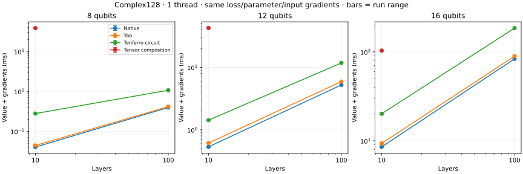
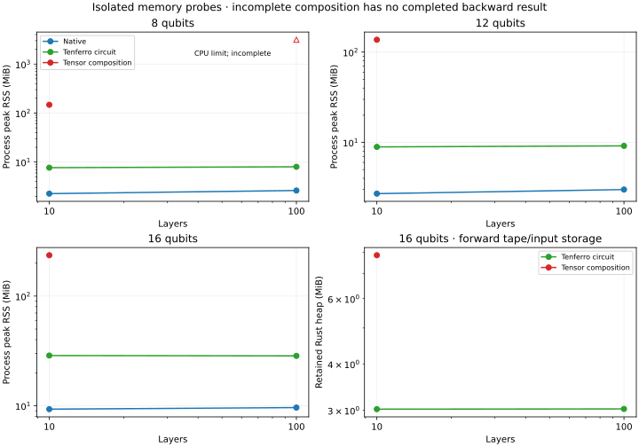

# CPU backend baseline

Generated from raw Criterion and BenchmarkTools samples in this directory.

Platform: macOS-26.6.2-arm64-arm-64bit. Precision: complex128. Independent runs: 3.

Times below are medians of per-process medians. Rust/Julia includes state copying; tensor phases are reported separately. A Julia/Rust ratio greater than one means native Rust was faster.

| Threads | Case | Native Rust µs | Yao µs | Julia/Rust | Max output error |
| --- | --- | ---: | ---: | ---: | ---: |
| 1 | custom_gradient_12_depth10 | 535.473 | 614.604 | 1.15 | 1.29e-14 |
| 1 | custom_gradient_12_depth100 | 5229.175 | 5913.562 | 1.13 | 5.11e-15 |
| 1 | custom_gradient_16_depth10 | 8541.741 | 9339.374 | 1.09 | 7.99e-15 |
| 1 | custom_gradient_16_depth100 | 83394.625 | 89390.708 | 1.07 | 2.20e-14 |
| 1 | custom_gradient_8_depth10 | 40.081 | 44.041 | 1.10 | 4.44e-16 |
| 1 | custom_gradient_8_depth100 | 393.761 | 415.084 | 1.05 | 5.00e-16 |
| 4 | custom_gradient_12_depth10 | 543.439 | 3601.271 | 6.63 | 1.29e-14 |
| 4 | custom_gradient_12_depth100 | 5315.494 | 63566.750 | 11.96 | 5.11e-15 |
| 4 | custom_gradient_16_depth10 | 8679.469 | 11952.271 | 1.38 | 7.99e-15 |
| 4 | custom_gradient_16_depth100 | 84744.667 | 124505.500 | 1.47 | 2.20e-14 |
| 4 | custom_gradient_8_depth10 | 41.007 | 43.354 | 1.06 | 4.44e-16 |
| 4 | custom_gradient_8_depth100 | 400.302 | 426.771 | 1.07 | 5.00e-16 |

## Tensor and extension phases

Each row uses the named API boundary. `tenferro_from_arrays` includes conversion, automatic planning, execution and output conversion; `omeinsum` includes its conversion/planning/execution. `tenferro_warm` uses an already prepared plan. Those prototype rows use independent planning policies. Where present, `supported_planning` compiles an existing omeco greedy tree; `supported_warm` runs the supported CPU adapter including ndarray input/output adaptation; `supported_from_arrays` combines those two phases. `omeinsum_fixed_tree` executes the identical tree, including its internal preparation. These supported rows exclude tree search and CPU context creation.

| Threads | Case | Phase | Median µs | Range of run medians µs |
| --- | --- | --- | ---: | ---: |
| 1 | custom_gradient_12_depth10 | tenferro_circuit_ad | 1428.977 | 1426.373–1437.633 |
| 1 | custom_gradient_12_depth10 | tenferro_composed_ad | 42636.771 | 42272.625–42830.812 |
| 1 | custom_gradient_12_depth100 | tenferro_circuit_ad | 11755.988 | 11683.694–11811.549 |
| 1 | custom_gradient_16_depth10 | tenferro_circuit_ad | 20120.479 | 19769.305–20207.250 |
| 1 | custom_gradient_16_depth10 | tenferro_composed_ad | 103422.167 | 102210.917–103673.188 |
| 1 | custom_gradient_16_depth100 | tenferro_circuit_ad | 185119.271 | 183336.771–186549.146 |
| 1 | custom_gradient_8_depth10 | tenferro_circuit_ad | 278.008 | 274.188–283.250 |
| 1 | custom_gradient_8_depth10 | tenferro_composed_ad | 38490.312 | 37813.573–39205.688 |
| 1 | custom_gradient_8_depth100 | tenferro_circuit_ad | 1068.520 | 1059.325–1071.274 |
| 1 | extension_12 | complex_ad | 90.738 | 90.199–92.575 |
| 1 | extension_12 | composed | 7.443 | 7.418–7.452 |
| 1 | extension_12 | custom | 12.414 | 12.143–12.579 |
| 1 | extension_12 | custom_prepare | 7.735 | 7.689–7.758 |
| 1 | extension_16 | complex_ad | 542.204 | 541.886–544.388 |
| 1 | extension_16 | composed | 79.289 | 78.774–79.358 |
| 1 | extension_16 | custom | 63.578 | 60.541–64.360 |
| 1 | extension_16 | custom_prepare | 7.830 | 7.656–7.903 |
| 1 | extension_8 | complex_ad | 61.489 | 59.700–61.690 |
| 1 | extension_8 | composed | 2.633 | 2.614–2.648 |
| 1 | extension_8 | custom | 8.600 | 8.500–8.658 |
| 1 | extension_8 | custom_prepare | 7.696 | 7.672–7.743 |
| 4 | custom_gradient_12_depth10 | tenferro_circuit_ad | 1749.706 | 1741.040–1753.885 |
| 4 | custom_gradient_12_depth10 | tenferro_composed_ad | 92487.063 | 91500.042–93333.083 |
| 4 | custom_gradient_12_depth100 | tenferro_circuit_ad | 11924.076 | 11778.970–11987.275 |
| 4 | custom_gradient_16_depth10 | tenferro_circuit_ad | 20040.431 | 19838.417–20143.938 |
| 4 | custom_gradient_16_depth10 | tenferro_composed_ad | 143667.979 | 143536.458–144252.478 |
| 4 | custom_gradient_16_depth100 | tenferro_circuit_ad | 187230.438 | 185787.229–187937.354 |
| 4 | custom_gradient_8_depth10 | tenferro_circuit_ad | 667.231 | 651.888–679.073 |
| 4 | custom_gradient_8_depth10 | tenferro_composed_ad | 86427.958 | 86346.208–87636.812 |
| 4 | custom_gradient_8_depth100 | tenferro_circuit_ad | 1394.485 | 1390.752–1396.037 |
| 4 | extension_12 | complex_ad | 223.772 | 222.495–228.681 |
| 4 | extension_12 | composed | 13.838 | 13.801–13.846 |
| 4 | extension_12 | custom | 23.615 | 23.552–24.600 |
| 4 | extension_12 | custom_prepare | 86.799 | 84.969–87.638 |
| 4 | extension_16 | complex_ad | 573.223 | 570.639–578.854 |
| 4 | extension_16 | composed | 88.050 | 87.374–88.544 |
| 4 | extension_16 | custom | 83.711 | 83.671–96.112 |
| 4 | extension_16 | custom_prepare | 86.248 | 84.977–86.764 |
| 4 | extension_8 | complex_ad | 185.715 | 181.299–194.713 |
| 4 | extension_8 | composed | 9.117 | 9.062–9.134 |
| 4 | extension_8 | custom | 18.676 | 18.216–20.231 |
| 4 | extension_8 | custom_prepare | 86.831 | 84.990–87.342 |

Raw confidence intervals and samples are in `*-rust.json`; Julia trial samples are in `*-julia.json`. Memory logs report instrumented Rust allocations per phase and whole-process peak RSS separately. Timings from the allocation instrument are diagnostic only. See `metadata.json` and pinned manifests for reproducibility.

## Circuit AD costs and memory

Every timing returns squared state-distance loss, real parameter gradients, and the complex input-state gradient. Native uses one forward pass plus its reversible sweep; the tenferro rows include input copies, eager graph construction, loss, backward and output collection, with context construction excluded. The ordinary-composition fixture uses 4×4 tensor matrices on the last two sites of the full asymmetric input; no gate fusion is applied.

Repeated ordinary-composition timings cover 10 layers. The 100-layer cases are qualified separately with a 30-CPU-second cap, starting at 8 qubits; larger cases are skipped if that representative run fails to complete. The memory table records each outcome. Missing timings are not speedups. The circuit primitive and native/Yao baselines cover all six cases.

| Backend | Qubits | Layers | Status | Forward retained MiB | Backward peak extra MiB | Process peak RSS MiB |
| --- | ---: | ---: | --- | ---: | ---: | ---: |
| native | 8 | 10 | complete | — | 0.028 | 2.266 |
| custom | 8 | 10 | complete | 0.033 | 0.245 | 7.672 |
| composed | 8 | 10 | complete | 0.866 | 74.953 | 147.594 |
| native | 8 | 100 | complete | — | 0.101 | 2.625 |
| custom | 8 | 100 | complete | 0.037 | 0.317 | 8.000 |
| composed | 8 | 100 | cpu_limit | 8.325 | — | 3138.703 |
| native | 12 | 10 | complete | — | 0.321 | 2.703 |
| custom | 12 | 10 | complete | 0.209 | 1.182 | 8.906 |
| composed | 12 | 10 | complete | 5.042 | 68.551 | 137.156 |
| native | 12 | 100 | complete | — | 0.394 | 3.000 |
| custom | 12 | 100 | complete | 0.213 | 1.196 | 9.141 |
| composed | 12 | 100 | not_run_after_representative_limit | — | — | — |
| native | 16 | 10 | complete | — | 5.008 | 9.312 |
| custom | 16 | 10 | complete | 3.022 | 16.182 | 28.703 |
| composed | 16 | 10 | complete | 7.855 | 159.621 | 235.641 |
| native | 16 | 100 | complete | — | 5.082 | 9.625 |
| custom | 16 | 100 | complete | 3.026 | 15.258 | 28.500 |
| composed | 16 | 100 | not_run_after_representative_limit | — | — | — |

Native peak heap covers combined value/gradient execution. Other backward peaks are additional to retained forward storage. RSS includes startup/provider allocations and allocator retention; a terminated run's RSS is only its observed peak before termination. Rust heap counts exclude native-provider allocations. Allocation-instrumented times are diagnostic only.
