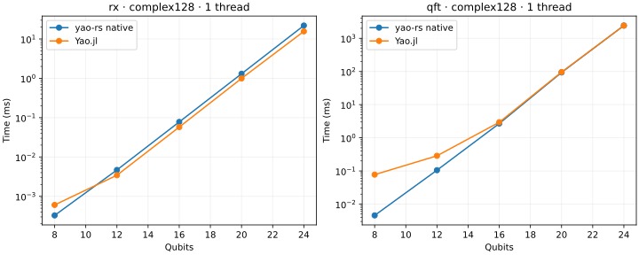
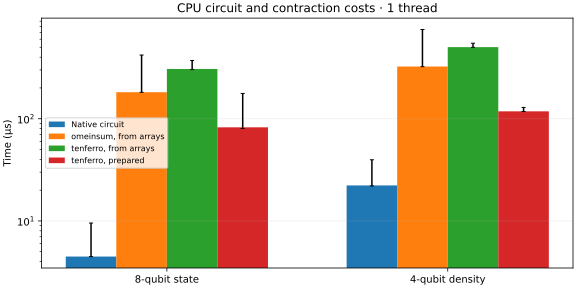
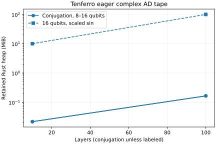

# CPU backend baseline

Generated from raw Criterion and BenchmarkTools samples in this directory.

Platform: macOS-26.6.2-arm64-arm-64bit-Mach-O. Precision: complex128. Independent runs: 3.

Times below are medians of per-process medians. Rust/Julia includes state copying; tensor phases are reported separately. A Julia/Rust ratio greater than one means native Rust was faster.

| Threads | Case | Native Rust µs | Yao µs | Julia/Rust | Max output error |
| --- | --- | ---: | ---: | ---: | ---: |
| 1 | cry_low_far_12 | 2.526 | 5.958 | 2.36 | 6.77e-17 |
| 1 | cry_low_far_16 | 45.507 | 40.480 | 0.89 | 2.45e-18 |
| 1 | cry_low_far_20 | 771.334 | 736.438 | 0.95 | 3.65e-17 |
| 1 | cry_low_far_24 | 13649.850 | 11597.041 | 0.85 | 1.47e-17 |
| 1 | cry_low_far_8 | 0.204 | 3.667 | 18.00 | 1.55e-17 |
| 1 | fsim_adjacent_12 | 8.026 | 10.625 | 1.32 | 6.07e-17 |
| 1 | fsim_adjacent_16 | 127.929 | 94.125 | 0.74 | 2.64e-18 |
| 1 | fsim_adjacent_20 | 2144.766 | 1592.375 | 0.74 | 3.25e-17 |
| 1 | fsim_adjacent_24 | 34947.156 | 25395.312 | 0.73 | 1.31e-17 |
| 1 | fsim_adjacent_8 | 0.717 | 4.771 | 6.65 | 1.55e-17 |
| 1 | gradient100_12 | 23308.681 | 23656.396 | 1.01 | 7.22e-16 |
| 1 | gradient100_4 | 112.581 | 93.499 | 0.83 | 1.80e-15 |
| 1 | gradient100_8 | 1112.383 | 1479.042 | 1.33 | 1.01e-15 |
| 1 | gradient10_12 | 2351.981 | 2343.146 | 1.00 | 2.89e-15 |
| 1 | gradient10_4 | 11.445 | 10.354 | 0.90 | 1.67e-16 |
| 1 | gradient10_8 | 112.168 | 159.021 | 1.42 | 6.66e-16 |
| 1 | layers100_12 | 5091.976 | 1995.104 | 0.39 | 1.96e-16 |
| 1 | layers100_4 | 19.075 | 15.500 | 0.81 | 3.51e-16 |
| 1 | layers100_8 | 236.631 | 115.667 | 0.49 | 3.20e-16 |
| 1 | layers10_12 | 509.169 | 203.542 | 0.40 | 2.08e-16 |
| 1 | layers10_4 | 1.964 | 1.750 | 0.89 | 8.33e-17 |
| 1 | layers10_8 | 23.655 | 12.166 | 0.51 | 6.21e-17 |
| 1 | noisy_10 | 198415.750 | 155448.375 | 0.78 | 6.72e-18 |
| 1 | noisy_4 | 22.241 | 32.062 | 1.44 | 1.25e-16 |
| 1 | noisy_6 | 388.382 | 360.896 | 0.93 | 5.20e-17 |
| 1 | noisy_8 | 7936.442 | 7243.500 | 0.91 | 1.83e-17 |
| 1 | qft_12 | 105.332 | 285.958 | 2.71 | 5.55e-16 |
| 1 | qft_16 | 2694.393 | 2942.604 | 1.09 | 1.14e-15 |
| 1 | qft_20 | 93398.520 | 95905.062 | 1.03 | 1.06e-14 |
| 1 | qft_24 | 2427361.271 | 2415332.583 | 1.00 | 1.94e-14 |
| 1 | qft_8 | 4.561 | 77.458 | 16.98 | 6.87e-16 |
| 1 | rx_12 | 4.681 | 3.437 | 0.73 | 6.16e-17 |
| 1 | rx_16 | 77.792 | 57.583 | 0.74 | 2.45e-18 |
| 1 | rx_20 | 1304.125 | 994.000 | 0.76 | 3.25e-17 |
| 1 | rx_24 | 21947.820 | 15603.938 | 0.71 | 1.31e-17 |
| 1 | rx_8 | 0.327 | 0.604 | 1.85 | 1.39e-17 |
| 1 | rz_12 | 2.426 | 4.333 | 1.79 | 6.16e-17 |
| 1 | rz_16 | 41.999 | 66.938 | 1.59 | 2.17e-18 |
| 1 | rz_20 | 739.415 | 1199.292 | 1.62 | 3.21e-17 |
| 1 | rz_24 | 12726.710 | 18930.395 | 1.49 | 1.29e-17 |
| 1 | rz_8 | 0.180 | 0.604 | 3.35 | 1.55e-17 |
| 1 | swap_far_12 | 2.429 | 3.209 | 1.32 | 5.91e-17 |
| 1 | swap_far_16 | 43.009 | 48.583 | 1.13 | 1.84e-18 |
| 1 | swap_far_20 | 755.791 | 948.479 | 1.25 | 3.19e-17 |
| 1 | swap_far_24 | 14014.490 | 15102.479 | 1.08 | 1.29e-17 |
| 1 | swap_far_8 | 0.179 | 0.541 | 3.02 | 6.94e-18 |
| 1 | tensor_state_4 | 0.352 | 0.396 | 1.12 | 0.00e+00 |
| 1 | tensor_state_8 | 4.482 | 2.750 | 0.61 | 0.00e+00 |
| 4 | cry_low_far_12 | 2.522 | 24.396 | 9.67 | 6.77e-17 |
| 4 | cry_low_far_16 | 46.360 | 72.854 | 1.57 | 2.45e-18 |
| 4 | cry_low_far_20 | 766.449 | 610.333 | 0.80 | 3.65e-17 |
| 4 | cry_low_far_24 | 13680.552 | 9159.833 | 0.67 | 1.47e-17 |
| 4 | cry_low_far_8 | 0.199 | 3.542 | 17.79 | 1.55e-17 |
| 4 | fsim_adjacent_12 | 8.000 | 26.146 | 3.27 | 6.07e-17 |
| 4 | fsim_adjacent_16 | 128.795 | 91.229 | 0.71 | 2.64e-18 |
| 4 | fsim_adjacent_20 | 2130.514 | 929.625 | 0.44 | 3.25e-17 |
| 4 | fsim_adjacent_24 | 34849.750 | 12950.209 | 0.37 | 1.31e-17 |
| 4 | fsim_adjacent_8 | 0.722 | 4.729 | 6.55 | 1.55e-17 |
| 4 | gradient100_12 | 23309.736 | 288999.084 | 12.40 | 7.22e-16 |
| 4 | gradient100_4 | 112.640 | 96.562 | 0.86 | 1.80e-15 |
| 4 | gradient100_8 | 1108.893 | 1418.833 | 1.28 | 1.01e-15 |
| 4 | gradient10_12 | 2341.439 | 27518.562 | 11.75 | 2.89e-15 |
| 4 | gradient10_4 | 11.515 | 10.250 | 0.89 | 1.67e-16 |
| 4 | gradient10_8 | 111.797 | 154.772 | 1.38 | 6.66e-16 |
| 4 | layers100_12 | 5066.232 | 48961.896 | 9.66 | 1.96e-16 |
| 4 | layers100_4 | 19.116 | 15.667 | 0.82 | 3.51e-16 |
| 4 | layers100_8 | 236.284 | 115.646 | 0.49 | 3.20e-16 |
| 4 | layers10_12 | 508.874 | 4064.812 | 7.99 | 2.08e-16 |
| 4 | layers10_4 | 1.943 | 1.688 | 0.87 | 8.33e-17 |
| 4 | layers10_8 | 23.658 | 12.062 | 0.51 | 6.21e-17 |
| 4 | noisy_10 | 196748.750 | 136163.771 | 0.69 | 6.72e-18 |
| 4 | noisy_4 | 22.110 | 37.125 | 1.68 | 1.25e-16 |
| 4 | noisy_6 | 386.800 | 1916.647 | 4.96 | 5.20e-17 |
| 4 | noisy_8 | 7922.038 | 10981.041 | 1.39 | 1.83e-17 |
| 4 | qft_12 | 105.213 | 1604.958 | 15.25 | 5.55e-16 |
| 4 | qft_16 | 2686.081 | 4506.417 | 1.68 | 1.14e-15 |
| 4 | qft_20 | 90761.583 | 39682.625 | 0.44 | 1.06e-14 |
| 4 | qft_24 | 2403893.812 | 1271881.791 | 0.53 | 1.94e-14 |
| 4 | qft_8 | 4.555 | 76.624 | 16.82 | 6.87e-16 |
| 4 | rx_12 | 4.639 | 21.979 | 4.74 | 6.16e-17 |
| 4 | rx_16 | 77.967 | 124.188 | 1.59 | 2.45e-18 |
| 4 | rx_20 | 1303.855 | 830.730 | 0.64 | 3.25e-17 |
| 4 | rx_24 | 21769.847 | 12123.375 | 0.56 | 1.31e-17 |
| 4 | rx_8 | 0.325 | 0.500 | 1.54 | 1.39e-17 |
| 4 | rz_12 | 2.400 | 20.104 | 8.38 | 6.16e-17 |
| 4 | rz_16 | 42.280 | 105.959 | 2.51 | 2.17e-18 |
| 4 | rz_20 | 741.464 | 1371.812 | 1.85 | 3.21e-17 |
| 4 | rz_24 | 12695.954 | 21127.187 | 1.66 | 1.29e-17 |
| 4 | rz_8 | 0.180 | 0.646 | 3.59 | 1.55e-17 |
| 4 | swap_far_12 | 2.386 | 21.895 | 9.18 | 5.91e-17 |
| 4 | swap_far_16 | 42.901 | 65.125 | 1.52 | 1.84e-18 |
| 4 | swap_far_20 | 761.146 | 735.104 | 0.97 | 3.19e-17 |
| 4 | swap_far_24 | 13989.612 | 11537.188 | 0.82 | 1.29e-17 |
| 4 | swap_far_8 | 0.177 | 0.542 | 3.06 | 6.94e-18 |
| 4 | tensor_state_4 | 0.347 | 0.354 | 1.02 | 0.00e+00 |
| 4 | tensor_state_8 | 4.467 | 2.813 | 0.63 | 0.00e+00 |

## Tensor and extension phases

Each row uses the named API boundary. `tenferro_from_arrays` includes conversion, automatic planning, execution and output conversion; `omeinsum` includes its conversion/planning/execution. `tenferro_warm` uses an already prepared plan. These are independent planning policies, not a fixed-tree comparison.

| Threads | Case | Phase | Median µs | Range of run medians µs |
| --- | --- | --- | ---: | ---: |
| 1 | extension_12 | complex_ad | 128.994 | 94.985–179.324 |
| 1 | extension_12 | composed | 7.702 | 7.548–9.709 |
| 1 | extension_12 | custom | 13.011 | 12.972–14.909 |
| 1 | extension_12 | custom_prepare | 8.137 | 8.024–11.266 |
| 1 | extension_16 | complex_ad | 566.362 | 560.021–574.973 |
| 1 | extension_16 | composed | 91.681 | 81.080–110.019 |
| 1 | extension_16 | custom | 66.398 | 64.586–66.877 |
| 1 | extension_16 | custom_prepare | 8.212 | 8.124–8.600 |
| 1 | extension_8 | complex_ad | 65.523 | 63.125–67.762 |
| 1 | extension_8 | composed | 2.678 | 2.653–2.738 |
| 1 | extension_8 | custom | 9.077 | 8.885–9.148 |
| 1 | extension_8 | custom_prepare | 8.175 | 8.161–8.196 |
| 1 | noisy_4 | conversion | 22.863 | 22.812–50.836 |
| 1 | noisy_4 | omeinsum | 323.882 | 322.617–746.327 |
| 1 | noisy_4 | planning | 344.213 | 343.432–524.766 |
| 1 | noisy_4 | tenferro_from_arrays | 501.462 | 499.278–547.315 |
| 1 | noisy_4 | tenferro_warm | 118.041 | 117.690–128.881 |
| 1 | noisy_6 | conversion | 34.358 | 34.168–35.123 |
| 1 | noisy_6 | omeinsum | 542.473 | 541.376–557.666 |
| 1 | noisy_6 | planning | 586.309 | 585.997–602.835 |
| 1 | noisy_6 | tenferro_from_arrays | 901.406 | 868.606–1940.119 |
| 1 | noisy_6 | tenferro_warm | 236.357 | 219.648–255.958 |
| 1 | tensor_state_4 | conversion | 8.745 | 8.719–16.772 |
| 1 | tensor_state_4 | omeinsum | 72.502 | 72.467–179.028 |
| 1 | tensor_state_4 | planning | 80.570 | 80.406–188.395 |
| 1 | tensor_state_4 | tenferro_from_arrays | 125.578 | 123.150–240.851 |
| 1 | tensor_state_4 | tenferro_warm | 32.364 | 28.051–55.239 |
| 1 | tensor_state_8 | conversion | 18.287 | 18.270–35.342 |
| 1 | tensor_state_8 | omeinsum | 181.669 | 181.259–419.750 |
| 1 | tensor_state_8 | planning | 204.941 | 204.297–454.886 |
| 1 | tensor_state_8 | tenferro_from_arrays | 306.617 | 302.567–371.151 |
| 1 | tensor_state_8 | tenferro_warm | 82.360 | 80.152–176.580 |
| 4 | extension_12 | complex_ad | 219.661 | 217.994–221.577 |
| 4 | extension_12 | composed | 14.407 | 13.649–18.403 |
| 4 | extension_12 | custom | 25.236 | 24.816–25.762 |
| 4 | extension_12 | custom_prepare | 87.118 | 87.025–87.799 |
| 4 | extension_16 | complex_ad | 569.994 | 569.430–576.367 |
| 4 | extension_16 | composed | 89.768 | 89.655–90.052 |
| 4 | extension_16 | custom | 83.723 | 82.841–84.112 |
| 4 | extension_16 | custom_prepare | 86.411 | 86.360–87.503 |
| 4 | extension_8 | complex_ad | 183.542 | 182.932–187.843 |
| 4 | extension_8 | composed | 8.961 | 8.947–9.012 |
| 4 | extension_8 | custom | 20.192 | 19.925–20.907 |
| 4 | extension_8 | custom_prepare | 87.910 | 87.273–106.429 |
| 4 | noisy_4 | conversion | 22.804 | 22.591–22.909 |
| 4 | noisy_4 | omeinsum | 321.649 | 321.502–323.916 |
| 4 | noisy_4 | planning | 344.827 | 343.200–345.422 |
| 4 | noisy_4 | tenferro_from_arrays | 513.876 | 513.861–517.909 |
| 4 | noisy_4 | tenferro_warm | 132.248 | 120.923–140.643 |
| 4 | noisy_6 | conversion | 34.131 | 34.061–34.200 |
| 4 | noisy_6 | omeinsum | 540.160 | 540.007–540.410 |
| 4 | noisy_6 | planning | 587.238 | 586.207–587.836 |
| 4 | noisy_6 | tenferro_from_arrays | 890.328 | 886.708–891.198 |
| 4 | noisy_6 | tenferro_warm | 243.555 | 233.510–246.004 |
| 4 | tensor_state_4 | conversion | 8.716 | 8.683–8.751 |
| 4 | tensor_state_4 | omeinsum | 72.051 | 71.652–72.105 |
| 4 | tensor_state_4 | planning | 80.396 | 80.064–80.593 |
| 4 | tensor_state_4 | tenferro_from_arrays | 134.973 | 134.588–135.966 |
| 4 | tensor_state_4 | tenferro_warm | 41.623 | 36.925–46.025 |
| 4 | tensor_state_8 | conversion | 18.414 | 18.370–22.960 |
| 4 | tensor_state_8 | omeinsum | 180.079 | 178.416–254.918 |
| 4 | tensor_state_8 | planning | 203.605 | 203.316–260.668 |
| 4 | tensor_state_8 | tenferro_from_arrays | 317.859 | 316.940–384.839 |
| 4 | tensor_state_8 | tenferro_warm | 84.536 | 83.896–104.005 |

Raw confidence intervals and samples are in `*-rust.json`; Julia trial samples are in `*-julia.json`. Memory logs report instrumented Rust allocations per phase and whole-process peak RSS separately. Timings from the allocation instrument are diagnostic only. See `metadata.json` and pinned manifests for reproducibility.

## Plots

