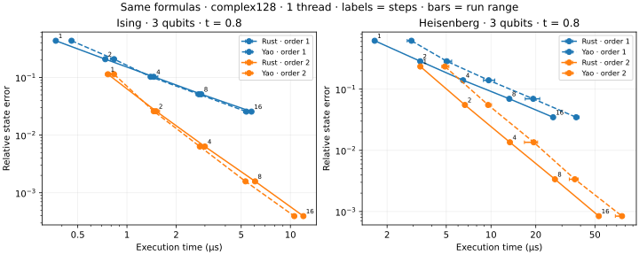

# CPU backend baseline

Generated from raw Criterion and BenchmarkTools samples in this directory.

Platform: macOS-26.6.2-arm64-arm-64bit. Precision: complex128. Independent runs: 3.

Measurement notes: Timing runs used committed sources at 2c97de3f7dcb63fca12a06415222dcfeb9909280; three independent runs each at one and four threads, with no task-owned build/test jobs running during timing. Native timings apply the lowered Circuit using the existing register kernels. Physical binding/model construction is outside execution timing. Product-formula error is reported separately from cross-language state agreement. Memory diagnostics are separate allocation-instrumented processes, added after timing. Their source revision is recorded separately; their diagnostic times are not used in performance ratios.

Times below are medians of per-process medians. Rust/Julia includes state copying; tensor phases are reported separately. A Julia/Rust ratio greater than one means native Rust was faster.

| Threads | Case | Native Rust µs | Yao µs | Julia/Rust | Max output error |
| --- | --- | ---: | ---: | ---: | ---: |
| 1 | evolution_heisenberg_order1_steps1 | 1.650 | 2.917 | 1.77 | 2.05e-15 |
| 1 | evolution_heisenberg_order1_steps16 | 26.165 | 37.396 | 1.43 | 2.99e-14 |
| 1 | evolution_heisenberg_order1_steps2 | 3.341 | 5.042 | 1.51 | 3.82e-15 |
| 1 | evolution_heisenberg_order1_steps4 | 6.489 | 9.646 | 1.49 | 7.57e-15 |
| 1 | evolution_heisenberg_order1_steps8 | 13.280 | 19.229 | 1.45 | 1.55e-14 |
| 1 | evolution_heisenberg_order2_steps1 | 3.345 | 4.896 | 1.46 | 3.75e-15 |
| 1 | evolution_heisenberg_order2_steps16 | 53.089 | 76.020 | 1.43 | 5.70e-14 |
| 1 | evolution_heisenberg_order2_steps2 | 6.676 | 9.563 | 1.43 | 7.31e-15 |
| 1 | evolution_heisenberg_order2_steps4 | 13.396 | 19.375 | 1.45 | 1.50e-14 |
| 1 | evolution_heisenberg_order2_steps8 | 26.915 | 36.646 | 1.36 | 2.97e-14 |
| 1 | evolution_ising_order1_steps1 | 0.367 | 0.458 | 1.25 | 4.71e-16 |
| 1 | evolution_ising_order1_steps16 | 5.780 | 5.375 | 0.93 | 7.68e-15 |
| 1 | evolution_ising_order1_steps2 | 0.737 | 0.834 | 1.13 | 9.93e-16 |
| 1 | evolution_ising_order1_steps4 | 1.458 | 1.396 | 0.96 | 2.04e-15 |
| 1 | evolution_ising_order1_steps8 | 2.849 | 2.750 | 0.97 | 4.22e-15 |
| 1 | evolution_ising_order2_steps1 | 0.765 | 0.834 | 1.09 | 1.16e-15 |
| 1 | evolution_ising_order2_steps16 | 12.008 | 10.562 | 0.88 | 1.65e-14 |
| 1 | evolution_ising_order2_steps2 | 1.509 | 1.458 | 0.97 | 1.97e-15 |
| 1 | evolution_ising_order2_steps4 | 2.998 | 2.792 | 0.93 | 4.37e-15 |
| 1 | evolution_ising_order2_steps8 | 6.082 | 5.312 | 0.87 | 7.86e-15 |
| 1 | evolution_tensor_heisenberg | 6.710 | 9.229 | 1.38 | 1.41e-14 |
| 1 | evolution_tensor_ising | 1.518 | 1.500 | 0.99 | 3.13e-15 |
| 4 | evolution_heisenberg_order1_steps1 | 1.696 | 2.917 | 1.72 | 2.05e-15 |
| 4 | evolution_heisenberg_order1_steps16 | 27.054 | 40.084 | 1.48 | 2.99e-14 |
| 4 | evolution_heisenberg_order1_steps2 | 3.380 | 5.083 | 1.50 | 3.82e-15 |
| 4 | evolution_heisenberg_order1_steps4 | 6.677 | 9.375 | 1.40 | 7.57e-15 |
| 4 | evolution_heisenberg_order1_steps8 | 13.234 | 19.688 | 1.49 | 1.55e-14 |
| 4 | evolution_heisenberg_order2_steps1 | 3.394 | 5.229 | 1.54 | 3.75e-15 |
| 4 | evolution_heisenberg_order2_steps16 | 54.352 | 75.021 | 1.38 | 5.70e-14 |
| 4 | evolution_heisenberg_order2_steps2 | 6.743 | 9.791 | 1.45 | 7.31e-15 |
| 4 | evolution_heisenberg_order2_steps4 | 13.642 | 19.625 | 1.44 | 1.50e-14 |
| 4 | evolution_heisenberg_order2_steps8 | 27.147 | 38.209 | 1.41 | 2.97e-14 |
| 4 | evolution_ising_order1_steps1 | 0.377 | 0.500 | 1.33 | 4.71e-16 |
| 4 | evolution_ising_order1_steps16 | 5.778 | 5.146 | 0.89 | 7.68e-15 |
| 4 | evolution_ising_order1_steps2 | 0.735 | 0.792 | 1.08 | 9.93e-16 |
| 4 | evolution_ising_order1_steps4 | 1.461 | 1.480 | 1.01 | 2.04e-15 |
| 4 | evolution_ising_order1_steps8 | 2.905 | 2.709 | 0.93 | 4.22e-15 |
| 4 | evolution_ising_order2_steps1 | 0.770 | 0.792 | 1.03 | 1.16e-15 |
| 4 | evolution_ising_order2_steps16 | 12.102 | 10.875 | 0.90 | 1.65e-14 |
| 4 | evolution_ising_order2_steps2 | 1.534 | 1.480 | 0.96 | 1.97e-15 |
| 4 | evolution_ising_order2_steps4 | 3.046 | 2.750 | 0.90 | 4.37e-15 |
| 4 | evolution_ising_order2_steps8 | 6.030 | 5.500 | 0.91 | 7.86e-15 |
| 4 | evolution_tensor_heisenberg | 6.822 | 9.979 | 1.46 | 1.41e-14 |
| 4 | evolution_tensor_ising | 1.532 | 1.562 | 1.02 | 3.13e-15 |

## Tensor and extension phases

Each row uses the named API boundary. `tenferro_from_arrays` includes conversion, automatic planning, execution and output conversion; `omeinsum` includes its conversion/planning/execution. `tenferro_warm` uses an already prepared plan. Those prototype rows use independent planning policies. Where present, `supported_planning` compiles an existing omeco greedy tree; `supported_warm` runs the supported CPU adapter including ndarray input/output adaptation; `supported_from_arrays` combines those two phases. `omeinsum_fixed_tree` executes the identical tree, including its internal preparation. These supported rows exclude tree search and CPU context creation.

| Threads | Case | Phase | Median µs | Range of run medians µs |
| --- | --- | --- | ---: | ---: |
| 1 | evolution_tensor_heisenberg | conversion | 151.640 | 150.077–153.628 |
| 1 | evolution_tensor_heisenberg | omeinsum | 91620.062 | 90785.625–92077.271 |
| 1 | evolution_tensor_heisenberg | omeinsum_fixed_tree | 700.462 | 698.171–701.850 |
| 1 | evolution_tensor_heisenberg | planning | 92965.042 | 91611.500–93479.000 |
| 1 | evolution_tensor_heisenberg | supported_from_arrays | 8539.399 | 8493.377–8602.513 |
| 1 | evolution_tensor_heisenberg | supported_planning | 4926.620 | 4835.342–4937.038 |
| 1 | evolution_tensor_heisenberg | supported_warm | 3666.768 | 3618.053–3699.749 |
| 1 | evolution_tensor_heisenberg | tenferro_from_arrays | 93985.312 | 93581.833–94077.230 |
| 1 | evolution_tensor_heisenberg | tenferro_warm | 921.787 | 919.274–924.575 |
| 1 | evolution_tensor_ising | conversion | 35.437 | 34.484–35.916 |
| 1 | evolution_tensor_ising | omeinsum | 1125.413 | 1103.537–1125.921 |
| 1 | evolution_tensor_ising | omeinsum_fixed_tree | 153.250 | 151.100–153.631 |
| 1 | evolution_tensor_ising | planning | 1176.928 | 1169.320–1187.606 |
| 1 | evolution_tensor_ising | supported_from_arrays | 981.213 | 957.409–990.388 |
| 1 | evolution_tensor_ising | supported_planning | 354.498 | 349.087–356.361 |
| 1 | evolution_tensor_ising | supported_warm | 615.951 | 611.880–616.134 |
| 1 | evolution_tensor_ising | tenferro_from_arrays | 1403.440 | 1398.241–1423.048 |
| 1 | evolution_tensor_ising | tenferro_warm | 185.031 | 181.815–187.720 |
| 1 | extension_12 | complex_ad | 90.936 | 90.848–91.389 |
| 1 | extension_12 | composed | 7.465 | 7.356–7.483 |
| 1 | extension_12 | custom | 12.447 | 12.419–12.592 |
| 1 | extension_12 | custom_prepare | 7.825 | 7.736–7.909 |
| 1 | extension_16 | complex_ad | 543.771 | 539.544–544.844 |
| 1 | extension_16 | composed | 79.254 | 78.999–79.491 |
| 1 | extension_16 | custom | 64.044 | 63.261–65.469 |
| 1 | extension_16 | custom_prepare | 7.854 | 7.745–8.006 |
| 1 | extension_8 | complex_ad | 60.969 | 60.503–62.268 |
| 1 | extension_8 | composed | 2.565 | 2.564–2.587 |
| 1 | extension_8 | custom | 8.576 | 8.534–8.827 |
| 1 | extension_8 | custom_prepare | 7.746 | 7.734–7.932 |
| 4 | evolution_tensor_heisenberg | conversion | 152.209 | 152.179–155.462 |
| 4 | evolution_tensor_heisenberg | omeinsum | 93608.208 | 93071.292–93732.708 |
| 4 | evolution_tensor_heisenberg | omeinsum_fixed_tree | 710.224 | 699.371–711.174 |
| 4 | evolution_tensor_heisenberg | planning | 93835.354 | 93604.354–95402.396 |
| 4 | evolution_tensor_heisenberg | supported_from_arrays | 11555.633 | 11546.142–11560.549 |
| 4 | evolution_tensor_heisenberg | supported_planning | 4913.565 | 4894.338–4921.404 |
| 4 | evolution_tensor_heisenberg | supported_warm | 6641.704 | 6608.495–6646.167 |
| 4 | evolution_tensor_heisenberg | tenferro_from_arrays | 96150.272 | 94627.896–96752.333 |
| 4 | evolution_tensor_heisenberg | tenferro_warm | 911.103 | 906.480–912.029 |
| 4 | evolution_tensor_ising | conversion | 35.530 | 35.466–35.814 |
| 4 | evolution_tensor_ising | omeinsum | 1137.319 | 1128.588–1143.431 |
| 4 | evolution_tensor_ising | omeinsum_fixed_tree | 157.510 | 155.267–157.840 |
| 4 | evolution_tensor_ising | planning | 1200.783 | 1193.491–1219.268 |
| 4 | evolution_tensor_ising | supported_from_arrays | 1456.692 | 1439.473–1461.798 |
| 4 | evolution_tensor_ising | supported_planning | 359.723 | 358.801–360.290 |
| 4 | evolution_tensor_ising | supported_warm | 1134.215 | 1124.458–1135.443 |
| 4 | evolution_tensor_ising | tenferro_from_arrays | 1448.895 | 1436.084–1456.541 |
| 4 | evolution_tensor_ising | tenferro_warm | 194.267 | 193.478–197.534 |
| 4 | extension_12 | complex_ad | 221.243 | 220.348–222.572 |
| 4 | extension_12 | composed | 13.838 | 13.796–13.936 |
| 4 | extension_12 | custom | 23.515 | 23.399–23.519 |
| 4 | extension_12 | custom_prepare | 83.889 | 83.717–85.327 |
| 4 | extension_16 | complex_ad | 571.476 | 569.371–582.687 |
| 4 | extension_16 | composed | 87.533 | 87.498–87.981 |
| 4 | extension_16 | custom | 83.388 | 80.930–83.846 |
| 4 | extension_16 | custom_prepare | 84.144 | 83.590–85.570 |
| 4 | extension_8 | complex_ad | 183.121 | 181.907–183.496 |
| 4 | extension_8 | composed | 9.102 | 9.000–9.111 |
| 4 | extension_8 | custom | 18.634 | 18.602–18.694 |
| 4 | extension_8 | custom_prepare | 83.857 | 83.838–85.900 |

Raw confidence intervals and samples are in `*-rust.json`; Julia trial samples are in `*-julia.json`. Memory logs report instrumented Rust allocations per phase and whole-process peak RSS separately. Timings from the allocation instrument are diagnostic only. See `metadata.json` and pinned manifests for reproducibility.

## Product-formula accuracy

Relative state error is measured against a dense exponential of the Hamiltonian built independently with Yao Pauli blocks. Timings compare the same lowered product formula on the same input; they exclude Hamiltonian/circuit construction and do not compare against adaptive Krylov execution.

| Threads | Case | Native µs | Yao µs | Native relative error | Yao relative error |
| --- | --- | ---: | ---: | ---: | ---: |
| 1 | evolution_heisenberg_order1_steps1 | 1.650 | 2.917 | 6.177e-01 | 6.177e-01 |
| 1 | evolution_heisenberg_order1_steps16 | 26.165 | 37.396 | 3.470e-02 | 3.470e-02 |
| 1 | evolution_heisenberg_order1_steps2 | 3.341 | 5.042 | 2.856e-01 | 2.856e-01 |
| 1 | evolution_heisenberg_order1_steps4 | 6.489 | 9.646 | 1.397e-01 | 1.397e-01 |
| 1 | evolution_heisenberg_order1_steps8 | 13.280 | 19.229 | 6.948e-02 | 6.948e-02 |
| 1 | evolution_heisenberg_order2_steps1 | 3.345 | 4.896 | 2.343e-01 | 2.343e-01 |
| 1 | evolution_heisenberg_order2_steps16 | 53.089 | 76.020 | 8.408e-04 | 8.408e-04 |
| 1 | evolution_heisenberg_order2_steps2 | 6.676 | 9.563 | 5.515e-02 | 5.515e-02 |
| 1 | evolution_heisenberg_order2_steps4 | 13.396 | 19.375 | 1.353e-02 | 1.353e-02 |
| 1 | evolution_heisenberg_order2_steps8 | 26.915 | 36.646 | 3.367e-03 | 3.367e-03 |
| 1 | evolution_ising_order1_steps1 | 0.367 | 0.458 | 4.324e-01 | 4.324e-01 |
| 1 | evolution_ising_order1_steps16 | 5.780 | 5.375 | 2.556e-02 | 2.556e-02 |
| 1 | evolution_ising_order1_steps2 | 0.737 | 0.834 | 2.072e-01 | 2.072e-01 |
| 1 | evolution_ising_order1_steps4 | 1.458 | 1.396 | 1.026e-01 | 1.026e-01 |
| 1 | evolution_ising_order1_steps8 | 2.849 | 2.750 | 5.115e-02 | 5.115e-02 |
| 1 | evolution_ising_order2_steps1 | 0.765 | 0.834 | 1.135e-01 | 1.135e-01 |
| 1 | evolution_ising_order2_steps16 | 12.008 | 10.562 | 3.939e-04 | 3.939e-04 |
| 1 | evolution_ising_order2_steps2 | 1.509 | 1.458 | 2.593e-02 | 2.593e-02 |
| 1 | evolution_ising_order2_steps4 | 2.998 | 2.792 | 6.344e-03 | 6.344e-03 |
| 1 | evolution_ising_order2_steps8 | 6.082 | 5.312 | 1.578e-03 | 1.578e-03 |
| 4 | evolution_heisenberg_order1_steps1 | 1.696 | 2.917 | 6.177e-01 | 6.177e-01 |
| 4 | evolution_heisenberg_order1_steps16 | 27.054 | 40.084 | 3.470e-02 | 3.470e-02 |
| 4 | evolution_heisenberg_order1_steps2 | 3.380 | 5.083 | 2.856e-01 | 2.856e-01 |
| 4 | evolution_heisenberg_order1_steps4 | 6.677 | 9.375 | 1.397e-01 | 1.397e-01 |
| 4 | evolution_heisenberg_order1_steps8 | 13.234 | 19.688 | 6.948e-02 | 6.948e-02 |
| 4 | evolution_heisenberg_order2_steps1 | 3.394 | 5.229 | 2.343e-01 | 2.343e-01 |
| 4 | evolution_heisenberg_order2_steps16 | 54.352 | 75.021 | 8.408e-04 | 8.408e-04 |
| 4 | evolution_heisenberg_order2_steps2 | 6.743 | 9.791 | 5.515e-02 | 5.515e-02 |
| 4 | evolution_heisenberg_order2_steps4 | 13.642 | 19.625 | 1.353e-02 | 1.353e-02 |
| 4 | evolution_heisenberg_order2_steps8 | 27.147 | 38.209 | 3.367e-03 | 3.367e-03 |
| 4 | evolution_ising_order1_steps1 | 0.377 | 0.500 | 4.324e-01 | 4.324e-01 |
| 4 | evolution_ising_order1_steps16 | 5.778 | 5.146 | 2.556e-02 | 2.556e-02 |
| 4 | evolution_ising_order1_steps2 | 0.735 | 0.792 | 2.072e-01 | 2.072e-01 |
| 4 | evolution_ising_order1_steps4 | 1.461 | 1.480 | 1.026e-01 | 1.026e-01 |
| 4 | evolution_ising_order1_steps8 | 2.905 | 2.709 | 5.115e-02 | 5.115e-02 |
| 4 | evolution_ising_order2_steps1 | 0.770 | 0.792 | 1.135e-01 | 1.135e-01 |
| 4 | evolution_ising_order2_steps16 | 12.102 | 10.875 | 3.939e-04 | 3.939e-04 |
| 4 | evolution_ising_order2_steps2 | 1.534 | 1.480 | 2.593e-02 | 2.593e-02 |
| 4 | evolution_ising_order2_steps4 | 3.046 | 2.750 | 6.344e-03 | 6.344e-03 |
| 4 | evolution_ising_order2_steps8 | 6.030 | 5.500 | 1.578e-03 | 1.578e-03 |

## Product-formula memory

Second-order formulas, isolated native processes. Retained circuit heap is measured after construction; execution peak is additional Rust heap above the existing circuit/input state. Whole-process RSS includes startup and allocator retention. These small workloads do not establish a large-state memory limit. Allocation-instrumented times are diagnostic only.

| Model | Qubits | Steps | Gates | Circuit retained KiB | Execution peak KiB | Process peak RSS MiB |
| --- | ---: | ---: | ---: | ---: | ---: | ---: |
| heisenberg | 12 | 1 | 528 | 101.15 | 64.06 | 2.47 |
| heisenberg | 12 | 16 | 8448 | 1616.38 | 64.06 | 6.75 |
| heisenberg | 3 | 1 | 132 | 25.32 | 0.19 | 2.23 |
| heisenberg | 3 | 16 | 2112 | 404.12 | 0.19 | 3.33 |
| ising | 12 | 1 | 138 | 26.72 | 64.06 | 2.34 |
| ising | 12 | 16 | 2208 | 425.80 | 64.06 | 3.38 |
| ising | 3 | 1 | 30 | 5.90 | 0.19 | 2.09 |
| ising | 3 | 16 | 480 | 93.67 | 0.19 | 2.42 |
