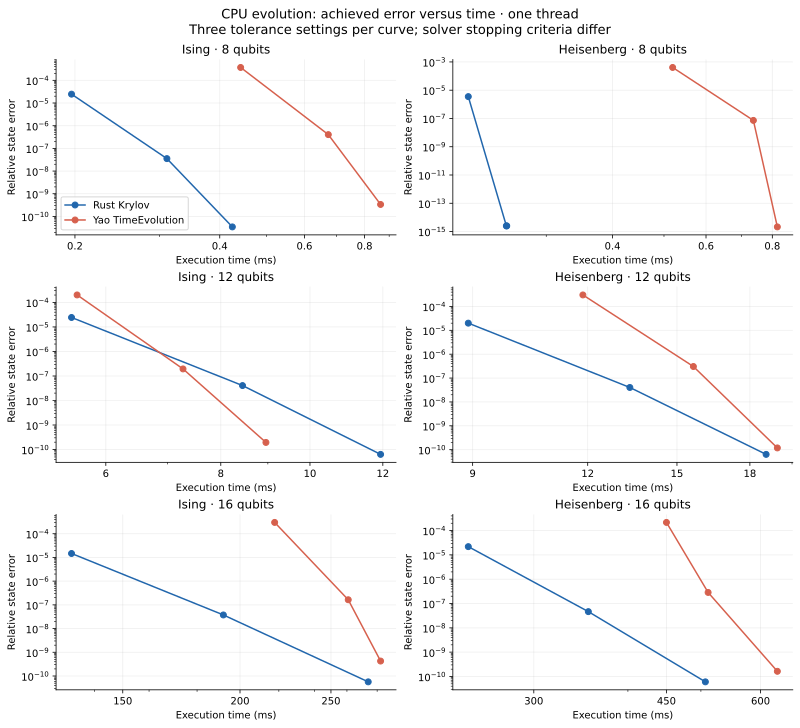
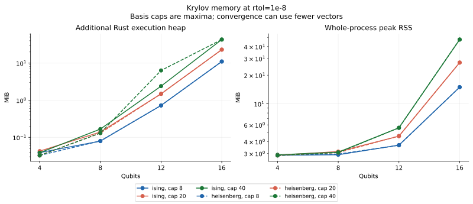
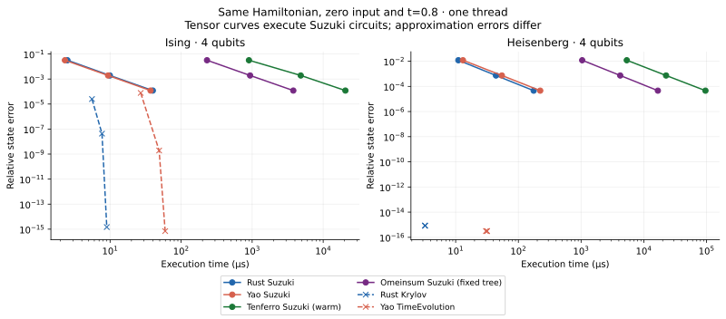

# CPU backend baseline

Generated from raw Criterion and BenchmarkTools samples in this directory.

Platform: macOS-26.6.2-arm64-arm-64bit. Precision: complex128. Independent runs: 3.

Times below are medians of per-process medians and include solver output allocation. Julia/Rust ratios compare different solver policies at the listed tolerances; consult achieved errors below before comparing efficiency. Product-formula rows compare the same circuit. Tensor phases are separate.

| Threads | Case | Native Rust µs | Yao µs | Julia/Rust | Max output error |
| --- | --- | ---: | ---: | ---: | ---: |
| 1 | krylov_heisenberg_12q_tol10 | 18745.292 | 19279.645 | 1.03 | 2.75e-11 |
| 1 | krylov_heisenberg_12q_tol4 | 8902.702 | 11856.042 | 1.33 | 4.79e-05 |
| 1 | krylov_heisenberg_12q_tol7 | 13333.611 | 15628.792 | 1.17 | 2.42e-08 |
| 1 | krylov_heisenberg_16q_tol10 | 506873.604 | 631622.875 | 1.25 | 1.78e-11 |
| 1 | krylov_heisenberg_16q_tol4 | 245551.041 | 450008.021 | 1.83 | 1.50e-05 |
| 1 | krylov_heisenberg_16q_tol7 | 354420.646 | 511124.000 | 1.44 | 1.93e-08 |
| 1 | krylov_heisenberg_4q_asymmetric | 13.680 | 107.416 | 7.85 | 8.25e-16 |
| 1 | krylov_heisenberg_4q_tol10 | 3.241 | 31.604 | 9.75 | 6.47e-16 |
| 1 | krylov_heisenberg_4q_tol4 | 3.244 | 31.604 | 9.74 | 6.47e-16 |
| 1 | krylov_heisenberg_4q_tol7 | 3.240 | 30.396 | 9.38 | 6.47e-16 |
| 1 | krylov_heisenberg_8q_tol10 | 252.778 | 817.625 | 3.23 | 3.95e-16 |
| 1 | krylov_heisenberg_8q_tol4 | 213.935 | 519.167 | 2.43 | 9.55e-05 |
| 1 | krylov_heisenberg_8q_tol7 | 252.361 | 736.854 | 2.92 | 1.27e-08 |
| 1 | krylov_ising_12q_tol10 | 11932.893 | 8956.708 | 0.75 | 2.99e-11 |
| 1 | krylov_ising_12q_tol4 | 5506.702 | 5583.896 | 1.01 | 3.84e-05 |
| 1 | krylov_ising_12q_tol7 | 8447.075 | 7278.375 | 0.86 | 2.80e-08 |
| 1 | krylov_ising_16q_tol10 | 273934.604 | 282380.979 | 1.03 | 6.99e-11 |
| 1 | krylov_ising_16q_tol4 | 132281.771 | 217743.250 | 1.65 | 4.28e-05 |
| 1 | krylov_ising_16q_tol7 | 191996.396 | 260831.146 | 1.36 | 1.56e-08 |
| 1 | krylov_ising_4q_asymmetric | 11.819 | 71.020 | 6.01 | 3.31e-11 |
| 1 | krylov_ising_4q_tol10 | 8.983 | 59.604 | 6.63 | 1.18e-15 |
| 1 | krylov_ising_4q_tol4 | 5.560 | 26.980 | 4.85 | 3.06e-05 |
| 1 | krylov_ising_4q_tol7 | 7.692 | 49.020 | 6.37 | 2.32e-08 |
| 1 | krylov_ising_8q_tol10 | 424.863 | 863.812 | 2.03 | 6.05e-11 |
| 1 | krylov_ising_8q_tol4 | 196.758 | 442.084 | 2.25 | 1.10e-04 |
| 1 | krylov_ising_8q_tol7 | 310.594 | 672.542 | 2.17 | 9.87e-08 |
| 1 | krylov_product_heisenberg_4q_steps2 | 11.047 | 13.062 | 1.18 | 1.83e-14 |
| 1 | krylov_product_heisenberg_4q_steps32 | 175.532 | 223.000 | 1.27 | 3.01e-13 |
| 1 | krylov_product_heisenberg_4q_steps8 | 43.937 | 54.584 | 1.24 | 7.65e-14 |
| 1 | krylov_product_ising_4q_steps2 | 2.508 | 2.312 | 0.92 | 4.31e-15 |
| 1 | krylov_product_ising_4q_steps32 | 39.937 | 37.124 | 0.93 | 7.05e-14 |
| 1 | krylov_product_ising_4q_steps8 | 9.930 | 9.375 | 0.94 | 1.73e-14 |
| 4 | krylov_heisenberg_12q_tol10 | 18722.805 | 109402.084 | 5.84 | 2.75e-11 |
| 4 | krylov_heisenberg_12q_tol4 | 8948.340 | 78038.500 | 8.72 | 4.79e-05 |
| 4 | krylov_heisenberg_12q_tol7 | 13375.948 | 97983.083 | 7.33 | 2.42e-08 |
| 4 | krylov_heisenberg_16q_tol10 | 507121.291 | 672238.166 | 1.33 | 1.78e-11 |
| 4 | krylov_heisenberg_16q_tol4 | 245701.271 | 475924.166 | 1.94 | 1.50e-05 |
| 4 | krylov_heisenberg_16q_tol7 | 355515.791 | 575795.083 | 1.62 | 1.93e-08 |
| 4 | krylov_heisenberg_4q_asymmetric | 13.833 | 203.958 | 14.74 | 8.25e-16 |
| 4 | krylov_heisenberg_4q_tol10 | 3.265 | 119.646 | 36.65 | 6.47e-16 |
| 4 | krylov_heisenberg_4q_tol4 | 3.245 | 116.562 | 35.92 | 6.47e-16 |
| 4 | krylov_heisenberg_4q_tol7 | 3.266 | 112.876 | 34.56 | 6.47e-16 |
| 4 | krylov_heisenberg_8q_tol10 | 254.434 | 934.167 | 3.67 | 3.95e-16 |
| 4 | krylov_heisenberg_8q_tol4 | 215.664 | 731.542 | 3.39 | 9.55e-05 |
| 4 | krylov_heisenberg_8q_tol7 | 252.983 | 868.792 | 3.43 | 1.27e-08 |
| 4 | krylov_ising_12q_tol10 | 12002.331 | 50430.250 | 4.20 | 2.99e-11 |
| 4 | krylov_ising_12q_tol4 | 5541.217 | 33370.334 | 6.02 | 3.84e-05 |
| 4 | krylov_ising_12q_tol7 | 8486.500 | 42463.438 | 5.00 | 2.80e-08 |
| 4 | krylov_ising_16q_tol10 | 274156.125 | 300631.729 | 1.10 | 6.99e-11 |
| 4 | krylov_ising_16q_tol4 | 132694.146 | 211075.125 | 1.59 | 4.28e-05 |
| 4 | krylov_ising_16q_tol7 | 192333.959 | 259462.542 | 1.35 | 1.56e-08 |
| 4 | krylov_ising_4q_asymmetric | 11.983 | 166.125 | 13.86 | 3.31e-11 |
| 4 | krylov_ising_4q_tol10 | 9.154 | 156.208 | 17.07 | 1.18e-15 |
| 4 | krylov_ising_4q_tol4 | 5.628 | 122.062 | 21.69 | 3.06e-05 |
| 4 | krylov_ising_4q_tol7 | 7.754 | 142.229 | 18.34 | 2.32e-08 |
| 4 | krylov_ising_8q_tol10 | 428.572 | 945.417 | 2.21 | 6.05e-11 |
| 4 | krylov_ising_8q_tol4 | 198.783 | 536.958 | 2.70 | 1.10e-04 |
| 4 | krylov_ising_8q_tol7 | 314.524 | 692.833 | 2.20 | 9.87e-08 |
| 4 | krylov_product_heisenberg_4q_steps2 | 10.975 | 13.834 | 1.26 | 1.83e-14 |
| 4 | krylov_product_heisenberg_4q_steps32 | 175.414 | 228.375 | 1.30 | 3.01e-13 |
| 4 | krylov_product_heisenberg_4q_steps8 | 44.177 | 56.959 | 1.29 | 7.65e-14 |
| 4 | krylov_product_ising_4q_steps2 | 2.527 | 2.271 | 0.90 | 4.31e-15 |
| 4 | krylov_product_ising_4q_steps32 | 40.071 | 34.354 | 0.86 | 7.05e-14 |
| 4 | krylov_product_ising_4q_steps8 | 10.001 | 8.709 | 0.87 | 1.73e-14 |

## Tensor and extension phases

Each row uses the named API boundary. `tenferro_from_arrays` includes conversion, automatic planning, execution and output conversion; `omeinsum` includes its conversion/planning/execution. `tenferro_warm` uses an already prepared plan. Those prototype rows use independent planning policies. Where present, `supported_planning` compiles an existing omeco greedy tree; `supported_warm` runs the supported CPU adapter including ndarray input/output adaptation; `supported_from_arrays` combines those two phases. `omeinsum_fixed_tree` executes the identical tree, including its internal preparation. These supported rows exclude tree search and CPU context creation.

| Threads | Case | Phase | Median µs | Range of run medians µs |
| --- | --- | --- | ---: | ---: |
| 1 | krylov_product_heisenberg_4q_steps2 | conversion | 223.092 | 222.609–223.502 |
| 1 | krylov_product_heisenberg_4q_steps2 | omeinsum | 6256.688 | 6256.022–6442.159 |
| 1 | krylov_product_heisenberg_4q_steps2 | omeinsum_fixed_tree | 1042.059 | 1019.549–1052.154 |
| 1 | krylov_product_heisenberg_4q_steps2 | planning | 8417.233 | 8264.689–8432.582 |
| 1 | krylov_product_heisenberg_4q_steps2 | supported_from_arrays | 11707.962 | 11690.133–11771.420 |
| 1 | krylov_product_heisenberg_4q_steps2 | supported_planning | 6402.621 | 6392.220–6599.326 |
| 1 | krylov_product_heisenberg_4q_steps2 | supported_warm | 5358.374 | 5257.713–5391.834 |
| 1 | krylov_product_heisenberg_4q_steps2 | tenferro_from_arrays | 9803.169 | 9759.356–9851.332 |
| 1 | krylov_product_heisenberg_4q_steps2 | tenferro_warm | 1247.589 | 1214.984–1269.834 |
| 1 | krylov_product_heisenberg_4q_steps32 | conversion | 4343.899 | 4320.590–4357.344 |
| 1 | krylov_product_heisenberg_4q_steps32 | omeinsum | 2575531.584 | 2573355.542–2725422.333 |
| 1 | krylov_product_heisenberg_4q_steps32 | omeinsum_fixed_tree | 16774.715 | 16730.583–17682.035 |
| 1 | krylov_product_heisenberg_4q_steps32 | planning | 3079050.896 | 3047217.626–3274337.209 |
| 1 | krylov_product_heisenberg_4q_steps32 | supported_from_arrays | 1441529.479 | 1438816.208–1466202.542 |
| 1 | krylov_product_heisenberg_4q_steps32 | supported_planning | 1335022.979 | 1331985.438–1366038.354 |
| 1 | krylov_product_heisenberg_4q_steps32 | supported_warm | 96238.770 | 95527.812–99615.542 |
| 1 | krylov_product_heisenberg_4q_steps32 | tenferro_from_arrays | 3110446.417 | 3095540.333–3318584.312 |
| 1 | krylov_product_heisenberg_4q_steps32 | tenferro_warm | 22686.146 | 22403.299–23081.166 |
| 1 | krylov_product_heisenberg_4q_steps8 | conversion | 882.643 | 872.848–882.666 |
| 1 | krylov_product_heisenberg_4q_steps8 | omeinsum | 72839.875 | 70766.083–73152.167 |
| 1 | krylov_product_heisenberg_4q_steps8 | omeinsum_fixed_tree | 4210.872 | 4175.664–4219.729 |
| 1 | krylov_product_heisenberg_4q_steps8 | planning | 107868.271 | 105702.479–110529.270 |
| 1 | krylov_product_heisenberg_4q_steps8 | supported_from_arrays | 110522.583 | 110225.146–111861.833 |
| 1 | krylov_product_heisenberg_4q_steps8 | supported_planning | 88809.104 | 87365.708–89118.812 |
| 1 | krylov_product_heisenberg_4q_steps8 | supported_warm | 22668.285 | 22641.458–22765.896 |
| 1 | krylov_product_heisenberg_4q_steps8 | tenferro_from_arrays | 113098.188 | 113081.167–115277.895 |
| 1 | krylov_product_heisenberg_4q_steps8 | tenferro_warm | 5118.659 | 5106.824–5202.579 |
| 1 | krylov_product_ising_4q_steps2 | conversion | 53.950 | 52.813–53.973 |
| 1 | krylov_product_ising_4q_steps2 | omeinsum | 981.522 | 978.218–984.783 |
| 1 | krylov_product_ising_4q_steps2 | omeinsum_fixed_tree | 231.402 | 227.019–232.163 |
| 1 | krylov_product_ising_4q_steps2 | planning | 1094.210 | 1093.586–1098.653 |
| 1 | krylov_product_ising_4q_steps2 | supported_from_arrays | 1476.485 | 1450.619–1483.964 |
| 1 | krylov_product_ising_4q_steps2 | supported_planning | 568.821 | 567.452–568.919 |
| 1 | krylov_product_ising_4q_steps2 | supported_warm | 901.211 | 891.641–901.683 |
| 1 | krylov_product_ising_4q_steps2 | tenferro_from_arrays | 1433.317 | 1417.978–1443.767 |
| 1 | krylov_product_ising_4q_steps2 | tenferro_warm | 265.164 | 261.472–284.218 |
| 1 | krylov_product_ising_4q_steps32 | conversion | 852.248 | 840.255–853.558 |
| 1 | krylov_product_ising_4q_steps32 | omeinsum | 271824.041 | 271472.354–292570.834 |
| 1 | krylov_product_ising_4q_steps32 | omeinsum_fixed_tree | 3795.261 | 3773.908–3813.446 |
| 1 | krylov_product_ising_4q_steps32 | planning | 304666.583 | 300908.749–312615.480 |
| 1 | krylov_product_ising_4q_steps32 | supported_from_arrays | 102853.772 | 102466.958–103700.270 |
| 1 | krylov_product_ising_4q_steps32 | supported_planning | 81080.458 | 81012.938–81117.250 |
| 1 | krylov_product_ising_4q_steps32 | supported_warm | 20532.604 | 20347.910–20846.986 |
| 1 | krylov_product_ising_4q_steps32 | tenferro_from_arrays | 309372.270 | 307349.791–310263.395 |
| 1 | krylov_product_ising_4q_steps32 | tenferro_warm | 4344.425 | 4310.344–4376.672 |
| 1 | krylov_product_ising_4q_steps8 | conversion | 214.389 | 211.603–214.956 |
| 1 | krylov_product_ising_4q_steps8 | omeinsum | 9380.938 | 9359.526–9423.032 |
| 1 | krylov_product_ising_4q_steps8 | omeinsum_fixed_tree | 935.994 | 935.194–993.101 |
| 1 | krylov_product_ising_4q_steps8 | planning | 11368.014 | 11367.974–11444.004 |
| 1 | krylov_product_ising_4q_steps8 | supported_from_arrays | 10836.622 | 10677.144–10845.197 |
| 1 | krylov_product_ising_4q_steps8 | supported_planning | 5933.575 | 5901.422–5937.230 |
| 1 | krylov_product_ising_4q_steps8 | supported_warm | 4832.067 | 4791.569–4901.668 |
| 1 | krylov_product_ising_4q_steps8 | tenferro_from_arrays | 12687.736 | 12645.676–12985.092 |
| 1 | krylov_product_ising_4q_steps8 | tenferro_warm | 1120.092 | 1090.157–1123.653 |
| 4 | krylov_product_heisenberg_4q_steps2 | conversion | 224.305 | 223.388–224.546 |
| 4 | krylov_product_heisenberg_4q_steps2 | omeinsum | 6306.538 | 6229.690–6372.948 |
| 4 | krylov_product_heisenberg_4q_steps2 | omeinsum_fixed_tree | 1039.894 | 1031.824–1053.111 |
| 4 | krylov_product_heisenberg_4q_steps2 | planning | 8340.885 | 8334.757–8506.783 |
| 4 | krylov_product_heisenberg_4q_steps2 | supported_from_arrays | 15720.865 | 15662.053–15781.164 |
| 4 | krylov_product_heisenberg_4q_steps2 | supported_planning | 6435.796 | 6372.192–6504.205 |
| 4 | krylov_product_heisenberg_4q_steps2 | supported_warm | 9241.604 | 9213.997–9444.167 |
| 4 | krylov_product_heisenberg_4q_steps2 | tenferro_from_arrays | 9949.699 | 9837.245–9968.512 |
| 4 | krylov_product_heisenberg_4q_steps2 | tenferro_warm | 1237.451 | 1206.685–1249.148 |
| 4 | krylov_product_heisenberg_4q_steps32 | conversion | 4398.199 | 4344.476–4477.498 |
| 4 | krylov_product_heisenberg_4q_steps32 | omeinsum | 2576444.125 | 2568126.688–2630626.604 |
| 4 | krylov_product_heisenberg_4q_steps32 | omeinsum_fixed_tree | 17029.496 | 16868.544–17046.377 |
| 4 | krylov_product_heisenberg_4q_steps32 | planning | 3117292.792 | 3106709.291–3127657.833 |
| 4 | krylov_product_heisenberg_4q_steps32 | supported_from_arrays | 1515641.229 | 1501093.458–1516827.542 |
| 4 | krylov_product_heisenberg_4q_steps32 | supported_planning | 1338298.625 | 1336396.396–1360670.271 |
| 4 | krylov_product_heisenberg_4q_steps32 | supported_warm | 158321.041 | 157635.541–159078.667 |
| 4 | krylov_product_heisenberg_4q_steps32 | tenferro_from_arrays | 3121135.646 | 3120527.917–3175498.291 |
| 4 | krylov_product_heisenberg_4q_steps32 | tenferro_warm | 22348.403 | 22194.674–22537.840 |
| 4 | krylov_product_heisenberg_4q_steps8 | conversion | 893.561 | 885.813–895.891 |
| 4 | krylov_product_heisenberg_4q_steps8 | omeinsum | 72263.458 | 72131.042–74489.855 |
| 4 | krylov_product_heisenberg_4q_steps8 | omeinsum_fixed_tree | 4225.965 | 4208.694–4241.800 |
| 4 | krylov_product_heisenberg_4q_steps8 | planning | 105779.105 | 105316.917–106067.396 |
| 4 | krylov_product_heisenberg_4q_steps8 | supported_from_arrays | 125993.750 | 125935.188–126266.292 |
| 4 | krylov_product_heisenberg_4q_steps8 | supported_planning | 87297.437 | 87219.729–89267.875 |
| 4 | krylov_product_heisenberg_4q_steps8 | supported_warm | 38316.802 | 38297.969–38460.427 |
| 4 | krylov_product_heisenberg_4q_steps8 | tenferro_from_arrays | 111381.500 | 111343.083–112944.604 |
| 4 | krylov_product_heisenberg_4q_steps8 | tenferro_warm | 5075.051 | 5058.659–5157.965 |
| 4 | krylov_product_ising_4q_steps2 | conversion | 54.115 | 53.733–54.624 |
| 4 | krylov_product_ising_4q_steps2 | omeinsum | 994.165 | 993.143–995.668 |
| 4 | krylov_product_ising_4q_steps2 | omeinsum_fixed_tree | 234.647 | 233.203–237.670 |
| 4 | krylov_product_ising_4q_steps2 | planning | 1110.486 | 1105.356–1110.614 |
| 4 | krylov_product_ising_4q_steps2 | supported_from_arrays | 2181.970 | 2171.916–2182.206 |
| 4 | krylov_product_ising_4q_steps2 | supported_planning | 574.405 | 567.610–579.665 |
| 4 | krylov_product_ising_4q_steps2 | supported_warm | 1629.668 | 1622.801–1648.659 |
| 4 | krylov_product_ising_4q_steps2 | tenferro_from_arrays | 1460.709 | 1459.366–1460.721 |
| 4 | krylov_product_ising_4q_steps2 | tenferro_warm | 275.904 | 273.226–277.263 |
| 4 | krylov_product_ising_4q_steps32 | conversion | 858.755 | 849.945–861.339 |
| 4 | krylov_product_ising_4q_steps32 | omeinsum | 274320.771 | 271414.209–276782.375 |
| 4 | krylov_product_ising_4q_steps32 | omeinsum_fixed_tree | 3797.484 | 3784.969–3814.332 |
| 4 | krylov_product_ising_4q_steps32 | planning | 300880.396 | 299864.334–301858.208 |
| 4 | krylov_product_ising_4q_steps32 | supported_from_arrays | 118134.645 | 117971.688–118357.105 |
| 4 | krylov_product_ising_4q_steps32 | supported_planning | 81492.083 | 81226.500–82101.188 |
| 4 | krylov_product_ising_4q_steps32 | supported_warm | 35940.302 | 35917.198–36065.448 |
| 4 | krylov_product_ising_4q_steps32 | tenferro_from_arrays | 305547.562 | 303859.417–308001.916 |
| 4 | krylov_product_ising_4q_steps32 | tenferro_warm | 4283.897 | 4271.497–4388.276 |
| 4 | krylov_product_ising_4q_steps8 | conversion | 215.893 | 215.437–216.533 |
| 4 | krylov_product_ising_4q_steps8 | omeinsum | 9462.824 | 9339.776–9666.298 |
| 4 | krylov_product_ising_4q_steps8 | omeinsum_fixed_tree | 943.862 | 943.402–953.671 |
| 4 | krylov_product_ising_4q_steps8 | planning | 11470.315 | 11387.135–11543.004 |
| 4 | krylov_product_ising_4q_steps8 | supported_from_arrays | 14793.017 | 14737.734–14878.258 |
| 4 | krylov_product_ising_4q_steps8 | supported_planning | 5946.042 | 5944.319–5946.566 |
| 4 | krylov_product_ising_4q_steps8 | supported_warm | 8774.624 | 8731.756–8843.870 |
| 4 | krylov_product_ising_4q_steps8 | tenferro_from_arrays | 12849.031 | 12704.055–12903.692 |
| 4 | krylov_product_ising_4q_steps8 | tenferro_warm | 1085.823 | 1082.139–1091.044 |

Raw confidence intervals and samples are in `*-rust.json`; Julia trial samples are in `*-julia.json`. Memory logs report instrumented Rust allocations per phase and whole-process peak RSS separately. Timings from the allocation instrument are diagnostic only. See `metadata.json` and pinned manifests for reproducibility.

## Evolution accuracy

Krylov rows time the public Rust adaptive solver and Yao TimeEvolution on the same state/Hamiltonian. Model construction is excluded; solver buffers and Rust Pauli-mask preparation are included. Tolerances have different meanings: Rust targets a final norm error, whereas Yao/KrylovKit uses its own estimate and time scaling. Compare achieved errors, not the timing ratio alone. Four/eight-qubit oracles use a dense exponential; larger oracles use KrylovKit at tol=1e-13, independently checked against tighter Rust results. Product rows use the same four-qubit zero state and Suzuki circuit in both languages. Their tensor phases provide tenferro/omeinsum costs for that product approximation, not an adaptive tenferro Krylov implementation.

| Threads | Case | Native µs | Yao µs | Native relative error | Yao relative error |
| --- | --- | ---: | ---: | ---: | ---: |
| 1 | krylov_heisenberg_12q_tol10 | 18745.292 | 19279.645 | 6.339e-11 | 1.182e-10 |
| 1 | krylov_heisenberg_12q_tol4 | 8902.702 | 11856.042 | 2.004e-05 | 3.049e-04 |
| 1 | krylov_heisenberg_12q_tol7 | 13333.611 | 15628.792 | 4.036e-08 | 3.054e-07 |
| 1 | krylov_heisenberg_16q_tol10 | 506873.604 | 631622.875 | 6.019e-11 | 1.634e-10 |
| 1 | krylov_heisenberg_16q_tol4 | 245551.041 | 450008.021 | 2.182e-05 | 2.163e-04 |
| 1 | krylov_heisenberg_16q_tol7 | 354420.646 | 511124.000 | 4.638e-08 | 2.856e-07 |
| 1 | krylov_heisenberg_4q_asymmetric | 13.680 | 107.416 | 1.727e-15 | 9.154e-16 |
| 1 | krylov_heisenberg_4q_tol10 | 3.241 | 31.604 | 8.438e-16 | 3.114e-16 |
| 1 | krylov_heisenberg_4q_tol4 | 3.244 | 31.604 | 8.438e-16 | 3.114e-16 |
| 1 | krylov_heisenberg_4q_tol7 | 3.240 | 30.396 | 8.438e-16 | 3.114e-16 |
| 1 | krylov_heisenberg_8q_tol10 | 252.778 | 817.625 | 2.494e-15 | 2.118e-15 |
| 1 | krylov_heisenberg_8q_tol4 | 213.935 | 519.167 | 3.511e-06 | 4.047e-04 |
| 1 | krylov_heisenberg_8q_tol7 | 252.361 | 736.854 | 2.494e-15 | 7.274e-08 |
| 1 | krylov_ising_12q_tol10 | 11932.893 | 8956.708 | 6.359e-11 | 1.951e-10 |
| 1 | krylov_ising_12q_tol4 | 5506.702 | 5583.896 | 2.427e-05 | 2.013e-04 |
| 1 | krylov_ising_12q_tol7 | 8447.075 | 7278.375 | 4.064e-08 | 1.938e-07 |
| 1 | krylov_ising_16q_tol10 | 273934.604 | 282380.979 | 5.674e-11 | 4.274e-10 |
| 1 | krylov_ising_16q_tol4 | 132281.771 | 217743.250 | 1.467e-05 | 3.001e-04 |
| 1 | krylov_ising_16q_tol7 | 191996.396 | 260831.146 | 3.756e-08 | 1.643e-07 |
| 1 | krylov_ising_4q_asymmetric | 11.819 | 71.020 | 2.332e-11 | 7.255e-11 |
| 1 | krylov_ising_4q_tol10 | 8.983 | 59.604 | 1.474e-15 | 7.011e-16 |
| 1 | krylov_ising_4q_tol4 | 5.560 | 26.980 | 2.509e-05 | 7.734e-05 |
| 1 | krylov_ising_4q_tol7 | 7.692 | 49.020 | 4.327e-08 | 1.928e-09 |
| 1 | krylov_ising_8q_tol10 | 424.863 | 863.812 | 3.459e-11 | 3.378e-10 |
| 1 | krylov_ising_8q_tol4 | 196.758 | 442.084 | 2.460e-05 | 3.693e-04 |
| 1 | krylov_ising_8q_tol7 | 310.594 | 672.542 | 3.543e-08 | 4.046e-07 |
| 1 | krylov_product_heisenberg_4q_steps2 | 11.047 | 13.062 | 1.195e-02 | 1.195e-02 |
| 1 | krylov_product_heisenberg_4q_steps32 | 175.532 | 223.000 | 4.565e-05 | 4.565e-05 |
| 1 | krylov_product_heisenberg_4q_steps8 | 43.937 | 54.584 | 7.313e-04 | 7.313e-04 |
| 1 | krylov_product_ising_4q_steps2 | 2.508 | 2.312 | 3.170e-02 | 3.170e-02 |
| 1 | krylov_product_ising_4q_steps32 | 39.937 | 37.124 | 1.196e-04 | 1.196e-04 |
| 1 | krylov_product_ising_4q_steps8 | 9.930 | 9.375 | 1.918e-03 | 1.918e-03 |
| 4 | krylov_heisenberg_12q_tol10 | 18722.805 | 109402.084 | 6.339e-11 | 1.182e-10 |
| 4 | krylov_heisenberg_12q_tol4 | 8948.340 | 78038.500 | 2.004e-05 | 3.049e-04 |
| 4 | krylov_heisenberg_12q_tol7 | 13375.948 | 97983.083 | 4.036e-08 | 3.054e-07 |
| 4 | krylov_heisenberg_16q_tol10 | 507121.291 | 672238.166 | 6.019e-11 | 1.634e-10 |
| 4 | krylov_heisenberg_16q_tol4 | 245701.271 | 475924.166 | 2.182e-05 | 2.163e-04 |
| 4 | krylov_heisenberg_16q_tol7 | 355515.791 | 575795.083 | 4.638e-08 | 2.856e-07 |
| 4 | krylov_heisenberg_4q_asymmetric | 13.833 | 203.958 | 1.727e-15 | 6.414e-16 |
| 4 | krylov_heisenberg_4q_tol10 | 3.265 | 119.646 | 8.438e-16 | 3.105e-16 |
| 4 | krylov_heisenberg_4q_tol4 | 3.245 | 116.562 | 8.438e-16 | 3.105e-16 |
| 4 | krylov_heisenberg_4q_tol7 | 3.266 | 112.876 | 8.438e-16 | 3.105e-16 |
| 4 | krylov_heisenberg_8q_tol10 | 254.434 | 934.167 | 2.461e-15 | 2.093e-15 |
| 4 | krylov_heisenberg_8q_tol4 | 215.664 | 731.542 | 3.511e-06 | 4.047e-04 |
| 4 | krylov_heisenberg_8q_tol7 | 252.983 | 868.792 | 2.461e-15 | 7.274e-08 |
| 4 | krylov_ising_12q_tol10 | 12002.331 | 50430.250 | 6.359e-11 | 1.951e-10 |
| 4 | krylov_ising_12q_tol4 | 5541.217 | 33370.334 | 2.427e-05 | 2.013e-04 |
| 4 | krylov_ising_12q_tol7 | 8486.500 | 42463.438 | 4.064e-08 | 1.938e-07 |
| 4 | krylov_ising_16q_tol10 | 274156.125 | 300631.729 | 5.674e-11 | 4.274e-10 |
| 4 | krylov_ising_16q_tol4 | 132694.146 | 211075.125 | 1.467e-05 | 3.001e-04 |
| 4 | krylov_ising_16q_tol7 | 192333.959 | 259462.542 | 3.756e-08 | 1.643e-07 |
| 4 | krylov_ising_4q_asymmetric | 11.983 | 166.125 | 2.332e-11 | 7.255e-11 |
| 4 | krylov_ising_4q_tol10 | 9.154 | 156.208 | 1.474e-15 | 7.003e-16 |
| 4 | krylov_ising_4q_tol4 | 5.628 | 122.062 | 2.509e-05 | 7.734e-05 |
| 4 | krylov_ising_4q_tol7 | 7.754 | 142.229 | 4.327e-08 | 1.928e-09 |
| 4 | krylov_ising_8q_tol10 | 428.572 | 945.417 | 3.459e-11 | 3.378e-10 |
| 4 | krylov_ising_8q_tol4 | 198.783 | 536.958 | 2.460e-05 | 3.693e-04 |
| 4 | krylov_ising_8q_tol7 | 314.524 | 692.833 | 3.543e-08 | 4.046e-07 |
| 4 | krylov_product_heisenberg_4q_steps2 | 10.975 | 13.834 | 1.195e-02 | 1.195e-02 |
| 4 | krylov_product_heisenberg_4q_steps32 | 175.414 | 228.375 | 4.565e-05 | 4.565e-05 |
| 4 | krylov_product_heisenberg_4q_steps8 | 44.177 | 56.959 | 7.313e-04 | 7.313e-04 |
| 4 | krylov_product_ising_4q_steps2 | 2.527 | 2.271 | 3.170e-02 | 3.170e-02 |
| 4 | krylov_product_ising_4q_steps32 | 40.071 | 34.354 | 1.196e-04 | 1.196e-04 |
| 4 | krylov_product_ising_4q_steps8 | 10.001 | 8.709 | 1.918e-03 | 1.918e-03 |

## Krylov convergence and memory

Raw per-process Krylov diagnostics record completed time, operator applications, accepted steps, maximum basis dimension, truncation/defect estimate and tolerance. Julia records include its own convergence diagnostics and the discrepancy between tight references. Floating-point roundoff is not certified by either reported estimate.

| Model | Qubits | Basis cap | Basis used | Steps | Matvecs | Additional execution heap MiB | Process peak RSS MiB |
| --- | ---: | ---: | ---: | ---: | ---: | ---: | ---: |
| heisenberg | 4 | 8 | 4 | 1 | 4 | 0.033 | 2.859 |
| heisenberg | 4 | 20 | 4 | 1 | 4 | 0.033 | 2.859 |
| heisenberg | 4 | 40 | 4 | 1 | 4 | 0.033 | 2.859 |
| heisenberg | 8 | 8 | 8 | 20 | 158 | 0.080 | 2.953 |
| heisenberg | 8 | 20 | 18 | 1 | 18 | 0.130 | 3.062 |
| heisenberg | 8 | 40 | 18 | 1 | 18 | 0.130 | 3.062 |
| heisenberg | 12 | 8 | 8 | 30 | 240 | 0.725 | 3.656 |
| heisenberg | 12 | 20 | 20 | 3 | 54 | 1.488 | 4.578 |
| heisenberg | 12 | 40 | 33 | 1 | 33 | 6.333 | 5.578 |
| heisenberg | 16 | 8 | 8 | 35 | 279 | 11.038 | 14.953 |
| heisenberg | 16 | 20 | 20 | 4 | 74 | 23.051 | 27.156 |
| heisenberg | 16 | 40 | 40 | 2 | 51 | 43.093 | 47.422 |
| ising | 4 | 8 | 8 | 3 | 22 | 0.039 | 2.875 |
| ising | 4 | 20 | 10 | 1 | 10 | 0.043 | 2.875 |
| ising | 4 | 40 | 10 | 1 | 10 | 0.038 | 2.906 |
| ising | 8 | 8 | 8 | 18 | 143 | 0.079 | 2.906 |
| ising | 8 | 20 | 20 | 2 | 35 | 0.139 | 3.141 |
| ising | 8 | 40 | 25 | 1 | 25 | 0.167 | 3.094 |
| ising | 12 | 8 | 8 | 25 | 199 | 0.724 | 3.672 |
| ising | 12 | 20 | 20 | 3 | 53 | 1.487 | 4.562 |
| ising | 12 | 40 | 34 | 1 | 34 | 2.398 | 5.594 |
| ising | 16 | 8 | 8 | 30 | 237 | 11.037 | 14.953 |
| ising | 16 | 20 | 20 | 4 | 68 | 23.050 | 27.125 |
| ising | 16 | 40 | 40 | 2 | 50 | 43.092 | 47.438 |

Memory probes use rtol=1e-8. The input state is already live before execution; additional heap includes basis/work/output storage. RSS includes input, startup and allocator retention. Instrumented times are excluded from timing tables.

