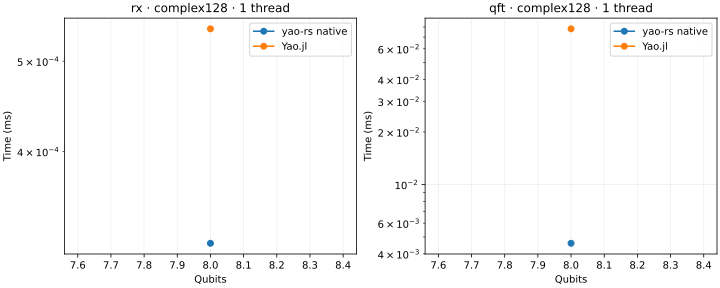
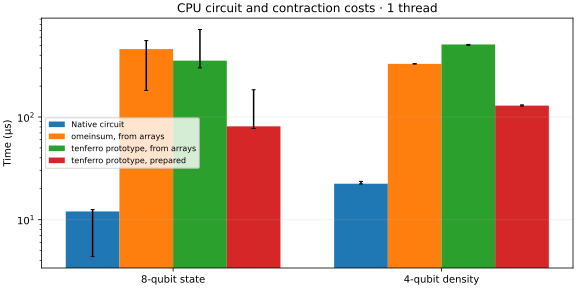
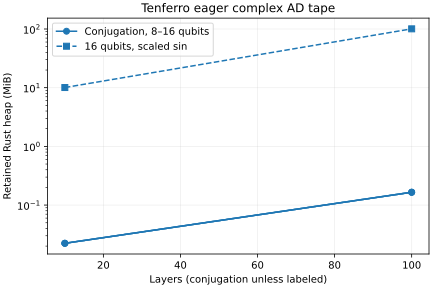
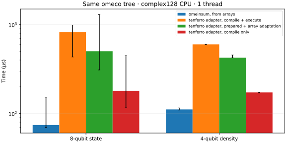

# CPU backend baseline

Generated from raw Criterion and BenchmarkTools samples in this directory.

Platform: macOS-26.6.2-arm64-arm-64bit. Precision: complex128. Independent runs: 3.

Measurement notes: Measurements were not pinned to exclusive CPU cores; inspect independent-run ranges. 19 shared circuit cases through 8 qubits; standalone extension/AD memory probes still reach 16 qubits. Task-owned build and test jobs completed before this final measurement batch. Substantial between-run variability appears in the small tensor-state timings; these results do not establish a stable regression threshold.

Times below are medians of per-process medians. Rust/Julia includes state copying; tensor phases are reported separately. A Julia/Rust ratio greater than one means native Rust was faster.

| Threads | Case | Native Rust µs | Yao µs | Julia/Rust | Max output error |
| --- | --- | ---: | ---: | ---: | ---: |
| 1 | cry_low_far_8 | 0.211 | 3.625 | 17.18 | 1.55e-17 |
| 1 | fsim_adjacent_8 | 0.740 | 4.917 | 6.64 | 1.55e-17 |
| 1 | gradient100_4 | 112.503 | 96.125 | 0.85 | 1.80e-15 |
| 1 | gradient100_8 | 1081.938 | 1505.417 | 1.39 | 1.01e-15 |
| 1 | gradient10_4 | 11.334 | 10.417 | 0.92 | 1.67e-16 |
| 1 | gradient10_8 | 109.090 | 153.292 | 1.41 | 6.66e-16 |
| 1 | layers100_4 | 18.970 | 15.396 | 0.81 | 3.51e-16 |
| 1 | layers100_8 | 227.585 | 123.459 | 0.54 | 3.20e-16 |
| 1 | layers10_4 | 1.935 | 1.708 | 0.88 | 8.33e-17 |
| 1 | layers10_8 | 23.250 | 12.604 | 0.54 | 6.21e-17 |
| 1 | noisy_4 | 22.396 | 36.145 | 1.61 | 1.25e-16 |
| 1 | noisy_6 | 387.040 | 407.813 | 1.05 | 5.20e-17 |
| 1 | noisy_8 | 7938.410 | 10571.021 | 1.33 | 1.83e-17 |
| 1 | qft_8 | 4.600 | 78.041 | 16.96 | 6.87e-16 |
| 1 | rx_8 | 0.319 | 0.541 | 1.70 | 1.39e-17 |
| 1 | rz_8 | 0.182 | 0.645 | 3.55 | 1.55e-17 |
| 1 | swap_far_8 | 0.179 | 0.584 | 3.26 | 6.94e-18 |
| 1 | tensor_state_4 | 0.350 | 0.396 | 1.13 | 0.00e+00 |
| 1 | tensor_state_8 | 12.017 | 2.958 | 0.25 | 0.00e+00 |
| 4 | cry_low_far_8 | 0.205 | 3.624 | 17.72 | 1.55e-17 |
| 4 | fsim_adjacent_8 | 0.756 | 4.917 | 6.51 | 1.55e-17 |
| 4 | gradient100_4 | 115.265 | 96.666 | 0.84 | 1.80e-15 |
| 4 | gradient100_8 | 1106.602 | 1461.958 | 1.32 | 1.01e-15 |
| 4 | gradient10_4 | 13.097 | 10.396 | 0.79 | 1.67e-16 |
| 4 | gradient10_8 | 122.893 | 153.750 | 1.25 | 6.66e-16 |
| 4 | layers100_4 | 19.304 | 15.521 | 0.80 | 3.51e-16 |
| 4 | layers100_8 | 231.308 | 116.042 | 0.50 | 3.20e-16 |
| 4 | layers10_4 | 1.949 | 1.688 | 0.87 | 8.33e-17 |
| 4 | layers10_8 | 23.431 | 11.896 | 0.51 | 6.21e-17 |
| 4 | noisy_4 | 21.920 | 36.374 | 1.66 | 1.25e-16 |
| 4 | noisy_6 | 383.975 | 1955.958 | 5.09 | 5.20e-17 |
| 4 | noisy_8 | 7887.908 | 11380.771 | 1.44 | 1.83e-17 |
| 4 | qft_8 | 4.745 | 77.084 | 16.25 | 6.87e-16 |
| 4 | rx_8 | 0.327 | 0.520 | 1.59 | 1.39e-17 |
| 4 | rz_8 | 0.200 | 0.625 | 3.12 | 1.55e-17 |
| 4 | swap_far_8 | 0.182 | 0.562 | 3.09 | 6.94e-18 |
| 4 | tensor_state_4 | 0.343 | 0.375 | 1.09 | 0.00e+00 |
| 4 | tensor_state_8 | 4.347 | 2.813 | 0.65 | 0.00e+00 |

## Tensor and extension phases

Each row uses the named API boundary. `tenferro_from_arrays` includes conversion, automatic planning, execution and output conversion; `omeinsum` includes its conversion/planning/execution. `tenferro_warm` uses an already prepared plan. Those prototype rows use independent planning policies. Where present, `supported_planning` compiles an existing omeco greedy tree; `supported_warm` runs the supported CPU adapter including ndarray input/output adaptation; `supported_from_arrays` combines those two phases. `omeinsum_fixed_tree` executes the identical tree, including its internal preparation. These supported rows exclude tree search and CPU context creation.

| Threads | Case | Phase | Median µs | Range of run medians µs |
| --- | --- | --- | ---: | ---: |
| 1 | extension_12 | complex_ad | 94.807 | 94.792–303.520 |
| 1 | extension_12 | composed | 7.902 | 7.593–12.981 |
| 1 | extension_12 | custom | 13.002 | 12.830–30.495 |
| 1 | extension_12 | custom_prepare | 8.015 | 7.982–15.729 |
| 1 | extension_16 | complex_ad | 561.889 | 560.609–1688.309 |
| 1 | extension_16 | composed | 81.344 | 81.151–172.423 |
| 1 | extension_16 | custom | 66.730 | 65.791–143.162 |
| 1 | extension_16 | custom_prepare | 8.007 | 7.990–16.315 |
| 1 | extension_8 | complex_ad | 66.483 | 63.343–190.067 |
| 1 | extension_8 | composed | 2.751 | 2.660–4.930 |
| 1 | extension_8 | custom | 9.156 | 8.853–16.135 |
| 1 | extension_8 | custom_prepare | 8.297 | 7.928–14.876 |
| 1 | noisy_4 | conversion | 22.823 | 22.736–23.204 |
| 1 | noisy_4 | omeinsum | 329.643 | 328.185–331.497 |
| 1 | noisy_4 | omeinsum_fixed_tree | 111.270 | 109.515–115.662 |
| 1 | noisy_4 | planning | 346.317 | 345.197–349.184 |
| 1 | noisy_4 | supported_from_arrays | 600.523 | 594.360–601.809 |
| 1 | noisy_4 | supported_planning | 172.762 | 171.210–174.288 |
| 1 | noisy_4 | supported_warm | 425.484 | 424.491–455.859 |
| 1 | noisy_4 | tenferro_from_arrays | 509.283 | 499.897–509.584 |
| 1 | noisy_4 | tenferro_warm | 129.115 | 128.214–131.257 |
| 1 | noisy_6 | conversion | 35.255 | 34.217–43.575 |
| 1 | noisy_6 | omeinsum | 542.714 | 542.045–546.125 |
| 1 | noisy_6 | omeinsum_fixed_tree | 195.994 | 194.111–239.269 |
| 1 | noisy_6 | planning | 590.584 | 587.275–1005.806 |
| 1 | noisy_6 | supported_from_arrays | 1034.807 | 1033.511–1331.217 |
| 1 | noisy_6 | supported_planning | 325.504 | 325.306–326.358 |
| 1 | noisy_6 | supported_warm | 700.462 | 697.952–1774.928 |
| 1 | noisy_6 | tenferro_from_arrays | 872.912 | 872.808–2567.695 |
| 1 | noisy_6 | tenferro_warm | 247.480 | 226.139–510.603 |
| 1 | tensor_state_4 | conversion | 16.534 | 8.740–21.050 |
| 1 | tensor_state_4 | omeinsum | 73.338 | 72.480–135.938 |
| 1 | tensor_state_4 | omeinsum_fixed_tree | 59.229 | 30.297–63.585 |
| 1 | tensor_state_4 | planning | 184.927 | 80.040–200.189 |
| 1 | tensor_state_4 | supported_from_arrays | 426.633 | 182.998–518.583 |
| 1 | tensor_state_4 | supported_planning | 41.212 | 40.982–103.752 |
| 1 | tensor_state_4 | supported_warm | 138.631 | 137.582–359.984 |
| 1 | tensor_state_4 | tenferro_from_arrays | 276.253 | 122.513–299.835 |
| 1 | tensor_state_4 | tenferro_warm | 74.213 | 27.870–85.828 |
| 1 | tensor_state_8 | conversion | 18.427 | 18.351–44.789 |
| 1 | tensor_state_8 | omeinsum | 459.151 | 181.750–555.752 |
| 1 | tensor_state_8 | omeinsum_fixed_tree | 74.242 | 69.781–152.867 |
| 1 | tensor_state_8 | planning | 205.552 | 201.823–397.506 |
| 1 | tensor_state_8 | supported_from_arrays | 824.540 | 433.125–991.252 |
| 1 | tensor_state_8 | supported_planning | 180.220 | 117.645–447.921 |
| 1 | tensor_state_8 | supported_warm | 502.258 | 309.305–1297.637 |
| 1 | tensor_state_8 | tenferro_from_arrays | 354.281 | 301.070–712.919 |
| 1 | tensor_state_8 | tenferro_warm | 81.127 | 77.322–184.230 |
| 4 | extension_12 | complex_ad | 209.229 | 208.117–213.609 |
| 4 | extension_12 | composed | 13.557 | 13.473–13.683 |
| 4 | extension_12 | custom | 24.190 | 24.103–25.558 |
| 4 | extension_12 | custom_prepare | 85.612 | 84.101–87.029 |
| 4 | extension_16 | complex_ad | 568.261 | 564.157–576.143 |
| 4 | extension_16 | composed | 89.736 | 89.469–89.850 |
| 4 | extension_16 | custom | 82.990 | 81.176–83.132 |
| 4 | extension_16 | custom_prepare | 86.194 | 85.399–87.656 |
| 4 | extension_8 | complex_ad | 177.818 | 175.888–182.349 |
| 4 | extension_8 | composed | 8.776 | 8.709–8.785 |
| 4 | extension_8 | custom | 19.297 | 18.995–19.826 |
| 4 | extension_8 | custom_prepare | 85.656 | 84.339–86.742 |
| 4 | noisy_4 | conversion | 22.693 | 22.612–29.322 |
| 4 | noisy_4 | omeinsum | 324.153 | 323.727–331.190 |
| 4 | noisy_4 | omeinsum_fixed_tree | 114.162 | 110.457–134.479 |
| 4 | noisy_4 | planning | 343.866 | 343.475–378.293 |
| 4 | noisy_4 | supported_from_arrays | 892.338 | 885.529–2496.556 |
| 4 | noisy_4 | supported_planning | 171.394 | 170.575–173.722 |
| 4 | noisy_4 | supported_warm | 723.248 | 722.708–1996.730 |
| 4 | noisy_4 | tenferro_from_arrays | 514.675 | 512.747–700.834 |
| 4 | noisy_4 | tenferro_warm | 143.348 | 140.672–190.985 |
| 4 | noisy_6 | conversion | 34.089 | 34.017–35.447 |
| 4 | noisy_6 | omeinsum | 541.209 | 540.787–552.347 |
| 4 | noisy_6 | omeinsum_fixed_tree | 187.177 | 186.344–202.062 |
| 4 | noisy_6 | planning | 587.207 | 584.314–607.521 |
| 4 | noisy_6 | supported_from_arrays | 1502.479 | 1475.280–1607.728 |
| 4 | noisy_6 | supported_planning | 322.932 | 322.340–367.129 |
| 4 | noisy_6 | supported_warm | 1173.410 | 1138.682–2871.719 |
| 4 | noisy_6 | tenferro_from_arrays | 885.479 | 879.253–905.438 |
| 4 | noisy_6 | tenferro_warm | 281.390 | 259.967–297.098 |
| 4 | tensor_state_4 | conversion | 8.654 | 8.628–8.667 |
| 4 | tensor_state_4 | omeinsum | 72.596 | 72.552–74.146 |
| 4 | tensor_state_4 | omeinsum_fixed_tree | 29.966 | 29.444–30.722 |
| 4 | tensor_state_4 | planning | 79.539 | 79.241–79.776 |
| 4 | tensor_state_4 | supported_from_arrays | 291.879 | 291.271–293.952 |
| 4 | tensor_state_4 | supported_planning | 41.177 | 41.064–41.237 |
| 4 | tensor_state_4 | supported_warm | 248.503 | 248.478–252.395 |
| 4 | tensor_state_4 | tenferro_from_arrays | 134.757 | 134.577–135.240 |
| 4 | tensor_state_4 | tenferro_warm | 37.145 | 36.905–41.054 |
| 4 | tensor_state_8 | conversion | 18.153 | 18.132–18.460 |
| 4 | tensor_state_8 | omeinsum | 181.205 | 180.672–181.547 |
| 4 | tensor_state_8 | omeinsum_fixed_tree | 68.429 | 67.999–71.743 |
| 4 | tensor_state_8 | planning | 202.245 | 201.313–203.585 |
| 4 | tensor_state_8 | supported_from_arrays | 661.769 | 659.457–665.399 |
| 4 | tensor_state_8 | supported_planning | 116.645 | 115.250–118.182 |
| 4 | tensor_state_8 | supported_warm | 541.024 | 539.862–543.039 |
| 4 | tensor_state_8 | tenferro_from_arrays | 314.285 | 313.631–316.918 |
| 4 | tensor_state_8 | tenferro_warm | 87.027 | 80.202–87.833 |

Raw confidence intervals and samples are in `*-rust.json`; Julia trial samples are in `*-julia.json`. Memory logs report instrumented Rust allocations per phase and whole-process peak RSS separately. Timings from the allocation instrument are diagnostic only. See `metadata.json` and pinned manifests for reproducibility.

## Plots

