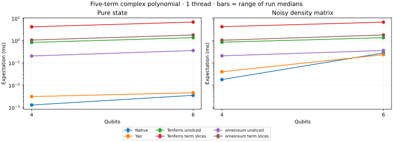
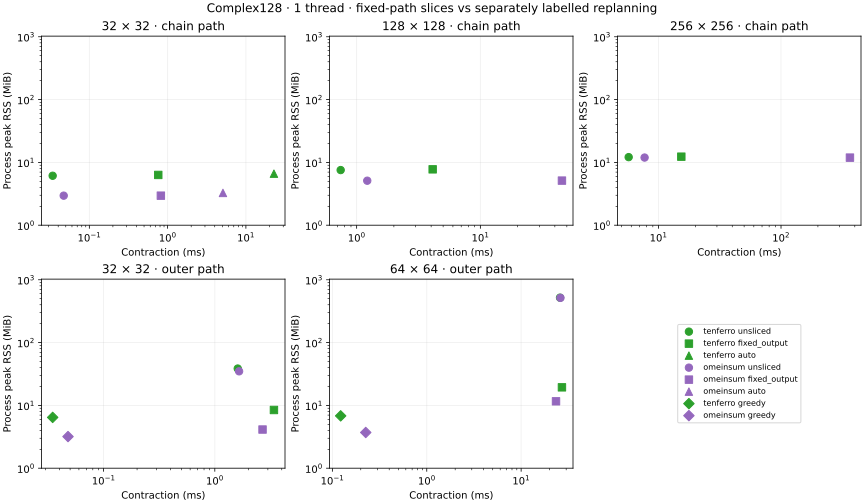

# CPU backend baseline

Generated from raw Criterion and BenchmarkTools samples in this directory.

Platform: macOS-26.6.2-arm64-arm-64bit. Precision: complex128. Independent runs: 3.

Measurement notes: Three independent processes each at 1 and 4 configured CPU threads; native state-vector kernels remain serial. All native/Yao circuit rows include simulation and the same complex polynomial expectation. Same-tree unsliced/fixed slicing is separated from heuristic replanning. The matrix outer-product path deliberately creates a large intermediate and is not an optimized baseline; greedy unsliced results show a better order. Each timing process records its actual selected trees/slices in *-plans.jsonl. Isolated memory logs record their own plans. Automatic TreeSA planning may select equivalent plans across processes. Storage budgets are a tensor estimate, not a hard process RSS cap. A zero workspace reserve is explicitly unmeasured provider scratch; compiled graphs, metadata and allocator retention are outside the estimate. Exactly one slice is active at a time.

Times below are medians of per-process medians. Rust/Julia includes state copying; tensor phases are reported separately. A Julia/Rust ratio greater than one means native Rust was faster.

| Threads | Case | Native Rust µs | Yao µs | Julia/Rust | Max output error |
| --- | --- | ---: | ---: | ---: | ---: |
| 1 | expectation_4_terms5 | 1.292 | 3.104 | 2.40 | 1.39e-17 |
| 1 | expectation_6_terms5 | 3.520 | 4.583 | 1.30 | 5.55e-17 |
| 1 | expectation_dm_4_terms5 | 17.941 | 40.250 | 2.24 | 5.00e-17 |
| 1 | expectation_dm_6_terms5 | 280.059 | 234.062 | 0.84 | 1.12e-16 |
| 4 | expectation_4_terms5 | 1.319 | 3.271 | 2.48 | 1.39e-17 |
| 4 | expectation_6_terms5 | 3.536 | 4.458 | 1.26 | 5.55e-17 |
| 4 | expectation_dm_4_terms5 | 18.385 | 39.646 | 2.16 | 5.00e-17 |
| 4 | expectation_dm_6_terms5 | 284.394 | 2002.458 | 7.04 | 1.12e-16 |

## Tensor and extension phases

Each row uses the named API boundary. `tenferro_from_arrays` includes conversion, automatic planning, execution and output conversion; `omeinsum` includes its conversion/planning/execution. `tenferro_warm` uses an already prepared plan. Those prototype rows use independent planning policies. Where present, `supported_planning` compiles an existing omeco greedy tree; `supported_warm` runs the supported CPU adapter including ndarray input/output adaptation; `supported_from_arrays` combines those two phases. `omeinsum_fixed_tree` executes the identical tree, including its internal preparation. These supported rows exclude tree search and CPU context creation.

| Threads | Case | Phase | Median µs | Range of run medians µs |
| --- | --- | --- | ---: | ---: |
| 1 | expectation_4_terms5 | observable_export | 25.632 | 24.881–25.928 |
| 1 | expectation_4_terms5 | omeinsum_term_sliced | 1063.986 | 1034.749–1069.083 |
| 1 | expectation_4_terms5 | omeinsum_unsliced | 204.538 | 203.566–210.583 |
| 1 | expectation_4_terms5 | tenferro_term_sliced_prepare | 476.049 | 463.952–476.155 |
| 1 | expectation_4_terms5 | tenferro_term_sliced_warm | 4164.483 | 4015.075–4169.763 |
| 1 | expectation_4_terms5 | tenferro_unsliced_prepare | 474.641 | 462.040–485.047 |
| 1 | expectation_4_terms5 | tenferro_unsliced_warm | 830.211 | 803.651–840.166 |
| 1 | expectation_6_terms5 | observable_export | 39.036 | 38.003–39.382 |
| 1 | expectation_6_terms5 | omeinsum_term_sliced | 1788.300 | 1784.742–1832.316 |
| 1 | expectation_6_terms5 | omeinsum_unsliced | 359.768 | 356.458–365.774 |
| 1 | expectation_6_terms5 | tenferro_term_sliced_prepare | 959.321 | 946.502–969.601 |
| 1 | expectation_6_terms5 | tenferro_term_sliced_warm | 6796.956 | 6658.318–6870.766 |
| 1 | expectation_6_terms5 | tenferro_unsliced_prepare | 962.230 | 958.291–971.538 |
| 1 | expectation_6_terms5 | tenferro_unsliced_warm | 1358.483 | 1285.576–1364.696 |
| 1 | expectation_dm_4_terms5 | observable_export | 15.980 | 15.578–16.165 |
| 1 | expectation_dm_4_terms5 | omeinsum_term_sliced | 1043.255 | 1018.503–1046.230 |
| 1 | expectation_dm_4_terms5 | omeinsum_unsliced | 208.354 | 202.705–210.269 |
| 1 | expectation_dm_4_terms5 | tenferro_term_sliced_prepare | 487.721 | 477.023–489.925 |
| 1 | expectation_dm_4_terms5 | tenferro_term_sliced_warm | 4237.920 | 4083.251–4307.722 |
| 1 | expectation_dm_4_terms5 | tenferro_unsliced_prepare | 485.767 | 473.256–489.535 |
| 1 | expectation_dm_4_terms5 | tenferro_unsliced_warm | 850.280 | 819.778–860.899 |
| 1 | expectation_dm_6_terms5 | observable_export | 23.536 | 23.456–23.886 |
| 1 | expectation_dm_6_terms5 | omeinsum_term_sliced | 1799.876 | 1795.662–1818.804 |
| 1 | expectation_dm_6_terms5 | omeinsum_unsliced | 360.424 | 354.671–360.428 |
| 1 | expectation_dm_6_terms5 | tenferro_term_sliced_prepare | 988.299 | 987.117–1002.738 |
| 1 | expectation_dm_6_terms5 | tenferro_term_sliced_warm | 6748.120 | 6694.272–6854.165 |
| 1 | expectation_dm_6_terms5 | tenferro_unsliced_prepare | 984.442 | 967.228–987.199 |
| 1 | expectation_dm_6_terms5 | tenferro_unsliced_warm | 1357.313 | 1339.319–1376.854 |
| 1 | matrix_chain_128 | omeinsum_fixed_output | 45637.448 | 44790.365–45774.010 |
| 1 | matrix_chain_128 | omeinsum_unsliced | 1218.109 | 1212.863–1228.368 |
| 1 | matrix_chain_128 | plan_fixed_output | 3.483 | 3.475–3.554 |
| 1 | matrix_chain_128 | plan_unsliced | 1.760 | 1.739–1.788 |
| 1 | matrix_chain_128 | tenferro_fixed_output_prepare | 5.297 | 5.254–5.331 |
| 1 | matrix_chain_128 | tenferro_fixed_output_warm | 4115.870 | 4113.054–4165.897 |
| 1 | matrix_chain_128 | tenferro_unsliced_prepare | 5.276 | 5.126–5.331 |
| 1 | matrix_chain_128 | tenferro_unsliced_warm | 742.800 | 731.230–743.880 |
| 1 | matrix_chain_256 | omeinsum_fixed_output | 365035.042 | 359753.646–366353.542 |
| 1 | matrix_chain_256 | omeinsum_unsliced | 7706.672 | 7604.847–7787.518 |
| 1 | matrix_chain_256 | plan_fixed_output | 3.531 | 3.526–3.560 |
| 1 | matrix_chain_256 | plan_unsliced | 1.749 | 1.728–1.759 |
| 1 | matrix_chain_256 | tenferro_fixed_output_prepare | 5.267 | 5.224–5.368 |
| 1 | matrix_chain_256 | tenferro_fixed_output_warm | 15365.795 | 15362.530–15508.535 |
| 1 | matrix_chain_256 | tenferro_unsliced_prepare | 5.262 | 5.223–5.327 |
| 1 | matrix_chain_256 | tenferro_unsliced_warm | 5714.061 | 5633.654–5737.630 |
| 1 | matrix_chain_32 | omeinsum_auto | 5092.233 | 5026.939–5229.356 |
| 1 | matrix_chain_32 | omeinsum_fixed_output | 819.722 | 801.420–832.332 |
| 1 | matrix_chain_32 | omeinsum_unsliced | 47.057 | 45.984–47.188 |
| 1 | matrix_chain_32 | plan_auto | 25.518 | 25.060–25.667 |
| 1 | matrix_chain_32 | plan_fixed_output | 3.535 | 3.444–3.538 |
| 1 | matrix_chain_32 | plan_unsliced | 1.759 | 1.740–1.760 |
| 1 | matrix_chain_32 | tenferro_auto_prepare | 5.266 | 5.253–5.350 |
| 1 | matrix_chain_32 | tenferro_auto_warm | 22821.104 | 22482.083–23033.243 |
| 1 | matrix_chain_32 | tenferro_fixed_output_prepare | 5.269 | 5.267–5.373 |
| 1 | matrix_chain_32 | tenferro_fixed_output_warm | 759.563 | 738.848–770.801 |
| 1 | matrix_chain_32 | tenferro_unsliced_prepare | 5.280 | 5.211–5.374 |
| 1 | matrix_chain_32 | tenferro_unsliced_warm | 33.999 | 33.975–34.479 |
| 1 | matrix_outer_32 | omeinsum_fixed_output | 2686.579 | 2592.565–2694.367 |
| 1 | matrix_outer_32 | omeinsum_greedy | 47.880 | 47.819–48.580 |
| 1 | matrix_outer_32 | omeinsum_unsliced | 1653.261 | 1624.501–1666.148 |
| 1 | matrix_outer_32 | plan_fixed_output | 4.002 | 3.925–4.034 |
| 1 | matrix_outer_32 | plan_greedy | 8.072 | 8.003–8.234 |
| 1 | matrix_outer_32 | plan_unsliced | 1.978 | 1.954–2.008 |
| 1 | matrix_outer_32 | tenferro_fixed_output_prepare | 5.913 | 5.886–6.006 |
| 1 | matrix_outer_32 | tenferro_fixed_output_warm | 3401.168 | 3320.862–3401.478 |
| 1 | matrix_outer_32 | tenferro_greedy_prepare | 5.581 | 5.577–5.676 |
| 1 | matrix_outer_32 | tenferro_greedy_warm | 34.849 | 34.291–37.258 |
| 1 | matrix_outer_32 | tenferro_unsliced_prepare | 5.867 | 5.866–5.957 |
| 1 | matrix_outer_32 | tenferro_unsliced_warm | 1607.734 | 1585.786–1623.766 |
| 1 | matrix_outer_64 | omeinsum_fixed_output | 23414.403 | 23344.597–23433.271 |
| 1 | matrix_outer_64 | omeinsum_greedy | 225.686 | 219.303–226.901 |
| 1 | matrix_outer_64 | omeinsum_unsliced | 26093.917 | 25480.219–26199.521 |
| 1 | matrix_outer_64 | plan_fixed_output | 3.972 | 3.945–4.025 |
| 1 | matrix_outer_64 | plan_greedy | 8.133 | 8.006–8.170 |
| 1 | matrix_outer_64 | plan_unsliced | 1.989 | 1.978–1.996 |
| 1 | matrix_outer_64 | tenferro_fixed_output_prepare | 5.994 | 5.917–6.007 |
| 1 | matrix_outer_64 | tenferro_fixed_output_warm | 27059.989 | 26724.250–27120.052 |
| 1 | matrix_outer_64 | tenferro_greedy_prepare | 5.559 | 5.535–5.683 |
| 1 | matrix_outer_64 | tenferro_greedy_warm | 122.425 | 114.803–122.806 |
| 1 | matrix_outer_64 | tenferro_unsliced_prepare | 5.976 | 5.937–6.021 |
| 1 | matrix_outer_64 | tenferro_unsliced_warm | 25823.646 | 25789.823–25883.416 |
| 4 | expectation_4_terms5 | observable_export | 26.508 | 26.356–28.491 |
| 4 | expectation_4_terms5 | omeinsum_term_sliced | 1082.765 | 1071.134–1097.518 |
| 4 | expectation_4_terms5 | omeinsum_unsliced | 215.880 | 211.934–217.341 |
| 4 | expectation_4_terms5 | tenferro_term_sliced_prepare | 484.436 | 482.620–485.094 |
| 4 | expectation_4_terms5 | tenferro_term_sliced_warm | 7421.436 | 7388.648–7432.413 |
| 4 | expectation_4_terms5 | tenferro_unsliced_prepare | 486.899 | 484.467–486.935 |
| 4 | expectation_4_terms5 | tenferro_unsliced_warm | 1499.312 | 1489.469–1500.691 |
| 4 | expectation_6_terms5 | observable_export | 39.873 | 39.081–39.929 |
| 4 | expectation_6_terms5 | omeinsum_term_sliced | 1835.505 | 1823.563–1843.790 |
| 4 | expectation_6_terms5 | omeinsum_unsliced | 364.227 | 363.596–364.678 |
| 4 | expectation_6_terms5 | tenferro_term_sliced_prepare | 979.541 | 977.990–987.179 |
| 4 | expectation_6_terms5 | tenferro_term_sliced_warm | 11705.477 | 11656.469–11716.510 |
| 4 | expectation_6_terms5 | tenferro_unsliced_prepare | 980.760 | 978.234–983.871 |
| 4 | expectation_6_terms5 | tenferro_unsliced_warm | 2331.556 | 2323.641–2354.997 |
| 4 | expectation_dm_4_terms5 | observable_export | 16.315 | 16.202–16.912 |
| 4 | expectation_dm_4_terms5 | omeinsum_term_sliced | 1070.463 | 1039.503–1078.296 |
| 4 | expectation_dm_4_terms5 | omeinsum_unsliced | 213.424 | 205.107–213.765 |
| 4 | expectation_dm_4_terms5 | tenferro_term_sliced_prepare | 494.096 | 493.627–494.713 |
| 4 | expectation_dm_4_terms5 | tenferro_term_sliced_warm | 7432.377 | 7425.383–7516.758 |
| 4 | expectation_dm_4_terms5 | tenferro_unsliced_prepare | 493.541 | 489.929–493.897 |
| 4 | expectation_dm_4_terms5 | tenferro_unsliced_warm | 1484.907 | 1483.769–1498.010 |
| 4 | expectation_dm_6_terms5 | observable_export | 24.213 | 23.762–24.371 |
| 4 | expectation_dm_6_terms5 | omeinsum_term_sliced | 1826.535 | 1792.652–1826.719 |
| 4 | expectation_dm_6_terms5 | omeinsum_unsliced | 363.012 | 356.305–366.747 |
| 4 | expectation_dm_6_terms5 | tenferro_term_sliced_prepare | 999.434 | 995.735–1005.133 |
| 4 | expectation_dm_6_terms5 | tenferro_term_sliced_warm | 11802.635 | 11751.679–11845.817 |
| 4 | expectation_dm_6_terms5 | tenferro_unsliced_prepare | 1000.319 | 996.138–1000.983 |
| 4 | expectation_dm_6_terms5 | tenferro_unsliced_warm | 2354.626 | 2348.599–2367.446 |
| 4 | matrix_chain_128 | omeinsum_fixed_output | 46620.334 | 46486.531–46782.625 |
| 4 | matrix_chain_128 | omeinsum_unsliced | 1251.622 | 1245.684–1263.899 |
| 4 | matrix_chain_128 | plan_fixed_output | 3.561 | 3.559–3.569 |
| 4 | matrix_chain_128 | plan_unsliced | 1.782 | 1.781–1.789 |
| 4 | matrix_chain_128 | tenferro_fixed_output_prepare | 5.429 | 5.414–5.479 |
| 4 | matrix_chain_128 | tenferro_fixed_output_warm | 7006.836 | 6950.397–7068.430 |
| 4 | matrix_chain_128 | tenferro_unsliced_prepare | 5.373 | 5.314–5.404 |
| 4 | matrix_chain_128 | tenferro_unsliced_warm | 278.358 | 276.147–280.210 |
| 4 | matrix_chain_256 | omeinsum_fixed_output | 373215.875 | 370323.938–374808.355 |
| 4 | matrix_chain_256 | omeinsum_unsliced | 7891.969 | 7865.779–7895.260 |
| 4 | matrix_chain_256 | plan_fixed_output | 3.570 | 3.558–3.595 |
| 4 | matrix_chain_256 | plan_unsliced | 1.783 | 1.767–1.801 |
| 4 | matrix_chain_256 | tenferro_fixed_output_prepare | 5.428 | 5.398–5.459 |
| 4 | matrix_chain_256 | tenferro_fixed_output_warm | 20688.243 | 20596.542–20776.708 |
| 4 | matrix_chain_256 | tenferro_unsliced_prepare | 5.376 | 5.359–5.418 |
| 4 | matrix_chain_256 | tenferro_unsliced_warm | 1654.703 | 1632.036–1659.227 |
| 4 | matrix_chain_32 | omeinsum_auto | 5254.708 | 5253.410–5259.704 |
| 4 | matrix_chain_32 | omeinsum_fixed_output | 839.656 | 837.818–840.656 |
| 4 | matrix_chain_32 | omeinsum_unsliced | 48.056 | 47.998–48.363 |
| 4 | matrix_chain_32 | plan_auto | 26.023 | 26.018–26.078 |
| 4 | matrix_chain_32 | plan_fixed_output | 3.571 | 3.540–3.578 |
| 4 | matrix_chain_32 | plan_unsliced | 1.779 | 1.774–1.796 |
| 4 | matrix_chain_32 | tenferro_auto_prepare | 5.351 | 5.348–5.359 |
| 4 | matrix_chain_32 | tenferro_auto_warm | 48902.521 | 48844.041–49016.250 |
| 4 | matrix_chain_32 | tenferro_fixed_output_prepare | 5.390 | 5.384–5.433 |
| 4 | matrix_chain_32 | tenferro_fixed_output_warm | 1517.868 | 1516.073–1863.221 |
| 4 | matrix_chain_32 | tenferro_unsliced_prepare | 5.363 | 5.245–5.402 |
| 4 | matrix_chain_32 | tenferro_unsliced_warm | 55.845 | 55.801–57.016 |
| 4 | matrix_outer_32 | omeinsum_fixed_output | 2733.012 | 2730.591–2746.453 |
| 4 | matrix_outer_32 | omeinsum_greedy | 48.638 | 48.620–49.291 |
| 4 | matrix_outer_32 | omeinsum_unsliced | 1692.950 | 1681.997–1700.266 |
| 4 | matrix_outer_32 | plan_fixed_output | 3.992 | 3.988–4.002 |
| 4 | matrix_outer_32 | plan_greedy | 8.180 | 8.154–8.204 |
| 4 | matrix_outer_32 | plan_unsliced | 1.992 | 1.972–1.994 |
| 4 | matrix_outer_32 | tenferro_fixed_output_prepare | 6.012 | 5.973–6.023 |
| 4 | matrix_outer_32 | tenferro_fixed_output_warm | 4421.949 | 4416.689–4422.208 |
| 4 | matrix_outer_32 | tenferro_greedy_prepare | 5.658 | 5.623–5.663 |
| 4 | matrix_outer_32 | tenferro_greedy_warm | 55.547 | 55.282–60.368 |
| 4 | matrix_outer_32 | tenferro_unsliced_prepare | 5.953 | 5.889–6.020 |
| 4 | matrix_outer_32 | tenferro_unsliced_warm | 918.732 | 917.781–921.419 |
| 4 | matrix_outer_64 | omeinsum_fixed_output | 23740.823 | 23716.271–23761.042 |
| 4 | matrix_outer_64 | omeinsum_greedy | 230.311 | 226.212–230.714 |
| 4 | matrix_outer_64 | omeinsum_unsliced | 25998.198 | 25642.864–26143.844 |
| 4 | matrix_outer_64 | plan_fixed_output | 3.982 | 3.970–4.034 |
| 4 | matrix_outer_64 | plan_greedy | 8.141 | 8.140–8.179 |
| 4 | matrix_outer_64 | plan_unsliced | 1.982 | 1.980–2.011 |
| 4 | matrix_outer_64 | tenferro_fixed_output_prepare | 5.973 | 5.967–5.979 |
| 4 | matrix_outer_64 | tenferro_fixed_output_warm | 15636.427 | 15609.486–15800.509 |
| 4 | matrix_outer_64 | tenferro_greedy_prepare | 5.612 | 5.596–5.692 |
| 4 | matrix_outer_64 | tenferro_greedy_warm | 107.257 | 100.933–108.364 |
| 4 | matrix_outer_64 | tenferro_unsliced_prepare | 6.039 | 6.003–6.040 |
| 4 | matrix_outer_64 | tenferro_unsliced_warm | 18389.354 | 18369.680–18493.076 |

Raw confidence intervals and samples are in `*-rust.json`; Julia trial samples are in `*-julia.json`. Memory logs report instrumented Rust allocations per phase and whole-process peak RSS separately. Timings from the allocation instrument are diagnostic only. See `metadata.json` and pinned manifests for reproducibility.

## Polynomial expectations and sliced contraction

Circuit rows compare the same complex polynomial expectation from a zero input, including simulation and expectation evaluation in native Rust/Yao. Yao uses sandwich for pure states and its dense operator trace formula without real projection for density matrices; native Rust applies each operator string without a dense operator matrix. Tensor rows share circuit tensors across terms. `observable_export` is separate; prepared tenferro execution excludes CPU context, tree search and compilation. omeinsum rows include executor preparation. Unsliced and term-sliced rows use the identical omeco greedy tree.

Synthetic matrix-chain rows are a separate dense complex128 contraction workload, with no native/Yao simulator timing. `fixed_output` slices the first output index of the supplied ((A B) C) tree. `auto` explicitly allows omeco TreeSA replanning under the complete estimated budget; it is qualified at dimension 32 only. Heuristic slicing can produce many slice assignments. Larger fixed-path runs use dimensions 128/256. Separately labelled outer-product stress cases at dimensions 32/64 deliberately form an n^4 intermediate before contracting the third matrix; fixed output slicing is compared on that path, while a greedy unsliced path shows how planning can avoid the intermediate entirely. No automatic-planner speedup is inferred for those larger sizes.

## Isolated contraction memory

One active slice; all storage columns are MiB. Input and full output storage remain allocated. Estimates conservatively count tensor buffers and a zero user workspace reserve; they exclude runtime metadata, compiled programs, allocator retention and unreported provider scratch. Process RSS is measured independently and is not bounded by that estimate. Heap-instrumented execution times are diagnostic only.

| Backend | Fixture | Matrix dimension | Mode | Slices | Input | Output | omeco peak | Worker buffers | Total estimate | Execution extra heap | Process peak RSS |
| --- | --- | ---: | --- | ---: | ---: | ---: | ---: | ---: | ---: | ---: | ---: |
| omeinsum | chain | 128 | fixed_output | 128 | 0.750 | 0.250 | 0.254 | 1.260 | 2.260 | 1.505 | 5.125 |
| omeinsum | chain | 128 | unsliced | 1 | 0.750 | 0.250 | 0.750 | 2.500 | 3.500 | 6.252 | 5.109 |
| omeinsum | chain | 256 | fixed_output | 256 | 3.000 | 1.000 | 1.008 | 5.020 | 9.020 | 6.009 | 11.906 |
| omeinsum | chain | 256 | unsliced | 1 | 3.000 | 1.000 | 3.000 | 10.000 | 14.000 | 11.002 | 11.938 |
| omeinsum | chain | 32 | auto | 1024 | 0.047 | 0.016 | 0.001 | 0.004 | 0.067 | 0.022 | 3.266 |
| omeinsum | chain | 32 | fixed_output | 32 | 0.047 | 0.016 | 0.017 | 0.081 | 0.143 | 0.096 | 2.953 |
| omeinsum | chain | 32 | unsliced | 1 | 0.047 | 0.016 | 0.047 | 0.156 | 0.219 | 4.099 | 2.953 |
| omeinsum | outer | 32 | fixed_output | 32 | 0.047 | 0.016 | 0.516 | 0.580 | 0.643 | 1.083 | 4.125 |
| omeinsum | outer | 32 | greedy | 1 | 0.047 | 0.016 | 0.062 | 0.156 | 0.219 | 4.115 | 3.188 |
| omeinsum | outer | 32 | unsliced | 1 | 0.047 | 0.016 | 16.031 | 16.141 | 16.203 | 32.065 | 34.875 |
| omeinsum | outer | 64 | fixed_output | 64 | 0.188 | 0.062 | 4.063 | 4.316 | 4.566 | 8.319 | 11.609 |
| omeinsum | outer | 64 | greedy | 1 | 0.188 | 0.062 | 0.250 | 0.625 | 0.875 | 4.443 | 3.703 |
| omeinsum | outer | 64 | unsliced | 1 | 0.188 | 0.062 | 256.125 | 256.562 | 256.812 | 512.253 | 515.250 |
| tenferro | chain | 128 | fixed_output | 128 | 0.750 | 0.250 | 0.254 | 1.260 | 2.260 | 0.810 | 7.750 |
| tenferro | chain | 128 | unsliced | 1 | 0.750 | 0.250 | 0.750 | 2.500 | 3.500 | 5.547 | 7.547 |
| tenferro | chain | 256 | fixed_output | 256 | 3.000 | 1.000 | 1.008 | 5.020 | 9.020 | 3.065 | 12.328 |
| tenferro | chain | 256 | unsliced | 1 | 3.000 | 1.000 | 3.000 | 10.000 | 14.000 | 8.047 | 12.125 |
| tenferro | chain | 32 | auto | 1024 | 0.047 | 0.016 | 0.001 | 0.004 | 0.067 | 0.071 | 6.609 |
| tenferro | chain | 32 | fixed_output | 32 | 0.047 | 0.016 | 0.017 | 0.081 | 0.143 | 0.102 | 6.312 |
| tenferro | chain | 32 | unsliced | 1 | 0.047 | 0.016 | 0.047 | 0.156 | 0.219 | 4.097 | 6.125 |
| tenferro | outer | 32 | fixed_output | 32 | 0.047 | 0.016 | 0.516 | 0.580 | 0.643 | 1.617 | 8.453 |
| tenferro | outer | 32 | greedy | 1 | 0.047 | 0.016 | 0.062 | 0.156 | 0.219 | 4.110 | 6.438 |
| tenferro | outer | 32 | unsliced | 1 | 0.047 | 0.016 | 16.031 | 16.141 | 16.203 | 32.085 | 38.594 |
| tenferro | outer | 64 | fixed_output | 64 | 0.188 | 0.062 | 4.063 | 4.316 | 4.566 | 12.305 | 19.375 |
| tenferro | outer | 64 | greedy | 1 | 0.188 | 0.062 | 0.250 | 0.625 | 0.875 | 4.298 | 6.812 |
| tenferro | outer | 64 | unsliced | 1 | 0.188 | 0.062 | 256.125 | 256.562 | 256.812 | 512.174 | 518.859 |
