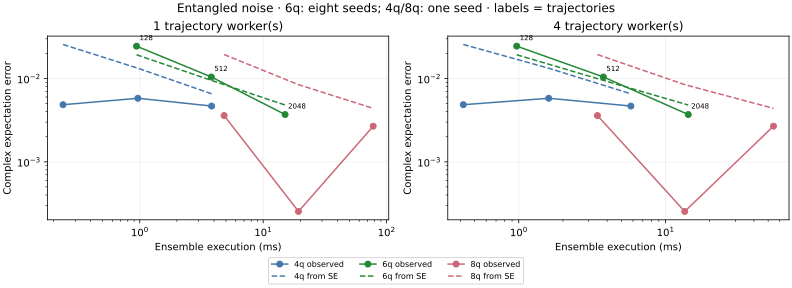
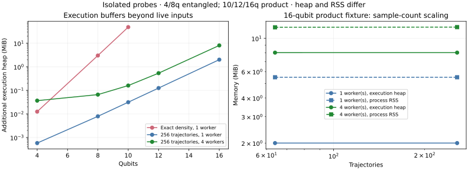

# CPU backend baseline

Generated from raw Criterion and BenchmarkTools samples in this directory.

Platform: macOS-26.6.2-arm64-arm-64bit. Precision: complex128. Independent runs: 3.

Measurement notes: Three independent timing processes each at one/four configured CPU threads. Native exact-density kernels are serial; trajectories use the requested number of workers. Parallel ensemble timing includes thread-pool creation. All 18 Yao exact complex-expectation comparisons pass (maximum discrepancy 3.1234658433439916e-16). Native/Yao exact rows include density input construction/copy and observable evaluation. Yao builds a dense polynomial operator; native Rust applies its words. Tenferro exact rows reuse an omeco greedy expectation-network plan and exclude CPU context, tensor export and order search; compilation is separately timed. These are exact contractions, not a tenferro trajectory implementation. Accuracy uses eight seeds at six qubits and one at other sizes. Repeated process seeds are deduplicated, and trajectory IDs are reused under sample-count refinement. Product fixtures at 12/16 qubits have analytic expectations and simpler structure than the entangled 4/6/8-qubit fixtures. Twenty trajectory and three exact-density memory probes completed. Execution heap, live input/density storage and total process RSS are different quantities; instrumented diagnostic times are not benchmark times.

Times below are medians of per-process medians. Rust/Julia includes state copying; tensor phases are reported separately. A Julia/Rust ratio greater than one means native Rust was faster.

| Threads | Case | Native Rust µs | Yao µs | Julia/Rust | Max output error |
| --- | --- | ---: | ---: | ---: | ---: |
| 1 | noisy_expectation_4 | 57.219 | 104.270 | 1.82 | 3.09e-16 |
| 1 | noisy_expectation_6 | 1056.744 | 1139.542 | 1.08 | 3.12e-16 |
| 1 | noisy_expectation_8 | 20425.430 | 19329.063 | 0.95 | 6.55e-17 |
| 4 | noisy_expectation_4 | 58.928 | 95.188 | 1.62 | 3.09e-16 |
| 4 | noisy_expectation_6 | 1086.681 | 5152.458 | 4.74 | 3.12e-16 |
| 4 | noisy_expectation_8 | 20920.688 | 26862.000 | 1.28 | 6.55e-17 |

## Trajectory and tensor phases

Trajectory rows report complete ensembles; `trajectory_prepare` validates/prepares local gates and channels. Tenferro rows report exact expectation-network compilation and warm contraction. Their accuracy and timing boundaries are detailed below.

| Threads | Case | Phase | Median µs | Range of run medians µs |
| --- | --- | --- | ---: | ---: |
| 1 | noisy_expectation_4 | tenferro_exact_prepare | 433.390 | 423.511–435.408 |
| 1 | noisy_expectation_4 | tenferro_exact_warm | 818.692 | 795.020–823.084 |
| 1 | noisy_expectation_4 | trajectory_128 | 238.857 | 231.768–242.818 |
| 1 | noisy_expectation_4 | trajectory_2048 | 3821.083 | 3704.642–3877.738 |
| 1 | noisy_expectation_4 | trajectory_512 | 965.746 | 945.680–966.077 |
| 1 | noisy_expectation_4 | trajectory_prepare | 7.518 | 7.410–7.581 |
| 1 | noisy_expectation_6 | tenferro_exact_prepare | 868.791 | 842.398–879.678 |
| 1 | noisy_expectation_6 | tenferro_exact_warm | 1278.899 | 1250.572–1317.876 |
| 1 | noisy_expectation_6 | trajectory_128 | 941.589 | 913.754–950.981 |
| 1 | noisy_expectation_6 | trajectory_2048 | 15055.524 | 14690.254–15155.684 |
| 1 | noisy_expectation_6 | trajectory_512 | 3800.142 | 3654.424–3814.167 |
| 1 | noisy_expectation_6 | trajectory_prepare | 11.140 | 11.093–11.413 |
| 1 | noisy_expectation_8 | tenferro_exact_prepare | 1422.763 | 1401.503–1440.236 |
| 1 | noisy_expectation_8 | tenferro_exact_warm | 1984.996 | 1765.846–2026.319 |
| 1 | noisy_expectation_8 | trajectory_128 | 4825.401 | 4715.727–4867.456 |
| 1 | noisy_expectation_8 | trajectory_2048 | 77968.645 | 75535.958–78622.771 |
| 1 | noisy_expectation_8 | trajectory_512 | 19335.590 | 19253.910–19538.889 |
| 1 | noisy_expectation_8 | trajectory_prepare | 15.200 | 14.925–15.411 |
| 1 | product_noise_12 | trajectory_256 | 64643.584 | 62898.333–64982.625 |
| 1 | product_noise_12 | trajectory_64 | 16117.386 | 15719.858–16390.962 |
| 1 | product_noise_16 | trajectory_256 | 1385657.396 | 1361287.541–1396184.812 |
| 1 | product_noise_16 | trajectory_64 | 344462.834 | 336429.750–348156.146 |
| 4 | noisy_expectation_4 | tenferro_exact_prepare | 440.625 | 438.298–441.176 |
| 4 | noisy_expectation_4 | tenferro_exact_warm | 1464.840 | 1445.968–1469.310 |
| 4 | noisy_expectation_4 | trajectory_128 | 418.885 | 411.172–431.504 |
| 4 | noisy_expectation_4 | trajectory_2048 | 5805.084 | 5780.951–5880.418 |
| 4 | noisy_expectation_4 | trajectory_512 | 1599.948 | 1599.014–1614.801 |
| 4 | noisy_expectation_4 | trajectory_prepare | 7.658 | 7.489–7.744 |
| 4 | noisy_expectation_6 | tenferro_exact_prepare | 883.249 | 870.011–884.453 |
| 4 | noisy_expectation_6 | tenferro_exact_warm | 2302.493 | 2274.432–2526.387 |
| 4 | noisy_expectation_6 | trajectory_128 | 968.133 | 966.578–974.704 |
| 4 | noisy_expectation_6 | trajectory_2048 | 14277.921 | 14136.578–14413.341 |
| 4 | noisy_expectation_6 | trajectory_512 | 3771.010 | 3740.301–3843.245 |
| 4 | noisy_expectation_6 | trajectory_prepare | 11.358 | 11.246–11.414 |
| 4 | noisy_expectation_8 | tenferro_exact_prepare | 1452.472 | 1451.222–1465.626 |
| 4 | noisy_expectation_8 | tenferro_exact_warm | 3176.409 | 3023.876–3483.957 |
| 4 | noisy_expectation_8 | trajectory_128 | 3435.652 | 3427.442–3440.488 |
| 4 | noisy_expectation_8 | trajectory_2048 | 54385.876 | 52603.520–54805.438 |
| 4 | noisy_expectation_8 | trajectory_512 | 13511.089 | 13439.691–13633.385 |
| 4 | noisy_expectation_8 | trajectory_prepare | 15.345 | 15.254–15.354 |
| 4 | product_noise_12 | trajectory_256 | 28237.084 | 27733.094–28308.583 |
| 4 | product_noise_12 | trajectory_64 | 6881.775 | 6838.147–6882.957 |
| 4 | product_noise_16 | trajectory_256 | 455988.541 | 455478.395–457452.126 |
| 4 | product_noise_16 | trajectory_64 | 112923.167 | 112002.895–112995.833 |

Raw confidence intervals and samples are in `*-rust.json`; Julia trial samples are in `*-julia.json`. Memory logs report instrumented Rust allocations per phase and whole-process peak RSS separately. Timings from the allocation instrument are diagnostic only. See `metadata.json` and pinned manifests for reproducibility.

## Trajectory accuracy and time

Exact native/Yao rows above evolve the same density matrix and complex polynomial. Tenferro exact warm rows contract a prepared expectation network; preparation excludes export and greedy order search. Trajectory timings include independent seeded evolution, observable evaluation, streaming moments, worker buffers and (at multiple threads) pool creation; local channel preparation is reported separately. These algorithms have different accuracy, so a timing ratio alone is not a speedup at equal error.

The six-qubit case uses eight independent seeds per sample count; other rows use one. Repeated timing processes with the same seed are deduplicated for accuracy. RMSE combines real and imaginary errors. Predicted RMS error combines their standard errors. Large product-state cases use analytic expectations and are simpler workloads than the entangled exact-density cases.

| Threads | Case | Trajectories | Independent seeds | Ensemble ms | Observed RMSE | Predicted RMS error |
| --- | --- | ---: | ---: | ---: | ---: | ---: |
| 1 | noisy_expectation_4 | 128 | 1 | 0.2389 | 4.8576e-03 | 2.5673e-02 |
| 1 | noisy_expectation_4 | 512 | 1 | 0.9657 | 5.8005e-03 | 1.3314e-02 |
| 1 | noisy_expectation_4 | 2048 | 1 | 3.8211 | 4.6781e-03 | 6.5652e-03 |
| 1 | noisy_expectation_6 | 128 | 8 | 0.9416 | 2.4504e-02 | 1.9323e-02 |
| 1 | noisy_expectation_6 | 512 | 8 | 3.8001 | 1.0449e-02 | 9.5214e-03 |
| 1 | noisy_expectation_6 | 2048 | 8 | 15.0555 | 3.7013e-03 | 4.8141e-03 |
| 1 | noisy_expectation_8 | 128 | 1 | 4.8254 | 3.5979e-03 | 1.9423e-02 |
| 1 | noisy_expectation_8 | 512 | 1 | 19.3356 | 2.5381e-04 | 8.4555e-03 |
| 1 | noisy_expectation_8 | 2048 | 1 | 77.9686 | 2.6829e-03 | 4.3891e-03 |
| 1 | product_noise_12 | 64 | 1 | 16.1174 | 5.5950e-02 | 8.3420e-02 |
| 1 | product_noise_12 | 256 | 1 | 64.6436 | 3.3629e-02 | 4.2862e-02 |
| 1 | product_noise_16 | 64 | 1 | 344.4628 | 5.5950e-02 | 8.3420e-02 |
| 1 | product_noise_16 | 256 | 1 | 1385.6574 | 3.3629e-02 | 4.2862e-02 |
| 4 | noisy_expectation_4 | 128 | 1 | 0.4189 | 4.8576e-03 | 2.5673e-02 |
| 4 | noisy_expectation_4 | 512 | 1 | 1.5999 | 5.8005e-03 | 1.3314e-02 |
| 4 | noisy_expectation_4 | 2048 | 1 | 5.8051 | 4.6781e-03 | 6.5652e-03 |
| 4 | noisy_expectation_6 | 128 | 8 | 0.9681 | 2.4504e-02 | 1.9323e-02 |
| 4 | noisy_expectation_6 | 512 | 8 | 3.7710 | 1.0449e-02 | 9.5214e-03 |
| 4 | noisy_expectation_6 | 2048 | 8 | 14.2779 | 3.7013e-03 | 4.8141e-03 |
| 4 | noisy_expectation_8 | 128 | 1 | 3.4357 | 3.5979e-03 | 1.9423e-02 |
| 4 | noisy_expectation_8 | 512 | 1 | 13.5111 | 2.5381e-04 | 8.4555e-03 |
| 4 | noisy_expectation_8 | 2048 | 1 | 54.3859 | 2.6829e-03 | 4.3891e-03 |
| 4 | product_noise_12 | 64 | 1 | 6.8818 | 5.5950e-02 | 8.3420e-02 |
| 4 | product_noise_12 | 256 | 1 | 28.2371 | 3.3629e-02 | 4.2862e-02 |
| 4 | product_noise_16 | 64 | 1 | 112.9232 | 5.5950e-02 | 8.3420e-02 |
| 4 | product_noise_16 | 256 | 1 | 455.9885 | 3.3629e-02 | 4.2862e-02 |

## Trajectory memory

Twenty trajectory probes and three exact-density probes run in isolation. Heap peaks describe the execution phase beyond live inputs/prepared channels; exact density storage is already live when its execution begins. RSS includes inputs, startup and allocator retention. Diagnostic instrumented times are excluded from timing tables. Qubits 4/8 use entangled fixtures; 10/12/16 use product fixtures. Native density execution is serial.

| Backend | Qubits | Trajectories | Threads | Execution additional heap MiB | Peak RSS MiB |
| --- | ---: | ---: | ---: | ---: | ---: |
| density | 4 | 0 | 1 | 0.0125 | 2.438 |
| density | 8 | 0 | 1 | 3.0008 | 6.484 |
| density | 10 | 0 | 1 | 48.0005 | 66.500 |
| trajectory | 4 | 64 | 1 | 0.0006 | 2.500 |
| trajectory | 4 | 64 | 4 | 0.0354 | 2.844 |
| trajectory | 4 | 256 | 1 | 0.0006 | 2.516 |
| trajectory | 4 | 256 | 4 | 0.0366 | 2.859 |
| trajectory | 8 | 64 | 1 | 0.0079 | 2.578 |
| trajectory | 8 | 64 | 4 | 0.0648 | 2.922 |
| trajectory | 8 | 256 | 1 | 0.0079 | 2.578 |
| trajectory | 8 | 256 | 4 | 0.0659 | 2.953 |
| trajectory | 10 | 64 | 1 | 0.0313 | 2.453 |
| trajectory | 10 | 64 | 4 | 0.1585 | 2.906 |
| trajectory | 10 | 256 | 1 | 0.0313 | 2.484 |
| trajectory | 10 | 256 | 4 | 0.1596 | 2.938 |
| trajectory | 12 | 64 | 1 | 0.1251 | 2.672 |
| trajectory | 12 | 64 | 4 | 0.5335 | 3.391 |
| trajectory | 12 | 256 | 1 | 0.1251 | 2.672 |
| trajectory | 12 | 256 | 4 | 0.5346 | 3.406 |
| trajectory | 16 | 64 | 1 | 2.0001 | 5.500 |
| trajectory | 16 | 64 | 4 | 8.0335 | 11.859 |
| trajectory | 16 | 256 | 1 | 2.0001 | 5.500 |
| trajectory | 16 | 256 | 4 | 8.0346 | 11.891 |

