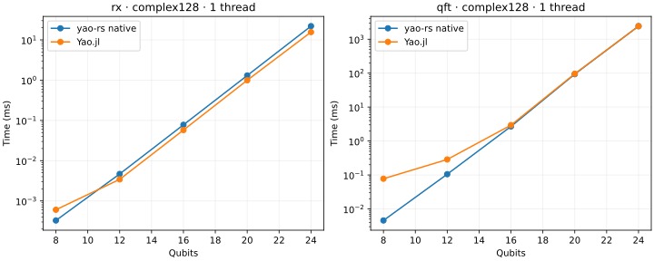

# Benchmarks vs Yao.jl

This CPU snapshot covers **70 workloads** with Yao.jl and, for state-vector
execution, Qulacs. It includes public application circuits, gradients, exact
noise, tensor workflows, and Hamiltonian evolution.

## Same-device results

**8 September 2026 · Apple M4 · 16 GiB RAM · macOS 26.6.2 · one thread · complex128.**
Rust 1.98.0, Julia 1.12.4, Yao.jl 0.9.3, and Qulacs 0.6.14.
The measured [source snapshot](https://github.com/GiggleLiu/yao-rs/commit/22364fbbbaff25f5b5df191b9475d63bf2d0d7a4) uses six
independent processes per implementation, with execution order counterbalanced.
Times below are medians of process medians; lower is better.



The vertical axes are logarithmic. “Fastest mode” selects direct execution or
a prepared circuit: yao-rs offers two- and four-qubit fusion; Qulacs uses direct
or four-qubit-fused execution. Preparation is excluded here and retained in the
raw results. For repeated fixed circuits, see [circuit fusion](states.md#reuse-a-fixed-circuit).

| Workload | yao-rs (ms) | Mode | Yao.jl (ms) | Qulacs (ms) |
|---|---:|---|---:|---:|
| Rx · 16 qubits | 0.0466 | Fused 4q | 0.0579 | 0.0925 |
| QFT · 16 qubits | 1.3681 | Direct | 2.9073 | 4.6652 |
| 100 Ry–CX layers · 4 qubits | 0.0003 | Fused 4q | 0.0157 | 0.0016 |
| 100 Ry–CX layers · 12 qubits | 1.9030 | Direct | 1.9668 | 5.9088 |
| QASMBench adder · 10 qubits | 0.0261 | Direct | 0.0553 | 0.0322 |
| QASMBench QAOA · 6 qubits | 0.0022 | Fused 2q | 0.0365 | 0.0061 |
| QASMBench UCCSD · 8 qubits | 0.6362 | Fused 2q | 2.2023 | 0.6192 |
| Value + gradient, 100 layers · 12 qubits | 10.8483 | Direct | 23.0744 | — |
| Custom-loss gradient, depth 100 · 12 qubits | 3.1170 | Direct | 5.7058 | — |
| Exact noisy density matrix · 10 qubits | 124.0126 | Direct | 154.1985 | — |
| Five-term expectation · 6 qubits | 0.0019 | Direct | 0.0045 | — |
| Ising Krylov evolution · 12 qubits | 6.5098 | Direct | 7.3002 | — |

For the 100-layer, 4-qubit circuit, fusion preparation takes **0.302 ms**.
It takes roughly **41 executions** to amortize that cost relative to direct
yao-rs execution at these median timings.

Qulacs entries use its fastest measured mode; a dash means that feature was
not measured with Qulacs. The expectation row uses direct simulation; tensor
export, planning, and contraction timings are separate in the full results.

**Qualification: 158/158 named execution comparisons pass** the 5%
tolerance using a 95% bootstrap interval over independent process medians.

This is a named-baseline result. A broader SOTA claim still requires tensor-
contraction competitors, matched stochastic accuracy, and same-GPU comparisons.

[All workload timings, qualification details, and raw samples](https://github.com/GiggleLiu/yao-rs/tree/main/benchmarks/results/mac-curated-cpu-2026-09-08)
retain every measured mode and phase, including slower results.

## Measurement boundaries

- Warmed execution includes a fresh input-state copy. Compilation, circuit
  construction, CLI startup, and file I/O are excluded.
- Complete outputs are checked before timing, with qubit order aligned.
  Gradient comparisons check both the value and derivatives.
- Krylov uses `rtol=1e-7` and a validated global relative-error budget of
  `1e-6`. Achieved errors are retained in the report; this is not an equal-error
  solver comparison.
- Shared CI checks correctness of the harness. Performance gates require
  repeated measurements on the same host and environment.

## Reproduce and detect regressions

The [curated suite](https://github.com/GiggleLiu/yao-rs/tree/main/benchmarks/regression) freezes 19
QASMBench/MQT application circuits and adds feature-specific fixtures.
The [dataset survey](https://github.com/GiggleLiu/yao-rs/blob/main/benchmarks/regression/SURVEY.md)
explains the selection and comparison pool.

From a checkout with Rust, Julia, and uv installed:

```bash
make benchmark-setup
make benchmark BENCH_OUT=benchmarks/results/local-cpu
```

Use `BENCH_PROFILE=smoke` for setup validation or `BENCH_PROFILE=full` for
larger cases and both thread budgets. To compare two revisions:

```bash
make benchmark-check \
  BENCH_BASELINE=path/to/baseline/results.json \
  BENCH_CANDIDATE=path/to/candidate/results.json
```

The check rejects missing cases, incompatible environments, correctness
failures, and inconclusive intervals. The saved M4 run provides the initial
baseline for this protocol; use a local baseline for another device.
See the [benchmark guide](https://github.com/GiggleLiu/yao-rs/blob/main/benchmarks/regression/README.md)
for environment locks, raw data, and the named-baseline qualification command.
