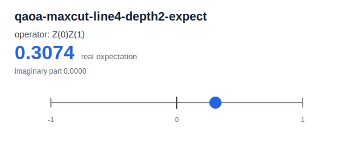

# CLI Example Visualization

This page collects the CLI commands used to generate the example circuits,
SVG diagrams, and result summaries committed under
[`generated/`](./generated/manifest.md). The generated manifest is the compact
index of every artifact:

- [Generated artifact manifest](./generated/manifest.md)

## Regenerate Artifacts

Build the CLI and regenerate the checked-in example artifacts from the
repository root:

```bash
cargo build -p yao-cli --no-default-features
YAO_BIN=target/debug/yao bash examples/cli/generate_artifacts.sh docs/src/examples/generated
```

The generator writes circuit JSON files, SVG diagrams, result JSON files, and
the manifest under `docs/src/examples/generated`.

To refresh only the result plots after editing or replacing result JSON, run:

```bash
python3 examples/cli/plot_results.py docs/src/examples/generated/results docs/src/examples/generated/plots
```

## Built-In Examples

The built-in examples are available directly from the `yao example` command:

```bash
target/debug/yao example bell
target/debug/yao example ghz --nqubits 4
target/debug/yao example qft --nqubits 4
```

## Scripted Examples

The algorithm examples below are shell workflows that compose the CLI commands
for circuit construction, simulation, probability extraction, and expectations.
Run them directly to emit result JSON to stdout; use the regenerate-all command
above to refresh the checked-in circuit JSON, SVG, and result artifacts:

```bash
YAO_BIN=target/debug/yao bash examples/cli/phase_estimation_z.sh
YAO_BIN=target/debug/yao bash examples/cli/hadamard_test_z.sh
YAO_BIN=target/debug/yao bash examples/cli/swap_test.sh
YAO_BIN=target/debug/yao bash examples/cli/bernstein_vazirani.sh 1011
YAO_BIN=target/debug/yao bash examples/cli/grover_marked_state.sh 5
YAO_BIN=target/debug/yao bash examples/cli/qaoa_maxcut_line4.sh 2
YAO_BIN=target/debug/yao bash examples/cli/qcbm_static.sh 2
```

The QCBM static example emits a fixed variational ansatz distribution. It is a
static circuit and probability example, not a full training workflow.

The Hadamard test minimal Z circuit intentionally matches the phase-estimation
Z demo, so the two examples are useful for comparing the CLI workflow shape
rather than contrasting two different circuits.

## Circuit Gallery

The gallery embeds the generated SVG diagrams directly from the documentation
tree.

### Built-In Circuits


### Algorithm Circuits


## Result Plots

The plotting helper turns generated probability and expectation JSON into
small SVG summaries. These plots are checked in with the other artifacts and
can be regenerated independently:

```bash
python3 examples/cli/plot_results.py docs/src/examples/generated/results docs/src/examples/generated/plots
```





## Generated Results

The generated result JSON files are useful for checking the output distribution
or expectation associated with each example. The table includes the key evidence
visible in each result file.

| Example | Result | Key evidence |
|---------|--------|--------------|
| Bell | [`generated/results/bell-probs.json`](./generated/results/bell-probs.json) | States `00` and `11` each have probability `0.5`. |
| GHZ 4 | [`generated/results/ghz4-probs.json`](./generated/results/ghz4-probs.json) | States `0000` and `1111` each have probability `0.5`. |
| QFT 4 | [`generated/results/qft4-probs.json`](./generated/results/qft4-probs.json) | Uniform 16-state distribution with probability `0.0625` per state. |
| Phase estimation Z | [`generated/results/phase-estimation-z-probs.json`](./generated/results/phase-estimation-z-probs.json) | State `11` / index `3` has probability `1.0`. |
| Hadamard test Z | [`generated/results/hadamard-test-z-probs.json`](./generated/results/hadamard-test-z-probs.json) | Minimal Z Hadamard-test circuit intentionally matches the phase-estimation Z demo. |
| Swap test | [`generated/results/swap-test-probs.json`](./generated/results/swap-test-probs.json) | Nonzero states are `001`, `010`, `101`, and `110`, each with probability `0.25`. |
| Bernstein-Vazirani 1011 | [`generated/results/bernstein-vazirani-1011-probs.json`](./generated/results/bernstein-vazirani-1011-probs.json) | Secret state `1011` / index `11` has probability `1.0`. |
| Grover marked state 5 | [`generated/results/grover-marked-5-probs.json`](./generated/results/grover-marked-5-probs.json) | Marked state `101` / index `5` has probability about `0.9453`. |
| QAOA MaxCut line-4 depth 2 | [`generated/results/qaoa-maxcut-line4-depth2-expect.json`](./generated/results/qaoa-maxcut-line4-depth2-expect.json) | `Z(0)Z(1)` expectation real part is about `0.3074`. |
| QCBM static depth 2 | [`generated/results/qcbm-static-depth2-probs.json`](./generated/results/qcbm-static-depth2-probs.json) | static zero-parameter demo; not full training. |

## Walkthroughs

Each walkthrough starts from the repository root after building the CLI:

```bash
cargo build -p yao-cli --no-default-features
```

### Bell State

The Bell example mirrors the standard two-qubit entanglement pattern: put the
first qubit in superposition, then copy its parity to the second qubit with a
controlled operation. In the CLI, generate the circuit JSON, draw it, and read
the state probabilities:

```bash
target/debug/yao example bell --json --output docs/src/examples/generated/circuits/bell.json
target/debug/yao visualize docs/src/examples/generated/circuits/bell.json --output docs/src/examples/generated/svg/bell.svg
target/debug/yao simulate docs/src/examples/generated/circuits/bell.json | target/debug/yao probs - > docs/src/examples/generated/results/bell-probs.json
python3 examples/cli/plot_results.py docs/src/examples/generated/results docs/src/examples/generated/plots
```

Circuit: [generated/svg/bell.svg](./generated/svg/bell.svg). Plot:
[generated/plots/bell-probs.svg](./generated/plots/bell-probs.svg). The result
JSON shows probability `0.5` on `00` and `0.5` on `11`, with the middle basis
states at zero.

### GHZ 4

The GHZ example extends the Bell idea across four qubits. One Hadamard creates
the branch, and the following controlled operations tie all qubits to the same
classical parity branch.

```bash
target/debug/yao example ghz --nqubits 4 --json --output docs/src/examples/generated/circuits/ghz4.json
target/debug/yao visualize docs/src/examples/generated/circuits/ghz4.json --output docs/src/examples/generated/svg/ghz4.svg
target/debug/yao simulate docs/src/examples/generated/circuits/ghz4.json | target/debug/yao probs - > docs/src/examples/generated/results/ghz4-probs.json
python3 examples/cli/plot_results.py docs/src/examples/generated/results docs/src/examples/generated/plots
```

Circuit: [generated/svg/ghz4.svg](./generated/svg/ghz4.svg). Plot:
[generated/plots/ghz4-probs.svg](./generated/plots/ghz4-probs.svg). The output
has only `0000` and `1111` populated, each with probability `0.5`.

### QFT 4

The QFT example builds the four-qubit Fourier-transform ladder from Hadamard
and controlled phase rotations, then finishes with swaps to match the usual
wire order. Starting from the zero state, this circuit produces a uniform
distribution.

```bash
target/debug/yao example qft --nqubits 4 --json --output docs/src/examples/generated/circuits/qft4.json
target/debug/yao visualize docs/src/examples/generated/circuits/qft4.json --output docs/src/examples/generated/svg/qft4.svg
target/debug/yao simulate docs/src/examples/generated/circuits/qft4.json | target/debug/yao probs - > docs/src/examples/generated/results/qft4-probs.json
python3 examples/cli/plot_results.py docs/src/examples/generated/results docs/src/examples/generated/plots
```

Circuit: [generated/svg/qft4.svg](./generated/svg/qft4.svg). Plot:
[generated/plots/qft4-probs.svg](./generated/plots/qft4-probs.svg). Each of the
16 basis states has probability `0.0625`.

### Phase Estimation Z

This compact phase-estimation example uses a Z phase pattern with two qubits.
It follows the documentation pattern of preparing phase kickback, applying the
inverse Fourier readout, and checking the measured phase register.

```bash
YAO_ARTIFACT_DIR=docs/src/examples/generated YAO_BIN=target/debug/yao bash examples/cli/phase_estimation_z.sh
python3 examples/cli/plot_results.py docs/src/examples/generated/results docs/src/examples/generated/plots
```

Circuit: [generated/svg/phase-estimation-z.svg](./generated/svg/phase-estimation-z.svg).
Plot:
[generated/plots/phase-estimation-z-probs.svg](./generated/plots/phase-estimation-z-probs.svg).
The checked-in result
[generated/results/phase-estimation-z-probs.json](./generated/results/phase-estimation-z-probs.json)
puts all probability on state `11`, index `3`.

### Hadamard Test Z

The Hadamard-test walkthrough keeps the circuit deliberately minimal so it is
easy to compare with the phase-estimation Z example. It prepares an ancilla,
uses controlled phase behavior, and reads out the resulting two-qubit
probabilities.

```bash
YAO_ARTIFACT_DIR=docs/src/examples/generated YAO_BIN=target/debug/yao bash examples/cli/hadamard_test_z.sh
python3 examples/cli/plot_results.py docs/src/examples/generated/results docs/src/examples/generated/plots
```

Circuit: [generated/svg/hadamard-test-z.svg](./generated/svg/hadamard-test-z.svg).
Plot:
[generated/plots/hadamard-test-z-probs.svg](./generated/plots/hadamard-test-z-probs.svg).
For this minimal Z case, the generated probabilities intentionally match the
phase-estimation Z demo and place probability `1.0` on state `11`.

### Swap Test

The swap test compares two prepared states through an ancilla-controlled swap
pattern. This static CLI version is useful for checking the circuit shape and
the probability distribution produced by the controlled swaps.

```bash
YAO_ARTIFACT_DIR=docs/src/examples/generated YAO_BIN=target/debug/yao bash examples/cli/swap_test.sh
python3 examples/cli/plot_results.py docs/src/examples/generated/results docs/src/examples/generated/plots
```

Circuit: [generated/svg/swap-test.svg](./generated/svg/swap-test.svg). Plot:
[generated/plots/swap-test-probs.svg](./generated/plots/swap-test-probs.svg).
The nonzero states are `001`, `010`, `101`, and `110`, each with probability
`0.25`.

### Bernstein-Vazirani 1011

The Bernstein-Vazirani example encodes the secret bit string `1011` in an
oracle-like phase pattern. After the final Hadamards, the input register returns
the secret directly in the probability distribution.

```bash
YAO_ARTIFACT_DIR=docs/src/examples/generated YAO_BIN=target/debug/yao bash examples/cli/bernstein_vazirani.sh 1011
python3 examples/cli/plot_results.py docs/src/examples/generated/results docs/src/examples/generated/plots
```

Circuit:
[generated/svg/bernstein-vazirani-1011.svg](./generated/svg/bernstein-vazirani-1011.svg).
Plot:
[generated/plots/bernstein-vazirani-1011-probs.svg](./generated/plots/bernstein-vazirani-1011-probs.svg).
The result
[generated/results/bernstein-vazirani-1011-probs.json](./generated/results/bernstein-vazirani-1011-probs.json)
places probability `1.0` on `1011`, index `11`.

### Grover Marked State 5

The Grover walkthrough follows the usual oracle-and-diffusion rhythm for a
three-qubit search space. The script marks basis index `5`, which is binary
state `101`, and applies two Grover iterations.

```bash
YAO_ARTIFACT_DIR=docs/src/examples/generated YAO_BIN=target/debug/yao bash examples/cli/grover_marked_state.sh 5
python3 examples/cli/plot_results.py docs/src/examples/generated/results docs/src/examples/generated/plots
```

Circuit: [generated/svg/grover-marked-5.svg](./generated/svg/grover-marked-5.svg).
Plot:
[generated/plots/grover-marked-5-probs.svg](./generated/plots/grover-marked-5-probs.svg).
The generated result
[generated/results/grover-marked-5-probs.json](./generated/results/grover-marked-5-probs.json)
shows the marked `101` state amplified to about `0.9453`.

### QAOA MaxCut Line-4 Depth 2

This QAOA walkthrough builds a fixed depth-2 ansatz for a four-node line graph.
It alternates edge phase separators with single-qubit mixers and then evaluates
the `Z(0)Z(1)` expectation. The script uses fixed parameters; it does not run a
classical optimizer.

```bash
YAO_ARTIFACT_DIR=docs/src/examples/generated YAO_BIN=target/debug/yao bash examples/cli/qaoa_maxcut_line4.sh 2
python3 examples/cli/plot_results.py docs/src/examples/generated/results docs/src/examples/generated/plots
```

Circuit:
[generated/svg/qaoa-maxcut-line4-depth2.svg](./generated/svg/qaoa-maxcut-line4-depth2.svg).
Plot:
[generated/plots/qaoa-maxcut-line4-depth2-expect.svg](./generated/plots/qaoa-maxcut-line4-depth2-expect.svg).
The expectation JSON
[generated/results/qaoa-maxcut-line4-depth2-expect.json](./generated/results/qaoa-maxcut-line4-depth2-expect.json)
reports `Z(0)Z(1)` with real value about `0.3074`.

### QCBM Static Depth 2

This QCBM example is a static zero-parameter, depth-2 ansatz demonstration. It
borrows the layered circuit shape used in QCBM examples, but it is intentionally
not full training and does not fit a data distribution.

```bash
YAO_ARTIFACT_DIR=docs/src/examples/generated YAO_BIN=target/debug/yao bash examples/cli/qcbm_static.sh 2
python3 examples/cli/plot_results.py docs/src/examples/generated/results docs/src/examples/generated/plots
```

Circuit:
[generated/svg/qcbm-static-depth2.svg](./generated/svg/qcbm-static-depth2.svg).
Plot:
[generated/plots/qcbm-static-depth2-probs.svg](./generated/plots/qcbm-static-depth2-probs.svg).
The generated probability JSON has 64 entries for six qubits and keeps this
demo's mass on the all-zero basis state.
