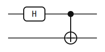
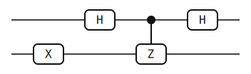
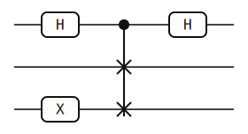
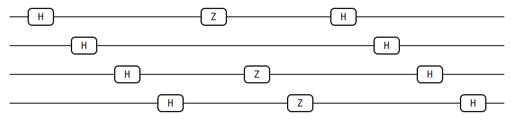
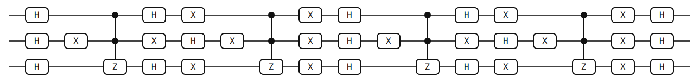
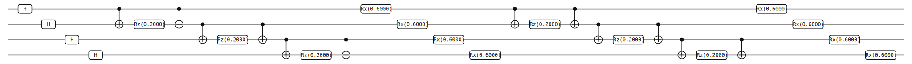

# CLI Example Visualization

This page collects the CLI commands used to generate the example circuits,
SVG diagrams, and result summaries committed under
[`generated/`](./generated/manifest.md). The generated manifest is the compact
index of every artifact:

- [Generated artifact manifest](./generated/manifest.md)

## Regenerate Artifacts

Build the CLI and regenerate the checked-in example artifacts from the
repository root:

```bash
cargo build -p yao-cli --no-default-features
YAO_BIN=target/debug/yao bash examples/cli/generate_artifacts.sh docs/src/examples/generated
```

The generator writes circuit JSON files, SVG diagrams, result JSON files, and
the manifest under `docs/src/examples/generated`.

## Built-In Examples

The built-in examples are available directly from the `yao example` command:

```bash
target/debug/yao example bell
target/debug/yao example ghz --nqubits 4
target/debug/yao example qft --nqubits 4
```

## Scripted Examples

The algorithm examples below are shell workflows that compose the CLI commands
for circuit construction, simulation, probability extraction, and expectations.
Run them directly to emit result JSON to stdout; use the regenerate-all command
above to refresh the checked-in circuit JSON, SVG, and result artifacts:

```bash
YAO_BIN=target/debug/yao bash examples/cli/phase_estimation_z.sh
YAO_BIN=target/debug/yao bash examples/cli/hadamard_test_z.sh
YAO_BIN=target/debug/yao bash examples/cli/swap_test.sh
YAO_BIN=target/debug/yao bash examples/cli/bernstein_vazirani.sh 1011
YAO_BIN=target/debug/yao bash examples/cli/grover_marked_state.sh 5
YAO_BIN=target/debug/yao bash examples/cli/qaoa_maxcut_line4.sh 2
YAO_BIN=target/debug/yao bash examples/cli/qcbm_static.sh 2
```

The QCBM static example emits a fixed variational ansatz distribution. It is a
static circuit and probability example, not a full training workflow.

The Hadamard test minimal Z circuit intentionally matches the phase-estimation
Z demo, so the two examples are useful for comparing the CLI workflow shape
rather than contrasting two different circuits.

## Circuit Gallery

The gallery embeds the generated SVG diagrams directly from the documentation
tree.

### Built-In Circuits




### Algorithm Circuits













## Generated Results

The generated result JSON files are useful for checking the output distribution
or expectation associated with each example. The table includes the key evidence
visible in each result file.

| Example | Result | Key evidence |
|---------|--------|--------------|
| Bell | [`generated/results/bell-probs.json`](./generated/results/bell-probs.json) | States `00` and `11` each have probability `0.5`. |
| GHZ 4 | [`generated/results/ghz4-probs.json`](./generated/results/ghz4-probs.json) | States `0000` and `1111` each have probability `0.5`. |
| QFT 4 | [`generated/results/qft4-probs.json`](./generated/results/qft4-probs.json) | Uniform 16-state distribution with probability `0.0625` per state. |
| Phase estimation Z | [`generated/results/phase-estimation-z-probs.json`](./generated/results/phase-estimation-z-probs.json) | State `11` / index `3` has probability `1.0`. |
| Hadamard test Z | [`generated/results/hadamard-test-z-probs.json`](./generated/results/hadamard-test-z-probs.json) | Minimal Z Hadamard-test circuit intentionally matches the phase-estimation Z demo. |
| Swap test | [`generated/results/swap-test-probs.json`](./generated/results/swap-test-probs.json) | Nonzero states are `001`, `010`, `101`, and `110`, each with probability `0.25`. |
| Bernstein-Vazirani 1011 | [`generated/results/bernstein-vazirani-1011-probs.json`](./generated/results/bernstein-vazirani-1011-probs.json) | Secret state `1011` / index `11` has probability `1.0`. |
| Grover marked state 5 | [`generated/results/grover-marked-5-probs.json`](./generated/results/grover-marked-5-probs.json) | Marked state `101` / index `5` has probability about `0.9453`. |
| QAOA MaxCut line-4 depth 2 | [`generated/results/qaoa-maxcut-line4-depth2-expect.json`](./generated/results/qaoa-maxcut-line4-depth2-expect.json) | `Z(0)Z(1)` expectation real part is about `0.3074`. |
| QCBM static depth 2 | [`generated/results/qcbm-static-depth2-probs.json`](./generated/results/qcbm-static-depth2-probs.json) | static zero-parameter demo; not full training. |
