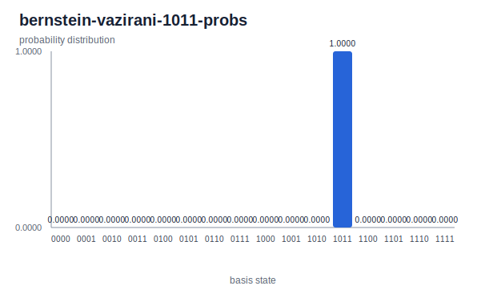

# Bernstein-Vazirani 1011

The Bernstein-Vazirani example encodes secret bit string `1011` in a phase
pattern. After the final Hadamards, the input register returns the secret
directly in the probability distribution.

## Commands

```bash
cargo build -p yao-cli --no-default-features
YAO_ARTIFACT_DIR=docs/src/examples/generated YAO_BIN=target/debug/yao bash examples/cli/bernstein_vazirani.sh 1011
python3 scripts/plot_cli_results.py docs/src/examples/generated/results docs/src/examples/generated/plots
```

## Generated Artifacts


[Bernstein-Vazirani 1011 result JSON](../generated/results/bernstein-vazirani-1011-probs.json)



The result places probability `1.0` on `1011`, index `11`.
