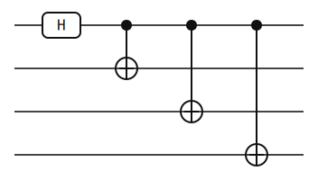

# GHZ 4

Run from the repository root. This walkthrough rebuilds the local CLI,
regenerates the four-qubit GHZ artifacts, and refreshes the plot from the
generated result JSON.

The circuit extends the Bell pattern across four qubits. One Hadamard creates
the branch, and controlled X operations fan that branch out to the rest of the
register.

## 1. Build the CLI

```bash
cargo build -p yao-cli --no-default-features
```

## 2. Generate the artifacts

```bash
target/debug/yao example ghz --nqubits 4 --json --output docs/src/examples/generated/circuits/ghz4.json
target/debug/yao visualize docs/src/examples/generated/circuits/ghz4.json --output docs/src/examples/generated/svg/ghz4.svg
target/debug/yao simulate docs/src/examples/generated/circuits/ghz4.json | target/debug/yao probs - > docs/src/examples/generated/results/ghz4-probs.json
```

## 3. Refresh the plot

```bash
python3 scripts/plot_cli_results.py docs/src/examples/generated/results docs/src/examples/generated/plots
```

## 4. Inspect the generated result

```bash
python3 -m json.tool docs/src/examples/generated/results/ghz4-probs.json
```

## Generated Artifacts



[GHZ 4 result JSON](../generated/results/ghz4-probs.json)


The result has only `0000` and `1111` populated, each with probability `0.5`.
