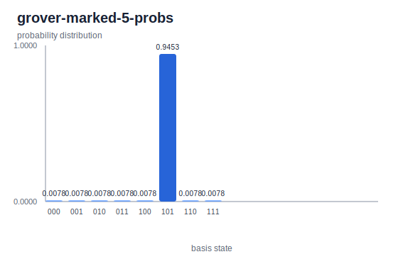

# Grover Marked State 5

Run from the repository root. This walkthrough rebuilds the local CLI, runs the
bash workflow for marked state `5`, and refreshes the plot from the generated
result JSON.

The circuit follows the oracle-and-diffusion rhythm for a three-qubit search
space. The script marks basis index `5`, binary state `101`, and applies two
Grover iterations.

## 1. Build the CLI

```bash
cargo build -p yao-cli --no-default-features
```

## 2. Generate the artifacts

```bash
YAO_ARTIFACT_DIR=docs/src/examples/generated YAO_BIN=target/debug/yao bash examples/cli/grover_marked_state.sh 5
```

## 3. Refresh the plot

```bash
python3 scripts/plot_cli_results.py docs/src/examples/generated/results docs/src/examples/generated/plots
```

## 4. Inspect the generated result

```bash
python3 -m json.tool docs/src/examples/generated/results/grover-marked-5-probs.json
```

## Generated Artifacts


[Grover Marked State 5 result JSON](../generated/results/grover-marked-5-probs.json)



The marked `101` state is amplified to about `0.9453`.
