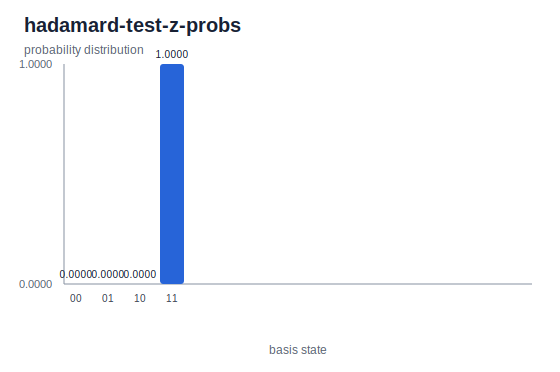

# Hadamard Test Z

The Hadamard-test example keeps the circuit deliberately small so it is easy to
compare with the phase-estimation Z workflow. It prepares an ancilla, applies
controlled phase behavior, and reads out the resulting two-qubit
probabilities.

## Commands

```bash
cargo build -p yao-cli --no-default-features
YAO_ARTIFACT_DIR=docs/src/examples/generated YAO_BIN=target/debug/yao bash examples/cli/hadamard_test_z.sh
python3 scripts/plot_cli_results.py docs/src/examples/generated/results docs/src/examples/generated/plots
```

## Generated Artifacts


[Hadamard Test Z result JSON](../generated/results/hadamard-test-z-probs.json)



For this minimal Z case, the generated probabilities intentionally match the
phase-estimation Z demo and place probability `1.0` on state `11`.
