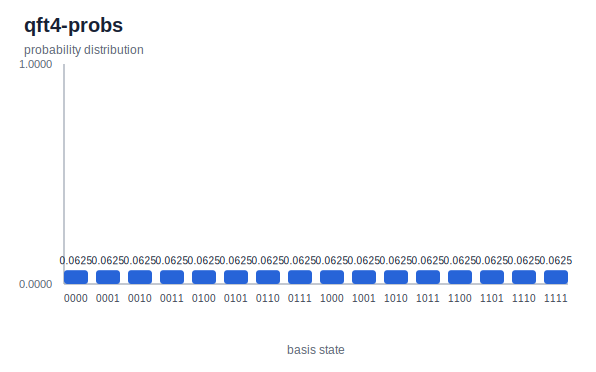

# QFT 4

Run from the repository root. This walkthrough rebuilds the local CLI,
regenerates the four-qubit QFT artifacts, and refreshes the plot from the
generated result JSON.

The circuit builds the Fourier-transform ladder from Hadamards, controlled phase
rotations, and final swaps for the usual output wire order. Starting from the
zero state, this circuit produces a uniform distribution.

## 1. Build the CLI

```bash
cargo build -p yao-cli --no-default-features
```

## 2. Generate the artifacts

```bash
target/debug/yao example qft --nqubits 4 --json --output docs/src/examples/generated/circuits/qft4.json
target/debug/yao visualize docs/src/examples/generated/circuits/qft4.json --output docs/src/examples/generated/svg/qft4.svg
target/debug/yao simulate docs/src/examples/generated/circuits/qft4.json | target/debug/yao probs - > docs/src/examples/generated/results/qft4-probs.json
```

## 3. Refresh the plot

```bash
python3 scripts/plot_cli_results.py docs/src/examples/generated/results docs/src/examples/generated/plots
```

## 4. Inspect the generated result

```bash
python3 -m json.tool docs/src/examples/generated/results/qft4-probs.json
```

## Generated Artifacts


[QFT 4 result JSON](../generated/results/qft4-probs.json)



The probability output is uniform across all 16 basis states, with probability
`0.0625` per state.
