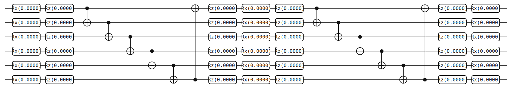
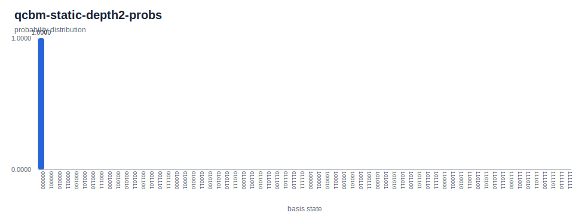

# Quantum Circuit Born Machine

> A parameterized quantum circuit samples a probability distribution over basis
> states via Born's rule; train the parameters to match a target distribution.
> This page lays out the ansatz — alternating single-qubit rotations and CNOT
> entangler rings — and runs it at the zero-parameter identity point.

## Background

The Quantum Circuit Born Machine (QCBM) is a quantum-native generative model
introduced by Liu and Wang in 2018[^lw]. A parameterized quantum circuit
\\( U(\boldsymbol\theta) \\) acting on \\( |0\rangle^{\otimes n} \\) prepares
a state whose computational-basis measurement distribution — the *Born
distribution* — is the generative distribution. One trains
\\( \boldsymbol\theta \\) so that this distribution matches a target
\\( \pi \\) given as either samples or a full histogram.

Two features make the QCBM worth studying. First, it is *quantum-native*:
there is no hand-designed score function or invertibility constraint; the
model is the circuit, and sampling is a measurement. Second, with enough
layers and entanglers it can represent distributions that classical
autoregressive models struggle with. The cost is trainability — loss
landscapes are non-convex and barren plateaus show up as depth grows.

This page shows the canonical ansatz — rotation layers separated by CNOT
entangler rings — and its default output at \\( \boldsymbol\theta = 0 \\).
Training is deferred to issue #31[^issue31]. For a second variational
ansatz on this site, see [QAOA for MaxCut](./qaoa-maxcut.md); both are
parameterized circuits, but QAOA optimizes an expectation value while
the QCBM optimizes a distribution distance.

## The math

**Born's rule defines a distribution.** Given a parameterized circuit
\\( U(\boldsymbol\theta) \\) acting on \\( |0\rangle^{\otimes n} \\), the
output state is
\\( |\psi(\boldsymbol\theta)\rangle = U(\boldsymbol\theta)|0\rangle^{\otimes n} \\)
and the Born distribution is

$$ p_{\boldsymbol\theta}(x) \;=\; |\langle x | \psi(\boldsymbol\theta)\rangle|^2, \qquad x \in \{0, 1\}^n. $$

Sampling from \\( p_{\boldsymbol\theta} \\) is a single measurement in the
computational basis. Evaluating \\( p_{\boldsymbol\theta}(x) \\) at a
specific \\( x \\) is easy in simulation; on hardware it is estimated from
repeated samples.

**Ansatz structure.** A QCBM alternates *rotation layers* and *entangler
layers*.

- A rotation layer applies a single-qubit rotation chain to each qubit.
  Two common choices are `Rx(θ₁)·Rz(θ₂)` (two parameters, sufficient for
  the "edge" layers where an adjacent entangler erases one redundant
  degree of freedom) and the three-gate `Rz(θ₁)·Rx(θ₂)·Rz(θ₃)` triple
  (three parameters, an arbitrary single-qubit unitary up to a global
  phase).
- An entangler layer is a fixed pattern of two-qubit gates. The standard
  choice — and the one this example uses — is a *CNOT ring*
  \\( 0 \to 1 \to 2 \to \cdots \to n-1 \to 0 \\).
- A *depth-\\( p \\)* ansatz has \\( p+1 \\) rotation layers separated by
  \\( p \\) entangler layers. Using the edge/middle split above the total
  parameter count is \\( 4n + 3n(p-1) \\) — linear in both \\( n \\) and
  \\( p \\).

**Loss function: maximum mean discrepancy.** Given a target distribution
\\( \pi \\) over \\( \{0, 1\}^n \\) and a kernel \\( K \\), the MMD loss is

$$ \mathrm{MMD}^2(p_{\boldsymbol\theta}, \pi) \;=\; \mathbb{E}_{x,x' \sim p_{\boldsymbol\theta}} K(x, x') - 2\,\mathbb{E}_{x \sim p_{\boldsymbol\theta},\,y \sim \pi} K(x, y) + \mathbb{E}_{y, y' \sim \pi} K(y, y'). $$

For a *characteristic* kernel (e.g. a Gaussian RBF),
\\( \mathrm{MMD}^2 = 0 \\) if and only if
\\( p_{\boldsymbol\theta} = \pi \\). The critical property for quantum
hardware is that each expectation above is estimable from samples alone —
the model never needs to evaluate \\( p_{\boldsymbol\theta}(x) \\)
explicitly.

**Gradients: parameter-shift.** For any rotation parameter \\( \theta \\)
that enters as \\( R_\bullet(\theta) = e^{-i\theta\,\bullet/2} \\) with
\\( \bullet \in \{X, Y, Z\} \\), the exact gradient of any expectation
value satisfies the two-point formula

$$ \frac{\partial \langle O \rangle_{\boldsymbol\theta}}{\partial \theta} \;=\; \frac{1}{2}\bigl(\langle O \rangle_{\boldsymbol\theta + \tfrac{\pi}{2}\mathbf{e}} - \langle O \rangle_{\boldsymbol\theta - \tfrac{\pi}{2}\mathbf{e}}\bigr), $$

where \\( \mathbf{e} \\) is the unit vector for the parameter being
differentiated. The MMD loss is a linear combination of kernel
expectations and inherits this rule, so unbiased gradient estimates come
from two circuit evaluations per parameter.

**Expressivity trade-off.** Shallow circuits are easy to train but cover
few distributions; deep circuits can represent more but their loss
landscapes develop exponentially flat regions (barren plateaus). Choosing
the right depth is a hyperparameter tune and an active research area.

## The circuit



Fifty-four gates on six qubits at depth \\( p = 2 \\). The layout is

- First rotation layer: `Rx(0), Rz(0)` on each of the six qubits
  — 12 gates, two parameters per qubit.
- Entangler ring: CNOTs
  \\( 0{\to}1, 1{\to}2, 2{\to}3, 3{\to}4, 4{\to}5, 5{\to}0 \\)
  — 6 gates.
- Middle rotation layer: `Rz(0), Rx(0), Rz(0)` on each qubit
  — 18 gates, three parameters per qubit.
- Entangler ring: identical to the first — 6 gates.
- Last rotation layer: `Rz(0), Rx(0)` on each qubit — 12 gates, two
  parameters per qubit.

Total parameter count at this depth is \\( 2 \cdot 6 + 3 \cdot 6 + 2 \cdot 6 = 42 \\).
All 42 are fixed at zero in this walkthrough.

The JSON excerpt below shows the first rotation layer, the full first
CNOT ring, and the first `Rz·Rx·Rz` triple of the middle rotation layer
(15 elements out of 54). The format follows the
[Circuit JSON Conventions](../conventions.md):

```json
{
  "num_qubits": 6,
  "elements": [
    {"type": "gate", "gate": "Rx", "targets": [0], "params": [0.0]},
    {"type": "gate", "gate": "Rz", "targets": [0], "params": [0.0]},
    {"type": "gate", "gate": "Rx", "targets": [1], "params": [0.0]},
    {"type": "gate", "gate": "Rz", "targets": [1], "params": [0.0]},
    {"type": "gate", "gate": "Rx", "targets": [2], "params": [0.0]},
    {"type": "gate", "gate": "Rz", "targets": [2], "params": [0.0]},
    {"type": "gate", "gate": "X", "targets": [1], "controls": [0]},
    {"type": "gate", "gate": "X", "targets": [2], "controls": [1]},
    {"type": "gate", "gate": "X", "targets": [3], "controls": [2]},
    {"type": "gate", "gate": "X", "targets": [4], "controls": [3]},
    {"type": "gate", "gate": "X", "targets": [5], "controls": [4]},
    {"type": "gate", "gate": "X", "targets": [0], "controls": [5]},
    {"type": "gate", "gate": "Rz", "targets": [0], "params": [0.0]},
    {"type": "gate", "gate": "Rx", "targets": [0], "params": [0.0]},
    {"type": "gate", "gate": "Rz", "targets": [0], "params": [0.0]}
  ]
}
```

The last three `Rx·Rz` pairs of the first rotation layer (qubits 3, 4, 5)
and the remaining per-qubit `Rz·Rx·Rz` triples of the middle layer follow
the same pattern; the second entangler ring is bit-for-bit identical to
the first; and the last rotation layer reverts to the two-gate `Rz·Rx`
pattern. [Full QCBM JSON](./generated/circuits/qcbm-static-depth2.json).

**Static-parameter caveat.** With every \\( \theta = 0 \\) we have
\\( R_x(0) = R_z(0) = I \\), so every rotation layer is the identity.
The circuit reduces to *two* CNOT rings acting on
\\( |0\rangle^{\otimes 6} \\). But \\( |0\rangle^{\otimes 6} \\) is a
fixed point of any CNOT: the control is always \\( |0\rangle \\), so the
target is left alone. The whole circuit therefore collapses to the
identity, and the state remains \\( |0\rangle^{\otimes 6} \\). The point
of running this circuit is to exhibit the *structure* of the QCBM
ansatz — the layered rotation+entangler skeleton — not to sample a
non-trivial distribution. Randomizing \\( \boldsymbol\theta \\) is what
activates the ansatz; see "Variations".

> **Bit ordering callout.** yao-rs places qubit 0 at the *most*
> significant bit of the probability-array index. For an all-zeros
> output, the specific convention does not matter (every bit is zero
> regardless of order), but the moment you randomize parameters and read
> out a non-trivial distribution, the labeling does matter. See
> [bit ordering](../conventions.md#bit-ordering) for the full rule.

## Running it

Run from the repository root. This rebuilds the CLI, regenerates every
artifact on this page via the bundled shell workflow, and refreshes the
plot:

```bash
cargo build -p yao-cli --no-default-features
YAO_ARTIFACT_DIR=docs/src/examples/generated YAO_BIN=target/debug/yao bash examples/cli/qcbm_static.sh 2
python3 scripts/plot_cli_results.py docs/src/examples/generated/results docs/src/examples/generated/plots
```

## Interpreting the result



The result is `probabilities[0] = 1.0` with every one of the remaining
63 entries exactly zero. Under the qubit-0-MSB convention, index 0 is
\\( |q_0 q_1 q_2 q_3 q_4 q_5\rangle = |000000\rangle \\) — all six
qubits in \\( |0\rangle \\). The integer 0 has all bits zero regardless
of ordering, so the specific labeling is irrelevant for this particular
output; the deterministic spike is a property of the zero-parameter
point, not of the convention.

This is exactly what the math predicts. Every rotation is the identity,
each CNOT ring leaves \\( |0\rangle^{\otimes 6} \\) invariant, the state
stays at \\( |0\rangle^{\otimes 6} \\), and Born's rule puts unit mass on
the corresponding basis index.

A *trained* QCBM would put mass on the bitstrings favored by its target
distribution. If the target were a truncated Gaussian over
\\( \{0, 1, \dots, 63\} \\), training should reshape the probability
array into a bell curve; if the target were the uniform distribution,
training should flatten it across all 64 bins. Neither happens here
because nothing has been trained — the ansatz is being evaluated at the
identity point in parameter space, and the observed spike is the
fingerprint of an untrained, un-randomized circuit rather than of a
degenerate ansatz.

The smallest one-line change — sample each \\( \theta \\) from
\\( \mathrm{Uniform}[0, 2\pi] \\) — immediately breaks the identity and
spreads probability over many of the 64 basis states. That is the first
experiment to run once the training infrastructure lands in issue
#31[^issue31].

## Variations & next steps

- **Randomize parameters.** Patch
  `examples/cli/qcbm_static.sh` to substitute random angles for the
  `0.0` arguments to `append_gate Rx/Rz`, rerun, and observe a
  non-trivial distribution over the 64 basis states. This is the single
  most informative modification.
- **Change depth.** Pass `1` or `3` to the script. Parameter count
  scales as \\( 4n + 3n(p-1) \\); expressivity scales roughly
  linearly in \\( n \cdot p \\), with barren plateaus kicking in at
  larger depths.
- **Change entangler topology.** Swap the CNOT ring for a brick-wall
  pattern, a nearest-neighbor line, or a random 2-local pattern. Each
  topology biases the accessible distributions differently; rings are a
  common default because they maximize connectivity under minimal gate
  count.
- **Training loop (issue #31).** Compute the MMD loss against a target
  distribution, evaluate gradients via parameter-shift, update via Adam
  or SPSA. The training harness is the missing piece this page cannot
  yet demonstrate end-to-end.
- **Related circuits.** See [QAOA for MaxCut](./qaoa-maxcut.md) for the
  other variational ansatz on this site — same hand-picked parameter
  treatment, different cost function. See
  [Entangled States](./entangled-states.md) for the H + CNOT fan that
  underlies the simplest possible "QCBM" — a depth-0 ansatz on two
  qubits is exactly a Bell pair.

## References

[^lw]: J.-G. Liu and L. Wang, "Differentiable Learning of Quantum Circuit
    Born Machines", *Phys. Rev. A* **98**, 062324 (2018);
    arXiv:1804.04168.

[^issue31]: yao-rs issue #31, "Parameter-optimization loop for
    variational examples". Tracks the planned training harness for QAOA,
    QCBM, and VQE-style workflows.
