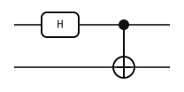

Quantum computing in Rust

# From circuit to result.

Build quantum circuits, simulate their behavior, and explore tensor networks. Use the <code>yao</code> command line or bring yao-rs into your Rust project.

<a class="primary-link" href="installation.html">Get started →</a>

<figure class="circuit-preview">

<figcaption>A Bell circuit. Two gates prepare an entangled pair.</figcaption>
</figure>

## One circuit, several ways to use it

A circuit describes the operations in your experiment. The state holds their
result. Keeping them separate lets you reuse a circuit with different starting
states and choose how to evaluate it.

| Your goal | What you do | What you get |
|---|---|---|
| [Simulate an experiment](states.md) | Apply the circuit to a qubit state. | Amplitudes, probabilities, samples, or expectation values. |
| [Work with tensor networks](tensor-networks.md) | Export the circuit, choose boundaries, then optimize and contract. | A state, overlap, or expectation value. |
| [Show the experiment](visualization.md) | Render the circuit directly. | An SVG diagram for a notebook, paper, or presentation. |

Create circuits with the [Rust builders](circuits.md), describe them in
[JSON](conventions.md), or import [OpenQASM](openqasm.md). These entry points
use the same circuit representation, so you can move between tools without
redrawing your experiment.

## Choose an evaluation method

**State-vector simulation** is a direct way to run qubit circuits and inspect
their full output. It stores one complex amplitude per basis state, so memory
grows as \\(2^n\\) for \\(n\\) qubits.

**Tensor networks** let you target a particular result and choose the order of
computation. Their cost depends on the circuit structure and contraction order.
They also support circuits with higher-dimensional sites, such as qutrits;
`ArrayReg` state-vector simulation supports qubits only.

yao-rs is an MIT-licensed Rust port of [Yao.jl](https://github.com/QuantumBFS/Yao.jl).
Explore the [worked examples](examples/catalog.md) to see complete experiments.
