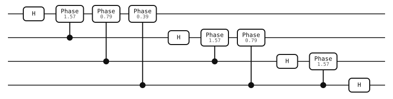

# Visualization

Render a circuit as SVG to inspect gate placement or share an experiment.
Diagrams are generated by yao-rs and open in any browser.

## Render from the CLI

```bash
yao example qft --nqubits 4 > qft.json
yao visualize qft.json --output qft.svg
```



`--output` is required. SVG stays sharp when resized and can be embedded in
HTML or imported into a document editor.

## Phase-gate notation

Diagrams use the [Qiskit convention](https://quantum.cloud.ibm.com/docs/en/api/qiskit/qiskit.circuit.library.CPhaseGate):
a controlled phase has two connected markers and an angle beside the connector.
An open control marker means the gate triggers on 0. Standalone and
multiply controlled phase gates use a `P` box with the angle beneath it.
Recognizable angles are written as multiples of π, such as `π/2` and `π/4`.

## Render from Rust

Call `to_svg()` on any circuit:

```rust
use yao_rs::easybuild::qft_circuit;

let circuit = qft_circuit(4);
std::fs::write("qft.svg", circuit.to_svg()).unwrap();
```

## Label a step

Annotations explain a part of the experiment without changing its execution.
Place a label on a qubit at the point where you want it to appear:

```rust
use yao_rs::{Circuit, Gate, label, put};

let circuit = Circuit::qubits(1, vec![
    label(0, "Prepare"),
    put(vec![0], Gate::H),
]).unwrap();
let svg = circuit.to_svg();
```

In a JSON circuit, the equivalent annotation element is:

```json
{"type": "label", "text": "Prepare", "loc": 0}
```
